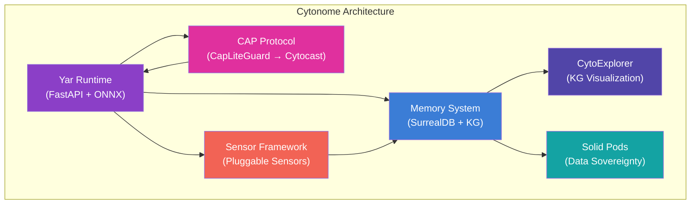
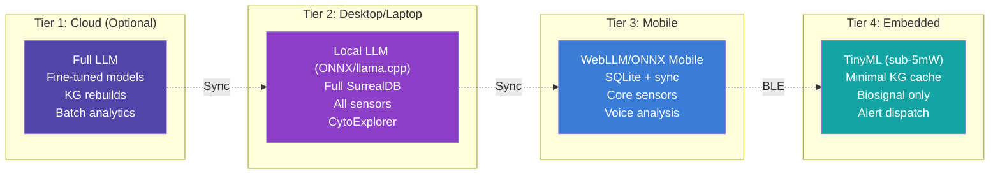
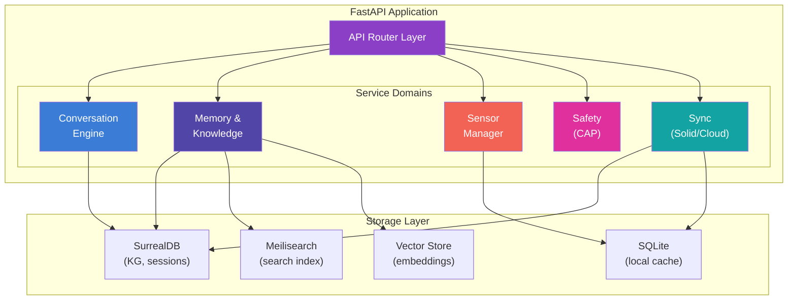
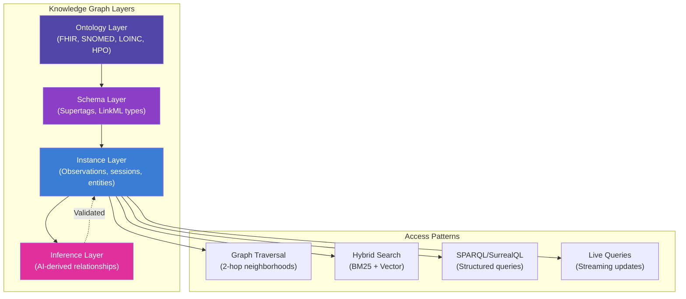
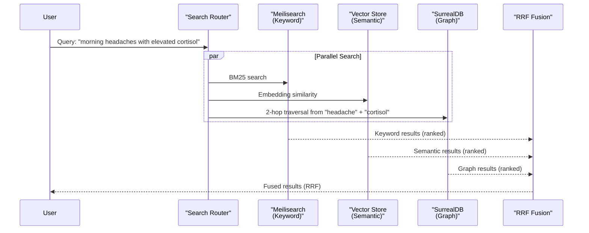
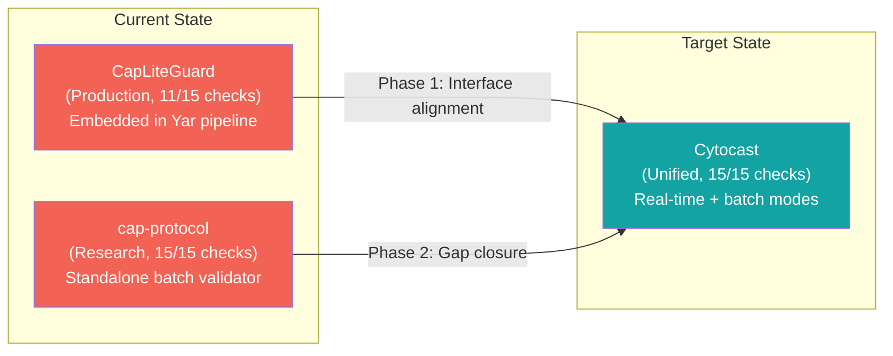
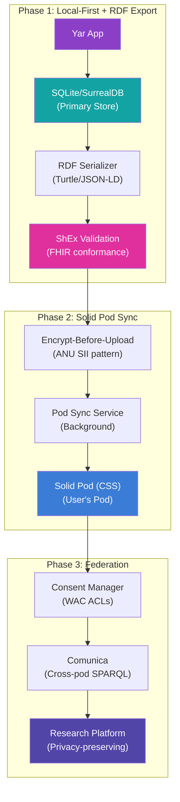
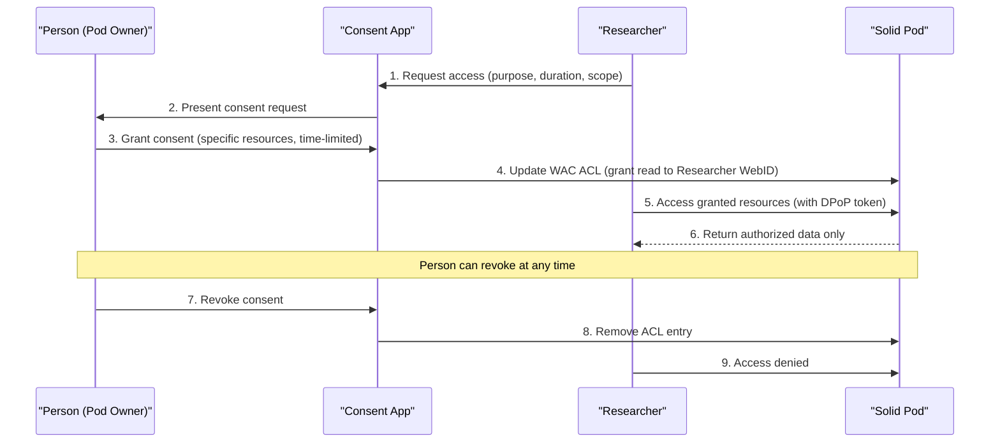
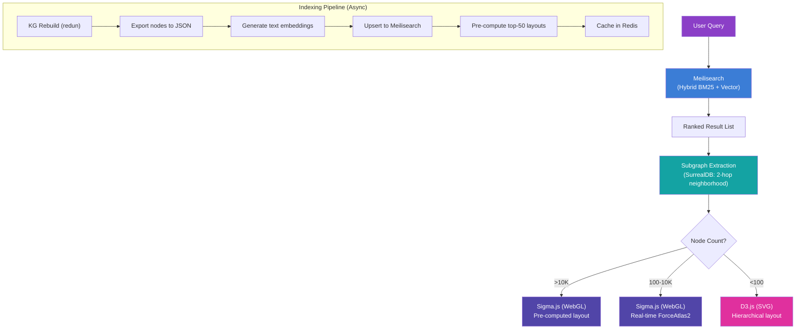
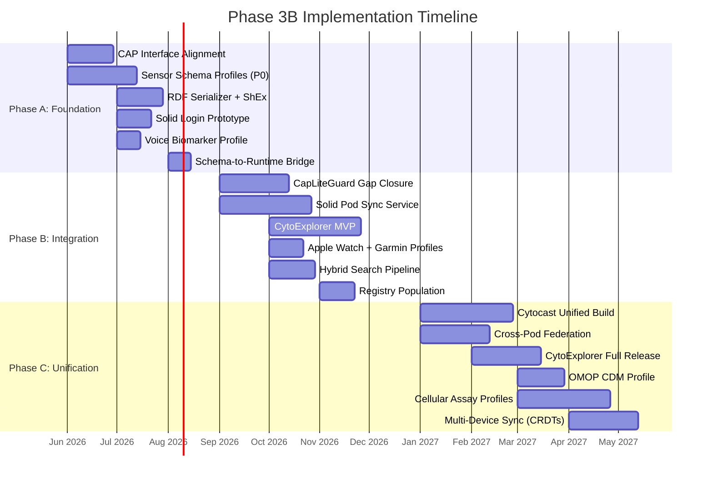

# Phase 3B: Cytonome/Yar Architecture Plan

> **Owner**: Shahin Mohammadi, Cytognosis Foundation
> **Date**: 2026-05-25
> **Status**: ACTIVE
> **Classification**: Internal Architecture Plan
> **Canonical location**: `~/repos/cytognosis/org/plans/phase3b-cytonome-yar-architecture.md`

---

## Table of Contents

| Section | Title |
|---------|-------|
| [1](#1-executive-summary) | Executive Summary |
| [2](#2-yar-architecture-overview) | Yar Architecture Overview |
| [3](#3-memory-and-knowledge-system) | Memory and Knowledge System |
| [4](#4-safety-privacy-and-cap-protocol) | Safety, Privacy, and CAP Protocol |
| [5](#5-data-sovereignty-via-solid-pods) | Data Sovereignty via Solid Pods |
| [6](#6-sensor-integration-framework) | Sensor Integration Framework |
| [7](#7-cytoexplorer-knowledge-graph-interface) | CytoExplorer Knowledge Graph Interface |
| [8](#8-technical-stack) | Technical Stack |
| [9](#9-risk-assessment) | Risk Assessment |
| [10](#10-implementation-timeline) | Implementation Timeline |

---

## 1. Executive Summary

Cytonome is the user-facing AI health navigator of the Cytognosis platform. Its codename is Yar. Where Cytoverse maps the health coordinate system and Cytoscope senses biosignals, Cytonome navigates. It is the companion that captures fleeting thoughts before they vanish, translates communication across neurotypes, and tracks cognitive and emotional patterns across a lifetime.

This document defines the architecture for Phase 3B of Cytonome/Yar development. It synthesizes 17 source documents spanning architecture specifications, planning roadmaps, research deep-dives, and 12 accepted Architecture Decision Records (ADRs). The plan covers six interconnected subsystems: the Yar runtime, the memory and knowledge graph, the safety and privacy layer, data sovereignty through Solid Pods, the pluggable sensor framework, and the CytoExplorer visualization interface.

### 1.1 Design Principles

Cytonome is built by neurodivergent minds, for everyone. Four principles anchor every architectural decision:

| Principle | What It Means |
|-----------|---------------|
| **Edge-first** | Inference, memory, and sensing run on the user's device. The cloud is optional, never required. Target: sub-5mW for core AI inference on mobile SoCs. |
| **Data sovereignty** | Health data belongs to the individual. Local-first storage with optional Solid Pod synchronization. The server never sees plaintext. |
| **Composable safety** | Every AI output passes through the Cytognosis Assurance Protocol (CAP). 15 conformance checks covering uncertainty, provenance, bias, and explanation. No exceptions. |
| **Neurodivergent-native** | The interface adapts to the user, not the other way around. Object-oriented knowledge management, flexible views, sensory-aware design, and communication style translation. |

### 1.2 Product Identity

| Attribute | Value |
|-----------|-------|
| **Code name** | Yar |
| **Product name** | Cytonome |
| **Tagline** | "The Navigator" |
| **Position in platform** | GPS for Health → Cytoverse (The Map) + Cytoscope (The Sensor) + Cytonome (The Navigator) |
| **Target form factors** | Mobile (Flutter), Web (React), Desktop (Electron/Tauri), Embedded (ONNX/WebLLM) |

### 1.3 Current Status

The Yar codebase implements 154 features across the runtime, sensor framework, and knowledge layer. Four items remain unimplemented from the Phase 3A specification. This plan closes those gaps and extends into three new capability domains: Solid Pod integration, CytoExplorer visualization, and psychiatric instrument profiles.



---

## 2. Yar Architecture Overview

### 2.1 Tiered Edge-First Architecture

Yar runs across a spectrum of computational environments. The architecture is tiered so that each deployment target receives the capabilities its hardware can support, gracefully degrading from cloud to microcontroller.



| Tier | Runtime | Database | AI Models | Sensors | Use Case |
|------|---------|----------|-----------|---------|----------|
| **1: Cloud** | FastAPI on Cloud Run | SurrealDB cluster, PostgreSQL (LaminDB/MLflow) | Full fine-tuned LLMs, batch inference | All (via API) | KG rebuilds, model training, research analytics |
| **2: Desktop** | FastAPI local, Electron/Tauri shell | SurrealDB embedded, SQLite | ONNX Runtime, llama.cpp, local sentence transformers | All: voice, wearable, clinical, surveys | Daily companion, full CytoExplorer, deep analysis |
| **3: Mobile** | Flutter + Dart isolates | SQLite (local-first), SurrealDB lite | WebLLM, ONNX Mobile, Core ML/NNAPI | Voice, wearable BLE, surveys | On-the-go capture, notification-driven check-ins |
| **4: Embedded** | Bare-metal C/Rust, Zephyr RTOS | Flat-file, ring buffer | TensorFlow Lite Micro, sub-5mW quantized | PPG, accelerometer, temperature, EDA | Continuous biosensing, anomaly alerts, edge triage |

### 2.2 Backend Architecture

The Yar backend is a FastAPI application organized into five service domains. Each domain owns its routes, models, and business logic. Cross-domain communication uses typed events on an internal event bus.



### 2.3 Frontend Architecture

The frontend follows a platform-adaptive strategy. Flutter handles mobile and desktop natively. React powers the web experience and CytoExplorer. Both share a common design system rooted in the Cytognosis brand palette.

| Platform | Framework | Key Libraries | Distribution |
|----------|-----------|---------------|-------------|
| **Web** | React 19 + TypeScript | `@react-sigma/core`, Graphology, Plotly.js, Mermaid | Firebase Hosting / self-hosted |
| **iOS/Android** | Flutter 3.x | `solidpod`, `rdflib`, `solidui`, provider/riverpod | App Store, Google Play, F-Droid |
| **macOS/Windows/Linux** | Flutter desktop + Tauri | Same Flutter stack + native system tray | Direct download, Homebrew, Flathub |

### 2.4 Communication Patterns

Yar uses three communication patterns depending on latency requirements:

| Pattern | Protocol | Latency | Use Case |
|---------|----------|---------|----------|
| **Request-Response** | HTTP/2 (FastAPI) | 50-200ms | Conversation turns, KG queries, sensor reads |
| **Streaming** | WebSocket + Server-Sent Events | <50ms | Voice analysis, real-time sensor feeds, typing indicators |
| **Background Sync** | Async task queue (Celery/ARQ) | Minutes to hours | Solid Pod sync, KG rebuild, batch analytics, model updates |

---

## 3. Memory and Knowledge System

### 3.1 Design Philosophy

Cytonome's memory is inspired by two knowledge management paradigms validated through deep-dive research: Tana's "everything is a node" architecture and Capacities' object-oriented knowledge management. Both systems treat knowledge as structured, interconnected objects rather than flat documents.

From Tana, Yar adopts:

- **Supertags**: Every entity in the knowledge graph carries a typed schema (supertag) that defines its fields, behaviors, and relationships. A "Symptom" supertag has different fields than a "Medication" supertag, but both participate in the same graph.
- **Live queries**: Saved searches that update in real-time as new knowledge enters the graph. A live query like "all symptoms reported in the last 7 days with severity > 3" remains current without manual refresh.
- **Command nodes**: Automated AI workflows triggered by graph events. When a new observation exceeds a threshold, a command node can trigger a check-in prompt or alert.

From Capacities, Yar adopts:

- **Object Studio**: Users define their own object types with custom properties, creating a personal health ontology that extends the platform's base schema.
- **Multi-view rendering**: The same underlying data renders as a timeline, a table, a graph, a calendar, or a kanban board depending on the user's current task and cognitive preference.
- **Daily notes**: A structured capture surface that automatically links mentions to existing knowledge graph entities, reducing the friction of data entry.

### 3.2 Knowledge Graph Architecture

The knowledge graph uses SurrealDB as its primary store. SurrealDB's multi-model capabilities (document, graph, relational) eliminate the need for separate databases for structured data and graph traversal.



| Layer | Content | Storage | Update Frequency |
|-------|---------|---------|-----------------|
| **Ontology** | FHIR R5 resources, SNOMED CT, LOINC, HPO, Gene Ontology, UBERON | Pre-loaded, read-only (quarterly refresh) | Quarterly |
| **Schema** | Supertag definitions, LinkML types, relationship schemas | User-editable via Object Studio | On user action |
| **Instance** | Observations, sessions, entities, documents, sensor readings | SurrealDB + SQLite (local-first) | Continuous |
| **Inference** | AI-derived relationships, predicted associations, risk scores | Generated by ML pipeline, validated before promotion | Batch + on-demand |

### 3.3 Hybrid Search Architecture

Yar combines three search modalities for comprehensive knowledge retrieval:

| Modality | Engine | Strength | Latency |
|----------|--------|----------|---------|
| **Keyword** | Meilisearch (BM25) | Exact matches, typo tolerance, faceted filtering | <50ms |
| **Semantic** | Vector embeddings (sentence-transformers) | Conceptual similarity, cross-lingual matching | <100ms |
| **Graph** | SurrealDB graph traversal | Relationship-aware discovery, path finding | <200ms |

The search pipeline fuses results from all three modalities using reciprocal rank fusion (RRF), producing a unified ranked list that balances precision (keyword), recall (semantic), and context (graph).



### 3.4 Memory Tiers

Yar organizes memory into four tiers with distinct persistence and access characteristics:

| Tier | Name | Scope | Persistence | Example |
|------|------|-------|-------------|---------|
| **Working** | Conversation context | Current session | Ephemeral (session-scoped) | "User just mentioned a headache" |
| **Episodic** | Session summaries | Days to weeks | Persistent, auto-summarized | "On May 20, user reported 3-day migraine cluster" |
| **Semantic** | Factual knowledge | Months to years | Persistent, versioned | "User has TBX1 mutation, diagnosed 2024" |
| **Longitudinal** | Trend data | Lifetime | Persistent, append-only | "HRV trending downward over 6 months" |

Each tier feeds into the knowledge graph at the appropriate layer. Working memory lives in the FastAPI session state. Episodic memory generates SurrealDB session documents. Semantic memory maps to ontology-linked entities. Longitudinal memory produces time-series observations stored through the sensor framework.

---

## 4. Safety, Privacy, and CAP Protocol

### 4.1 Cytognosis Assurance Protocol (CAP) Overview

The CAP protocol provides trust-layer guarantees for every AI output Cytonome produces. It defines 15 conformance checks organized into four domains. No AI-generated health insight reaches the user without passing the applicable CAP checks.

| Domain | Checks | Purpose |
|--------|--------|---------|
| **Uncertainty** | Calibration, confidence bounds, epistemic vs. aleatoric separation | Ensure the model knows what it does not know |
| **Provenance** | Data lineage, model version, input validation, temporal consistency | Trace every output to its source data and model |
| **Bias** | Population stratification, demographic parity, calibration across subgroups | Detect and flag disparities before they reach users |
| **Explanation** | Feature attribution, counterfactual reasoning, plain-language summary, cross-modal validation | Make AI reasoning transparent and auditable |

### 4.2 Implementation: CapLiteGuard to Cytocast

Two CAP implementations currently exist. The plan unifies them into a single library through a phased Cytocast rebuild, as specified in ADR-006.



**Phase 1: Interface alignment** (immediate)

Define a `CAPGuard` abstract protocol class in `cytos` with methods for all 15 V1 checks. Both existing implementations adopt this interface.

```python
class CAPGuard(Protocol):
    """Protocol for CAP conformance enforcement."""
    def check_uncertainty(self, output: AIOutput) -> ConformanceResult: ...
    def check_provenance(self, output: AIOutput) -> ConformanceResult: ...
    def check_bias(self, output: AIOutput) -> ConformanceResult: ...
    def check_explanation(self, output: AIOutput) -> ConformanceResult: ...
    def check_calibration(self, output: AIOutput) -> ConformanceResult: ...
    def check_temporal_consistency(self, output: AIOutput) -> ConformanceResult: ...
    def check_cross_modal(self, output: AIOutput) -> ConformanceResult: ...
    def check_population_stratification(self, output: AIOutput) -> ConformanceResult: ...
    def check_longitudinal_drift(self, output: AIOutput) -> ConformanceResult: ...
    # ... 6 additional conformance methods
```

**Phase 2: CapLiteGuard gap closure** (near-term)

Implement the 4 missing conformance checks: temporal consistency, cross-modal validation, population stratification, and longitudinal drift detection. Add configurable severity levels (WARN, BLOCK, LOG) per check.

**Phase 3: Cytocast unification** (medium-term)

Rebuild Cytocast as the single CAP enforcement layer. A YAML configuration specifies which checks run at which severity per deployment context. Cytocast wraps both real-time guards (for Yar inference) and batch validators (for experiment outputs). CAP conformance certificates ship as RO-Crate metadata.

### 4.3 Privacy Architecture

Privacy is not a feature. It is the architecture. Every layer of Cytonome enforces privacy by design.

| Layer | Mechanism | Guarantee |
|-------|-----------|-----------|
| **Transport** | TLS 1.3 / HTTPS | Encrypted in transit |
| **Storage (local)** | SQLite encryption (SQLCipher), SurrealDB encryption at rest | Encrypted on device |
| **Storage (remote)** | On-device encryption before Solid Pod upload (ANU SII pattern) | Server never sees plaintext |
| **Sensor data** | Privacy-preserving hashing (contacts, apps, BSSIDs) | No raw identifiers stored |
| **Voice analysis** | On-device inference only, no audio stored, affect features only | Raw audio never leaves device |
| **AI inference** | Local ONNX/WebLLM inference preferred, cloud only with explicit consent | Models run on user hardware |
| **Consent** | WAC/ACP access control, revocable at any time, audit-logged | User controls all sharing |

### 4.4 Voice Analysis Privacy Model

The voice emotion sensor deserves special attention because audio is among the most sensitive biometric data. Yar's voice pipeline enforces a strict privacy attestation model.

```python
class VoiceAffectPolicy(BaseModel):
    """Privacy attestation for voice analysis."""
    on_device: bool = True           # Inference runs locally
    no_audio_stored: bool = True     # Raw audio is never persisted
    consent_given: bool              # User explicitly opted in
    features_only: bool = True       # Only derived features are stored
    session_ephemeral: bool = True   # Features are session-scoped by default
```

Only the `VoiceAffectContextHint` (a coarse affect state: NEUTRAL, ELEVATED, SUBDUED, MIXED, AGITATED) reaches the response-style layer. The LLM never receives raw acoustic features. The user can disable voice analysis entirely through a single toggle. Feature flags (`VoiceAffectFeatureFlags`) provide kill switches for emotion tracking, context injection, and the debug UI.

---

## 5. Data Sovereignty via Solid Pods

### 5.1 Strategic Rationale

Precision health as a human right requires that individuals own their health data. The current architecture stores data in cloud databases managed by Cytognosis. This model places trust in the platform operator. Solid Pods shift that trust to the individual.

Solid (Social Linked Data) is a W3C Community Group specification that decouples data from applications. Users store personal data in Pods (Personal Online Data Stores), retaining ownership and granting granular, revocable access to applications and agents via WebID-based authentication. For Cytognosis, Solid represents the strongest candidate for a decentralized health data layer, as evaluated in the [Solid Pods Comprehensive Research](file:///home/mohammadi/repos/cytognosis/org/plans/research/solid-pods-comprehensive.md).

### 5.2 Integration Architecture

The integration follows ADR-008's phased approach: local-first with RDF export, then Solid Pod synchronization, then federated data sharing.



### 5.3 Health Data Pod Structure

Health data in the Solid Pod follows FHIR resource type organization. All data is encrypted on-device before upload. The pod server is a dumb storage layer.

```
/yar/
├── profile/
│   └── card.ttl                     # WebID profile
├── health/
│   ├── observations/
│   │   ├── vitals/
│   │   │   ├── heart-rate-2026-05.ttl
│   │   │   ├── blood-pressure-2026-05.ttl
│   │   │   └── temperature-2026-05.ttl
│   │   ├── labs/
│   │   │   ├── cmp-2026-05-20.ttl
│   │   │   └── cbc-2026-05-20.ttl
│   │   ├── surveys/
│   │   │   ├── phq9-2026-05-20.ttl
│   │   │   └── gad7-2026-05-20.ttl
│   │   └── voice-affect/
│   │       └── session-2026-05-20.ttl
│   ├── conditions/
│   │   └── active-conditions.ttl
│   ├── medications/
│   │   └── current-medications.ttl
│   └── devices/
│       ├── fitbit-sense.ttl
│       └── dexcom-g7.ttl
├── knowledge/
│   ├── entities/                     # KG entities synced to pod
│   └── sessions/                     # Conversation summaries
└── .acl                              # Access control
```

### 5.4 RDF Vocabulary Stack

| Vocabulary | Purpose | Yar Usage |
|------------|---------|-----------|
| **FHIR RDF** | Clinical data model (Patient, Observation, Condition) | Primary format for health data in pods |
| **Schema.org** | Lightweight metadata, web discovery | Public-facing annotations |
| **SNOMED CT** | Clinical terminology (diagnoses, procedures) | Condition and procedure coding |
| **LOINC** | Laboratory and clinical observation codes | Lab result and survey coding |
| **HPO** | Human Phenotype Ontology | Symptom and phenotype descriptions |
| **ShEx** | Validation of FHIR RDF data | Ensuring export conformance |

### 5.5 Synchronization Strategy

| Strategy | When Used | Mechanism |
|----------|-----------|-----------|
| **Export-on-change** | Critical health data (new diagnoses, medication changes) | Immediate RDF serialization and encrypted push |
| **Batch sync** | Routine observations (daily vitals, sensor readings) | Periodic bulk export every 6 hours |
| **CRDT-based** | Multi-device editing (knowledge graph edits) | Conflict-free merge on reconnection |
| **Event-sourced** | Audit-critical operations (consent changes, sharing actions) | Append-only event log, replayed to pod |

### 5.6 Caching and Data Tiering

| Tier | Storage | Purpose | Freshness |
|------|---------|---------|-----------|
| **Hot** | Local SQLite/SurrealDB | Active app data, instant access | Real-time |
| **Warm** | In-memory RDF cache | Recently synced pod data | Minutes |
| **Cold** | Solid Pod (CSS) | Durable backup, sharing layer | Sync interval (6h default) |
| **Archive** | Pod + encrypted backup | Long-term health records | Batch (weekly) |

### 5.7 Server Selection

Community Solid Server (CSS) is the only viable open-source, actively maintained server implementation. It deploys via Docker with WAC access control.

| Server | Status | License | Recommendation |
|--------|--------|---------|---------------|
| **CSS** (Community Solid Server) | Active, TypeScript, modular | MIT | **Primary choice** for self-hosting |
| **NSS** (Node Solid Server) | Legacy, unmaintained | MIT | Avoid |
| **ESS** (Inrupt Enterprise) | Commercial, production-ready | Proprietary | Consider only at enterprise scale |

### 5.8 Consent Management

Research data sharing follows a strict consent protocol:



---

## 6. Sensor Integration Framework

### 6.1 Universal Sensor Schema

The Cytoscope sensor infrastructure uses a comprehensive LinkML schema family (ADR-004) spanning core types, 6 standard profiles, 5 vendor profiles, and a validated test-case dataset. The schema aligns with W3C SOSA/SSN at the class level, IEEE 1752.1 at the semantics level, and FHIR R5 at the clinical interoperability level.

```
schemas/domains/sensor/
├── sensor.yaml                  # Umbrella import
├── core/
│   ├── core.yaml                # 35+ classes, 1461 lines
│   ├── selfreport.yaml          # Surveys, ESM/EMA
│   └── context.yaml             # Smartphone context sensors
├── profiles/
│   ├── profile_sosa.yaml        # W3C SOSA/SSN bindings
│   ├── profile_ieee1752.yaml    # IEEE 1752.1 / Open mHealth
│   ├── profile_fhir.yaml        # FHIR R5 mapping
│   ├── profile_bt_ghs.yaml      # Bluetooth GHS + IEEE 11073
│   ├── profile_aware.yaml       # AWARE smartphone sensors
│   └── profile_mcphases.yaml    # PhysioNet mcPHASES dataset
├── vendors/
│   ├── vendor_cytoscope.yaml    # Cytognosis Cytoscope (draft)
│   ├── vendor_fitbit.yaml       # Fitbit (19 Observation subclasses)
│   ├── vendor_dexcom.yaml       # Dexcom CGM
│   ├── vendor_mira.yaml         # Mira fertility analyzer
│   └── vendor_oura.yaml         # Oura Ring
└── examples/
    └── mcphases_example.yaml    # Validates clean
```

### 6.2 Core Entity Model

| Class | SOSA Alignment | Purpose |
|-------|---------------|---------|
| `Subject` | `sosa:FeatureOfInterest` | Human or animal participant |
| `Device` | `fhir:Device` | Physical artifact hosting sensors |
| `Sensor` | `sosa:Sensor` | Procedure-and-device combo producing observations |
| `Channel` | `ssn:System` | Single logical data channel |
| `Session` | `prov:Activity` | Bounded data-collection session |
| `Observation` | `sosa:Observation` | Single observation with typed result |
| `ObservationCollection` | `sosa:ObservationCollection` | Time series or multi-channel groupings |
| `Result` | `sosa:hasResult` | Polymorphic result (scalar, coded, waveform, attachment) |
| `SystemCapability` | `ssn-system:SystemCapability` | Declared capability (accuracy, range, drift) |

### 6.3 Pluggable Sensor Architecture

Yar implements a pluggable sensor framework where each sensor is a self-describing module with a standardized lifecycle.

```
┌──────────────────────────────────────────────────┐
│                   Cytonome App                    │
│                                                   │
│  ┌─────────────┐  ┌─────────────┐  ┌───────────┐│
│  │  Settings >  │  │  Dashboard  │  │  Agents   ││
│  │   Sensors    │  │  360° View  │  │ Supervisor││
│  └──────┬───────┘  └──────┬──────┘  └─────┬─────┘│
│         │                 │               │       │
│  ┌──────▼─────────────────▼───────────────▼─────┐│
│  │           Sensor Event Bus                    ││
│  └──────┬────────┬────────┬────────┬────────┬───┘│
│         │        │        │        │        │     │
│  ┌──────▼──┐ ┌───▼────┐ ┌▼──────┐ ┌▼──────┐ ┌▼─┐│
│  │  Voice  │ │ Fitbit │ │Dexcom │ │ PHQ-9 │ │...││
│  │ Emotion │ │ Sense  │ │  G7   │ │ Survey│ │   ││
│  │ Sensor  │ │ Plugin │ │Plugin │ │Plugin │ │   ││
│  └─────────┘ └────────┘ └───────┘ └───────┘ └───┘│
└──────────────────────────────────────────────────┘
```

**Sensor Protocol** (from Yar architecture):

```python
class Sensor(Protocol):
    @property
    def descriptor(self) -> SensorDescriptor: ...
    async def initialize(self) -> None: ...
    async def start(self, session_id: str) -> None: ...
    async def stop(self) -> None: ...
    async def observe(self, raw_input: bytes | None = None) -> SensorObservation: ...
    def stream(self, raw_input_stream: AsyncIterator[bytes]) -> AsyncIterator[SensorObservation]: ...
    async def teardown(self) -> None: ...
```

**SensorDescriptor** fields: `sensor_id`, `name`, `version`, `modality` (VOICE, TEXT, IMAGE, PHYSIOLOGICAL, etc.), `category` (EMOTION, COGNITION, VITALS, SLEEP, etc.), `privacy_level` (BIOMETRIC, HEALTH, BEHAVIORAL, CONTEXTUAL), output schema, hardware requirements, and dependencies.

### 6.4 Plugin Directory Structure

```
~/.cytonome/plugins/
├── cytonome-voice-emotion/
│   ├── plugin.yaml          # SensorDescriptor
│   ├── sensor.py            # Sensor implementation
│   ├── schema/
│   │   └── profile.yaml     # LinkML profile
│   └── registries/
│       ├── properties.yaml  # ObservableProperty entries
│       └── procedures.yaml  # Procedure entries
├── fitbit-connect/
│   ├── plugin.yaml
│   ├── sensor.py
│   ├── schema/
│   │   └── vendor_fitbit.yaml
│   └── registries/
│       └── devices.yaml
└── dexcom-connect/
    └── ...
```

### 6.5 Voice Emotion Sensor (Instance 0)

The first implemented sensor combines HuBERT (speech representation) with openSMILE eGeMAPSv02 (paralinguistic feature extraction). It produces 13 output fields per utterance:

| Field | Type | Unit | Clinical Relevance |
|-------|------|------|-------------------|
| `emotion_categorical` | Enum | — | Ekman emotion label (anger, sadness, fear, joy, neutral, surprise, disgust) |
| `emotion_confidence` | Float | [0,1] | Model confidence in categorical label |
| `valence` | Float | [-1,1] | Positive-negative affect dimension |
| `arousal` | Float | [0,1] | Calm-excited dimension |
| `dominance` | Float | [0,1] | Submissive-dominant dimension |
| `pitch_mean_hz` | Float | Hz | Baseline vocal fundamental frequency |
| `pitch_std_hz` | Float | Hz | Vocal variability marker |
| `speech_rate_syl_sec` | Float | syl/s | Cognitive processing speed indicator |
| `jitter_percent` | Float | % | Vocal fold regularity |
| `shimmer_db` | Float | dB | Amplitude perturbation |
| `hnr_db` | Float | dB | Harmonics-to-noise ratio |
| `pause_count` | Int | — | Number of pauses in utterance |
| `pause_total_ms` | Float | ms | Total pause duration |

### 6.6 Planned Sensor Profiles

| Profile | Priority | Deliverable |
|---------|----------|-------------|
| **Psychiatric Instruments** (PHQ-9, GAD-7, AUDIT, PCL-5) | P0 | `profile_psych_instruments.yaml` with concrete instrument classes, scoring enums, LOINC/SNOMED mappings |
| **Clinical Labs** (BMP, CMP, CBC, Lipid, Thyroid) | P0 | `profile_clinical_labs.yaml` modeling labs as sporadic snapshot sensors |
| **Voice Biomarkers** | P0 | `profile_voice_biomarker.yaml` bridging Yar runtime to Cytos schema |
| **Apple Watch** | P1 | `vendor_apple_watch.yaml` mapping 12 HealthKit data types |
| **Garmin** | P1 | `vendor_garmin.yaml` mapping 13 Garmin Connect data types |
| **OMOP CDM** | P2 | `profile_omop.yaml` for clinical data warehousing interop |
| **Cellular Assays** | P2 | Expand Cytoscope: scRNA-seq, flow cytometry, spatial transcriptomics |

### 6.7 Schema-to-Runtime Bridge

The Cytos LinkML schema (design-time) and Yar Pydantic models (runtime) are semantically equivalent but structurally distinct. A bridge module auto-generates LinkML-valid Cytos instances from Yar runtime objects.

| Cytos (LinkML) | Yar (Pydantic Runtime) | Bridge Action |
|----------------|----------------------|---------------|
| `Sensor` | `SensorDescriptor` | Map `sensor_modality` enums, copy identity fields |
| `Channel` + `ObservableProperty` | `ObservationField` | Split Yar's merged field into Cytos's separated channel and property |
| `Observation` | `SensorObservation` | Wrap Yar flat dict into SOSA-compliant Observation with typed Result |
| `Deployment` | `SensorRegistry.connect()` | Generate explicit deployment record from implicit connect action |
| `Session` | `session_id` string | Enrich with multi-device co-recording metadata |
| `ObservationQuality` | `confidence` float | Expand scalar confidence into structured quality flags |

---

## 7. CytoExplorer Knowledge Graph Interface

### 7.1 Purpose

CytoExplorer is the web interface for browsing the Cytognosis Knowledge Graph. At scale, the KG contains 10.7M nodes and 45M edges spanning genes, proteins, diseases, cell types, pathways, and drugs. Users search for biological entities, explore relationships, and visualize subgraphs. The technology stack follows ADR-007.

### 7.2 Visualization Stack

The stack uses three tiers of rendering based on subgraph size:

| Tier | Node Count | Renderer | Layout | Use Case |
|------|-----------|----------|--------|----------|
| **Overview** | >10K | Sigma.js (WebGL) | Pre-computed ForceAtlas2 | Global KG exploration |
| **Subgraph** | 100-10K | Sigma.js (WebGL) | Real-time ForceAtlas2 | Neighborhood browsing |
| **Detail** | <100 | D3.js (SVG) | Hierarchical/radial | Entity deep-dive |

**Why Sigma.js**: WebGL-native rendering handles 100K+ nodes without DOM overhead. Sigma.js v3 uses Graphology as its data layer, providing clean separation between graph data model and rendering. The `@react-sigma/core` wrapper enables React integration.

**Why Meilisearch**: Supports hybrid search (BM25 keyword + vector semantic) out of the box. Sub-50ms query latency. Typo tolerance and faceted filtering. Self-hostable single binary.

### 7.3 Entity Type Color Mapping

Derived from the Cytognosis brand palette (fluorescent dye wavelengths):

| Entity Type | Color | Hex | Fluorescent Source |
|-------------|-------|-----|-------------------|
| Gene | Azure | `#3B7DD6` | Alexa Fluor |
| Protein | Violet | `#8B3FC7` | DAPI |
| Disease | Magenta | `#E0309E` | Rhodamine |
| Cell Type | Teal | `#14A3A3` | GFP |
| Pathway | Coral | `#F26355` | MitoTracker |
| Drug | Indigo | `#5145A8` | UV |

### 7.4 Search and Render Pipeline



### 7.5 UI Design Principles

The CytoExplorer interface follows the Cytognosis design system:

| Element | Specification |
|---------|--------------|
| **Theme** | Dark (background `#0A0A14`, cards `#25253D`, text `#E0E0ED`) |
| **Elevation** | Glassmorphism (`rgba(30,41,59,0.5)` + `backdrop-filter: blur(12px)`) |
| **Typography** | Inter, system-native fallbacks |
| **Icons** | Phosphor Icons, outlined, 2px stroke |
| **Accessibility** | WCAG AAA (7:1 contrast for body text), min 44px touch targets |
| **Neutrals** | All grays carry indigo undertone (hue ~240), never cold gray |

---

## 8. Technical Stack

### 8.1 Backend Stack

| Component | Technology | Version | Purpose |
|-----------|-----------|---------|---------|
| **API Framework** | FastAPI | 0.115+ | HTTP/WebSocket API, async-first |
| **Primary Database** | SurrealDB | 2.x | Multi-model (document + graph), KG store |
| **Local Database** | SQLite (SQLCipher) | 3.x | Local-first cache, encrypted at rest |
| **Search Engine** | Meilisearch | 1.x | Hybrid search (BM25 + vector) |
| **Vector Store** | ChromaDB / pgvector | — | Embedding similarity search |
| **Task Queue** | ARQ (async Redis queue) | — | Background sync, batch processing |
| **ML Runtime** | ONNX Runtime, llama.cpp | — | On-device inference |
| **Schema** | LinkML | 1.x | Sensor schema, model registry, KG types |
| **Validation** | Pydantic v2 | 2.x | Runtime data validation |
| **Package Manager** | uv | 0.7+ | Fast dependency resolution |

### 8.2 Frontend Stack

| Component | Technology | Purpose |
|-----------|-----------|---------|
| **Web Framework** | React 19 + TypeScript | CytoExplorer, dashboard, admin |
| **Graph Rendering** | `@react-sigma/core` + Graphology | WebGL graph visualization |
| **Charts** | Plotly.js | Interactive data visualization |
| **Detail Graphs** | D3.js | SVG-based small subgraph rendering |
| **Mobile Framework** | Flutter 3.x | iOS, Android, desktop apps |
| **Solid SDK (JS)** | `@inrupt/solid-client` | Browser-based Solid Pod interaction |
| **Solid SDK (Flutter)** | `solidpod` + `rdflib` (Dart) | Mobile Solid Pod interaction |
| **Design System** | Cytognosis DS (custom CSS) | Dark theme, glassmorphism, brand palette |

### 8.3 Infrastructure

| Component | Technology | Purpose |
|-----------|-----------|---------|
| **Compute** | Google Cloud Run | Serverless API hosting |
| **Database Hosting** | Cloud SQL (PostgreSQL) | LaminDB, MLflow, redun, identity mapping |
| **Object Storage** | Google Cloud Storage | Artifacts, model checkpoints, datasets |
| **Static Hosting** | Firebase Hosting | Web frontend, CytoExplorer |
| **Caching** | Redis (Memorystore) | Session state, search result cache, layout cache |
| **Solid Server** | Community Solid Server (Docker) | Self-hosted Solid Pod server |
| **CI/CD** | GitHub Actions | Build, test, deploy pipelines |
| **Monitoring** | Cloud Monitoring + Structured Logging | Observability |

### 8.4 Standards Compliance Matrix

| Standard | Component | How Applied |
|----------|-----------|-------------|
| **W3C SOSA/SSN** | Sensor schema | Class and slot URI alignment for lossless RDF round-trip |
| **IEEE 1752.1 / Open mHealth** | Sensor schema | Header, data-point envelope, all major body schemas |
| **HL7 FHIR R5** | Sensor schema, Solid Pods | Health data serialization, clinical interop |
| **Bluetooth GHS / IEEE 11073** | Sensor schema | All 9 observation classes, MDC code bindings |
| **AWARE Framework** | Sensor schema | All 25 smartphone sensors + ESM |
| **W3C PROV** | Provenance stack | PROV-J sidecars, CAP provenance validation |
| **RO-Crate 1.2 (WRROC)** | Experiment publication | FAIR publication format |
| **Solid Protocol** | Data sovereignty | Pod-based health data storage |
| **EDAM** | Model registry, skill system | Bioinformatics tool/data classification |
| **LinkML** | All schemas | Single-source schema definition |
| **ShEx / SHACL** | Validation | FHIR RDF conformance, KG shape validation |

---

## 9. Risk Assessment

### 9.1 Risk Matrix

| Risk | Likelihood | Impact | Severity | Mitigation |
|------|-----------|--------|----------|------------|
| **On-device ML performance** | Medium | High | **High** | Quantization (INT8/INT4), model distillation, ONNX optimization, fallback to cloud with consent |
| **Solid ecosystem stagnation** | Medium | High | **High** | Build abstraction layer over Solid APIs. Pod sync is secondary storage, never primary. Can switch to alternative (IPFS, AT Protocol PDS) without data loss. |
| **SurrealDB stability** | Medium | Medium | **Medium** | SurrealDB is pre-2.0. Mitigated by pinning version, wrapping all calls through adapter layer, maintaining SQLite fallback for critical data. |
| **Voice sensor accuracy** | Medium | Medium | **Medium** | HuBERT + openSMILE ensemble reduces single-model risk. Confidence thresholds prevent low-certainty outputs from reaching users. CAP uncertainty check blocks unreliable results. |
| **Encryption key loss** | Low | Very High | **High** | Key recovery mechanism (social recovery or hardware backup). Clear user communication about key custody. No server-side key escrow for health data. |
| **HIPAA compliance** | High | Very High | **Critical** | On-device encryption, audit logging, consent tracking, BAA with pod hosting providers. Legal review of full data flow before clinical deployment. |
| **Multi-device sync conflicts** | Medium | Medium | **Medium** | Start with last-write-wins. Evolve to CRDTs for KG edits. Event-sourced audit log enables conflict resolution. |
| **FHIR RDF tooling maturity** | Medium | Medium | **Medium** | Contribute to open-source tooling. Build custom adapters. FHIR RDF supports lossless round-tripping with JSON FHIR. |
| **User adoption of pod concept** | High | High | **High** | Abstract pod management behind familiar UX. Users interact with "Backup & Sharing" settings, never with raw pod URLs. |
| **CAP performance overhead** | Medium | Low | **Low** | Async/batched checks for non-blocking conformance. Only BLOCK-severity checks run synchronously. |

### 9.2 Technical Debt Considerations

| Decision | Short-Term Benefit | Long-Term Risk | Mitigation |
|----------|-------------------|---------------|------------|
| WAC over ACP | Simpler, broader support | May need ACP migration for enterprise | Build ACL adapter with ACP extension point |
| SQLite primary + pod secondary | Proven local-first performance | Dual storage complexity | Clear data flow diagram, single sync service |
| CapLiteGuard before Cytocast | Production safety now (11/15 checks) | Two codebases to maintain | Interface alignment (Phase 1) is already underway |
| Flutter for mobile | Cross-platform, mature ecosystem | ANU SII dependency for Solid packages | Pin package versions, contribute upstream |
| CSS over ESS | Free, open-source | May lack enterprise features at scale | ESS migration path documented in ADR-008 |

### 9.3 Open Questions

1. **HIPAA Pod Architecture**: Can a Solid Pod architecture meet HIPAA requirements with the encrypt-before-upload pattern? Legal review is required before clinical deployment.
2. **Key Recovery**: If a user loses their encryption key, their health data becomes irrecoverable. What key recovery mechanisms are acceptable for health data while maintaining the zero-knowledge guarantee?
3. **CSS Scale Limits**: How does Community Solid Server perform with thousands of RDF resources per pod? What are the practical limits for health data volume per user?
4. **Offline Duration**: How long can a user operate offline before sync conflicts become unresolvable? What is the acceptable data staleness window?
5. **Cross-Platform Voice**: Can the HuBERT + openSMILE pipeline achieve real-time performance on mobile SoCs (Snapdragon 8 Gen 3, Apple A17)?
6. **CRDT Selection**: Which CRDT algorithm best fits the knowledge graph editing pattern? Automerge, Yjs, or a custom implementation?

---

## 10. Implementation Timeline

### 10.1 Phase Overview

The implementation spans three phases over 12 months. Each phase delivers independently usable capabilities while building toward the full Cytonome vision.



### 10.2 Phase A: Foundation (Months 1-3)

**Goal**: Establish the interfaces, schemas, and prototypes that all subsequent work builds on.

| Deliverable | Duration | Dependencies | Exit Criteria |
|-------------|----------|-------------|---------------|
| **CAP Interface Alignment** | 4 weeks | None | `CAPGuard` protocol in `cytos`, both implementations conforming |
| **Psychiatric Instrument Profiles** | 3 weeks | None | `profile_psych_instruments.yaml` with PHQ-9, GAD-7, AUDIT, PCL-5. LinkML validates clean. |
| **Clinical Labs Profile** | 3 weeks | None | `profile_clinical_labs.yaml` with BMP, CMP, CBC, Lipid, Thyroid. |
| **Voice Biomarker Profile** | 2 weeks | None | `profile_voice_biomarker.yaml` bridging Yar models to Cytos schema. |
| **RDF Serializer + ShEx Validation** | 4 weeks | Sensor profiles | Export health data as Turtle/JSON-LD. ShEx validates against FHIR shapes. |
| **Solid Login Prototype** | 3 weeks | None | "Login with Solid" using Inrupt JS SDK. Test CSS instance deployed via Docker. |
| **Schema-to-Runtime Bridge** | 2 weeks | Voice biomarker profile | `cytos_bridge.py` auto-generating LinkML instances from Yar Pydantic objects. |
| **CI/CD Schema Validation** | 1 week | All profiles | Automated `linkml-lint`, `gen-json-schema`, `linkml-validate` on every commit. |

### 10.3 Phase B: Integration (Months 4-6)

**Goal**: Connect the foundational pieces into working subsystems.

| Deliverable | Duration | Dependencies | Exit Criteria |
|-------------|----------|-------------|---------------|
| **CapLiteGuard Gap Closure** | 6 weeks | CAP interface (Phase A) | All 15 V1 conformance checks implemented. Configurable severity levels (WARN/BLOCK/LOG). |
| **Solid Pod Sync Service** | 8 weeks | RDF serializer, Solid login (Phase A) | Background bidirectional sync between local DB and Solid Pod. ANU SII encrypt-before-upload pattern. |
| **CytoExplorer MVP** | 8 weeks | None (parallel track) | Sigma.js + Graphology graph viewer. Meilisearch hybrid search. Entity detail panels. Dark theme. |
| **Apple Watch + Garmin Profiles** | 3 weeks | None | `vendor_apple_watch.yaml` (12 types), `vendor_garmin.yaml` (13 types). |
| **Hybrid Search Pipeline** | 4 weeks | CytoExplorer MVP | Meilisearch BM25 + vector search. Sentence-transformer embeddings. Faceted filtering by entity type. |
| **Registry Population** | 3 weeks | All vendor profiles | Initial `vendors.yaml`, `devices.yaml`, `observable_properties.yaml` with LOINC/SNOMED codes. |

### 10.4 Phase C: Unification (Months 7-12)

**Goal**: Unify the subsystems into the production Cytonome experience.

| Deliverable | Duration | Dependencies | Exit Criteria |
|-------------|----------|-------------|---------------|
| **Cytocast Unified Build** | 8 weeks | CapLiteGuard gap closure (Phase B) | Single CAP library. YAML config for check severity per context. Real-time + batch modes. |
| **Cross-Pod Federation** | 6 weeks | Pod sync service (Phase B) | Consent-gated research data sharing. Comunica cross-pod SPARQL. Time-bounded access grants. |
| **CytoExplorer Full Release** | 6 weeks | CytoExplorer MVP, hybrid search (Phase B) | Three-tier rendering. Pre-computed layouts. Entity comparison. Pathway visualization. |
| **OMOP CDM Profile** | 4 weeks | Clinical labs profile (Phase A) | `profile_omop.yaml` mapping Observation domain for clinical data warehousing. |
| **Cellular Assay Profiles** | 8 weeks | Cytoscope vendor profile | Expand with scRNA-seq, flow cytometry, spatial transcriptomics observation types. |
| **Multi-Device Sync** | 6 weeks | Pod sync service (Phase B) | CRDT-based conflict resolution for concurrent KG edits across devices. |

### 10.5 Resource Requirements

| Role | Phase A | Phase B | Phase C |
|------|---------|---------|---------|
| **Backend Engineer** (Python/FastAPI) | 1.0 FTE | 1.5 FTE | 1.5 FTE |
| **Schema Engineer** (LinkML/RDF) | 1.0 FTE | 0.5 FTE | 0.5 FTE |
| **Frontend Engineer** (React/TypeScript) | 0.5 FTE | 1.0 FTE | 1.0 FTE |
| **Flutter Developer** | 0.0 FTE | 0.5 FTE | 0.5 FTE |
| **ML Engineer** (voice, CAP) | 0.5 FTE | 0.5 FTE | 0.5 FTE |
| **Total** | **3.0 FTE** | **4.0 FTE** | **4.0 FTE** |

### 10.6 Success Metrics

| Metric | Phase A Target | Phase B Target | Phase C Target |
|--------|---------------|---------------|---------------|
| **CAP conformance coverage** | 15/15 checks defined (interface) | 15/15 checks implemented | Unified Cytocast deployed |
| **Sensor profiles** | 8 profiles (core + P0) | 10 profiles (+ Apple Watch, Garmin) | 12 profiles (+ OMOP, cellular) |
| **Search latency (p95)** | — | <100ms keyword, <200ms hybrid | <50ms keyword, <100ms hybrid |
| **Graph rendering** | — | 10K nodes at 60fps | 100K nodes at 30fps |
| **Pod sync coverage** | RDF export only | Bidirectional sync, encrypted | Cross-pod federation |
| **Schema validation CI** | `linkml-lint` passing | Cross-profile consistency tests | Full data-driven test suite |

---

## Appendix A: ADR Cross-Reference

This plan builds on 12 Architecture Decision Records. Changes to foundational ADRs ripple through this plan.

| ADR | Title | Status | Impact on Phase 3B |
|-----|-------|--------|-------------------|
| [ADR-001](file:///home/mohammadi/repos/cytognosis/org/plans/architecture-decisions.md#adr-001-central-asset-registry-on-lamindb) | Central Asset Registry (LaminDB) | ACCEPTED | Model and dataset registration for sensor profiles |
| [ADR-002](file:///home/mohammadi/repos/cytognosis/org/plans/architecture-decisions.md#adr-002-four-layer-provenance-stack) | Four-Layer Provenance Stack | ACCEPTED | CAP provenance validation, RO-Crate publication |
| [ADR-003](file:///home/mohammadi/repos/cytognosis/org/plans/architecture-decisions.md#adr-003-dual-engine-experiment-orchestration) | Dual-Engine Orchestration | ACCEPTED | KG rebuild pipeline (redun), sensor data processing |
| [ADR-004](file:///home/mohammadi/repos/cytognosis/org/plans/architecture-decisions.md#adr-004-linkml-universal-sensor-schema) | LinkML Sensor Schema | ACCEPTED | Foundation for all sensor profiles in Section 6 |
| [ADR-005](file:///home/mohammadi/repos/cytognosis/org/plans/architecture-decisions.md#adr-005-cytos-neuros-separation) | Cytos-Neuros Separation | ACCEPTED | Clean boundaries for domain-specific extensions |
| [ADR-006](file:///home/mohammadi/repos/cytognosis/org/plans/architecture-decisions.md#adr-006-cap-protocol-integration-strategy) | CAP Protocol Integration | ACCEPTED | Core of Section 4, phased Cytocast build |
| [ADR-007](file:///home/mohammadi/repos/cytognosis/org/plans/architecture-decisions.md#adr-007-cytoexplorer-visualization-stack) | CytoExplorer Visualization | ACCEPTED | Core of Section 7, three-tier rendering |
| [ADR-008](file:///home/mohammadi/repos/cytognosis/org/plans/architecture-decisions.md#adr-008-data-sovereignty-via-solid-pods) | Data Sovereignty (Solid Pods) | PROPOSED | Core of Section 5, phased pod integration |
| [ADR-009](file:///home/mohammadi/repos/cytognosis/org/plans/architecture-decisions.md#adr-009-tiledb-based-multi-modal-storage) | TileDB Multi-Modal Storage | PROPOSED | Biosignal and imaging storage for Phase C sensors |
| [ADR-010](file:///home/mohammadi/repos/cytognosis/org/plans/architecture-decisions.md#adr-010-composable-biological-model-registry) | LEGO Model Registry | ACCEPTED | EDAM-typed composable blocks, model discovery |
| [ADR-011](file:///home/mohammadi/repos/cytognosis/org/plans/architecture-decisions.md#adr-011-experiment-management-interface) | Experiment Management UI | ACCEPTED | FAIR readiness checks, cross-system identity |
| [ADR-012](file:///home/mohammadi/repos/cytognosis/org/plans/architecture-decisions.md#adr-012-edam-ontology-for-tool-classification) | EDAM Ontology | ACCEPTED | Sensor and tool classification taxonomy |

## Appendix B: Deferred Architecture Decisions

The following decisions are identified but not yet formalized. They will be addressed as dedicated ADRs when implementation reaches the relevant phase.

| ID | Topic | Blocked By | Target Phase |
|----|-------|-----------|-------------|
| ADR-013 | Yar KG Data Model (Tana supertags, live queries, graph navigation) | ADR-005 | Phase 3B-B |
| ADR-014 | On-Device ML Runtime (sub-5mW inference, model quantization) | ADR-010 | Phase 3C |
| ADR-015 | Multi-Tenant Deployment (workspace isolation, RBAC) | ADR-001, ADR-008 | Phase 3C |
| ADR-016 | Clinical Decision Support (FHIR CDS Hooks, CQL authoring) | ADR-004, ADR-006 | Phase 4 |

## Appendix C: Source Documents

This plan synthesizes the following source documents:

| Category | Document | Location |
|----------|----------|----------|
| **Yar Architecture** | Sensor Architecture | `Yar/docs/architecture/sensor_architecture.md` |
| **Yar Architecture** | All architecture docs | `Yar/docs/architecture/` |
| **Yar Planning** | All planning docs | `Yar/docs/planning/` |
| **Yar Research** | All research docs | `Yar/docs/research/` |
| **Research** | CytoExplorer Interface | `org/plans/research/cytoexplorer-interface-research.md` |
| **Research** | Tana Outliner Deep-Dive | `org/plans/research/tana-outliner-deep-dive.md` |
| **Research** | Capacities Deep-Dive | `org/plans/research/capacities-deep-dive.md` |
| **Research** | CAP Protocol Assessment | `org/plans/research/cap-protocol-assessment.md` |
| **Research** | Solid Pods Comprehensive | `org/plans/research/solid-pods-comprehensive.md` |
| **Research** | Universal Sensor Schema | `org/plans/research/universal-sensor-schema.md` |
| **ADRs** | Architecture Decisions (12 ADRs) | `org/plans/architecture-decisions.md` |

---

**Document Version**: 1.0
**Last Updated**: 2026-05-25
**Next Review**: After Phase A completion
**Owner**: Shahin Mohammadi, Cytognosis Foundation
