# Phase 3A: Cytoverse Product Architecture

> **Owner**: Shahin Mohammadi · **Created**: 2026-05-25
> **Status**: DRAFT — Synthesized from 18 research documents and 12 ADRs
> **Canonical location**: `~/repos/cytognosis/org/plans/phase3a-cytoverse-architecture.md`
> **Depends on**: [architecture-decisions.md](file:///home/mohammadi/repos/cytognosis/org/plans/architecture-decisions.md), [master-metaplan.md](file:///home/mohammadi/repos/cytognosis/org/plans/master-metaplan.md)

---

## Section Map

| # | Section | Purpose |
|---|---------|---------|
| 1 | [Executive Summary](#1-executive-summary) | Cytoverse as "The Map", ARPA-H positioning |
| 2 | [Cytos Data Substrate](#2-cytos-data-substrate) | v3.0 subgraphs, ~170 modules, pipeline stack |
| 3 | [Central Asset Registry](#3-central-asset-registry) | LaminDB backend, `cytognosis://` URIs, 16 asset types |
| 4 | [Four-Layer Provenance](#4-four-layer-provenance) | DVC → redun → LaminDB → MLflow → RO-Crate |
| 5 | [LEGO Model Registry](#5-lego-model-registry) | Composable biological blocks, EDAM typing |
| 6 | [Multi-Resolution Alignment](#6-multi-resolution-alignment) | Molecular → cellular → tissue → organism |
| 7 | [Causal Modeling Architecture](#7-causal-modeling-architecture) | SCMs, normalizing flows, GxE, counterfactuals |
| 8 | [TileDB Multi-Modal Storage](#8-tiledb-multi-modal-storage) | Self-hosted on GCS, 5 modalities |
| 9 | [Experiment Orchestration](#9-experiment-orchestration) | Dual-engine redun + Nextflow, RO-Crate WRROC |
| 10 | [CytoExplorer Interface](#10-cytoexplorer-interface) | Sigma.js, Meilisearch, three-tier rendering |
| 11 | [Cytos-Neuros Separation](#11-cytos-neuros-separation) | 23 neuro modules → neuros, plugin architecture |
| 12 | [ARPA-H HSF Alignment](#12-arpa-h-hsf-alignment) | Continuous health mapping, pre-symptomatic detection |
| 13 | [Implementation Timeline](#13-implementation-timeline) | 4 phases across Q3 2026 – Q2 2027 |
| 14 | [Risk Assessment](#14-risk-assessment) | 10 risks with mitigation strategies |

---

## 1. Executive Summary

Cytoverse is the AI health coordinate system, "The Map" in the Cytognosis GPS-for-Health platform. It constructs a continuous, multi-resolution representation of human biology from molecular to organismal scale. Every gene, protein, pathway, cell state, tissue region, and clinical phenotype occupies a coordinate in this map. The map enables a core capability no existing system provides: detecting deviations from health trajectories years before symptoms emerge.

> [!IMPORTANT]
> **Cytoverse transforms healthcare from snapshots to trajectories.** Current precision medicine captures one-time molecular profiles. Cytoverse captures the temporal dynamics of health, mapping how an individual's cellular state evolves through a coordinate system grounded in causal biology.

### Platform Context

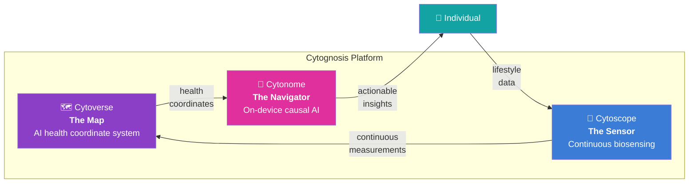

### Core Thesis

The map rests on three architectural pillars:

| Pillar | Description | Enabling Component |
|--------|-------------|--------------------|
| **Multi-modal integration** | Unify genomics, transcriptomics, proteomics, imaging, biosignals, and clinical data into a single queryable substrate | Cytos knowledge graph + TileDB arrays |
| **Causal reasoning** | Move beyond correlations to structural causal models that explain *why* health states change | SCM/CFM architecture + GxE interaction modeling |
| **Temporal dynamics** | Track health state trajectories across time, not just point-in-time snapshots | Residual spaces + counterfactual health trajectories |

### ARPA-H HSF Positioning

Cytoverse positions directly against ARPA-H's Health Sensing Futures (HSF) program. The HSF seeks continuous health monitoring infrastructure that intercepts disease before clinical presentation. Cytoverse provides the computational substrate: the coordinate system that makes continuous sensor data interpretable at the causal-biological level. Section 12 details this alignment.

### Built on Cytos

Cytoverse is not a new codebase. It is the product layer built on top of the **cytos** data substrate, a knowledge graph and data integration platform with ~170 modules, 3 constituent subgraphs, and a pipeline stack of Kedro, DVC, MLflow, and Dagster. This architecture plan defines how cytos evolves into a production-grade health mapping platform.

---

## 2. Cytos Data Substrate

The cytos data substrate is the foundational knowledge graph and data integration engine powering Cytoverse. It integrates heterogeneous biomedical data sources into a unified, queryable graph with typed relationships and ontology-grounded entities.

### v3.0 Architecture: Three Constituent Subgraphs

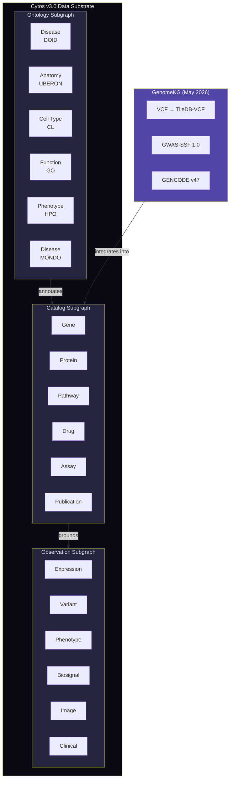

> [!NOTE]
> **GenomeKG integration (May 2026)**: The genomics layer adds variant-to-gene-to-disease mappings using VCF data stored in TileDB-VCF, GWAS summary statistics in GWAS-SSF 1.0 format, and gene annotations from GENCODE v47. This completes the molecular foundation of the coordinate system.

### Module Inventory (~170 Modules)

| Category | Module Count | Key Components |
|----------|:------------:|----------------|
| **Genomics** | 26 | VCF parsing, variant annotation, GWAS integration, eQTL mapping, polygenic risk scoring, pharmacogenomics |
| **Database** | ~15 | Neo4j graph store, SurrealDB document/graph hybrid, connection pooling, query optimization |
| **Schema** | ~12 | LinkML schema definitions, SHACL validation, JSON-LD serialization, schema migration tools |
| **Scholarly** | 30 | Literature mining (PubMed, OpenAlex), citation networks, funding tracking, NER extraction |
| **Knowledge Graph** | ~20 | KGBuilder engine (860 LOC core), entity resolution, relationship extraction, graph embedding |
| **Ontology** | ~18 | OBO ontology loaders, cross-ontology mapping, term enrichment analysis, EDAM integration |
| **ML/DL** | ~22 | Model training, evaluation, hyperparameter search, graph neural networks, embedding spaces |
| **Data Curation** | ~15 | Data ingestion pipelines, quality control, normalization, batch effect correction |
| **Utilities** | ~12 | Logging, configuration, CLI tools, VFS integration, provenance helpers |

### Pipeline Stack

Cytos pipelines run on a composed stack of four orchestration and tracking tools:

| Tool | Role | Integration Point |
|------|------|-------------------|
| **Kedro** | Project structure and pipeline definition | `conf/`, `pipelines/`, `params.yaml` |
| **DVC** | Data versioning and pipeline DAG | `dvc.yaml` (10 stages), `.dvc/` pointer files on GCS |
| **MLflow** | Experiment tracking and model registry | `mlflow.cytognosis.org`, run parameters, metrics, artifacts |
| **Dagster** | Optional orchestration for complex scheduling | Software-defined assets for production pipelines |

### Database Architecture

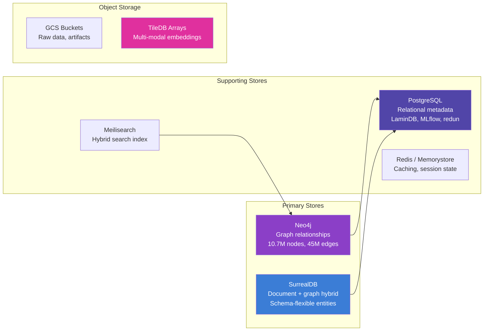

---

## 3. Central Asset Registry

> **Reference**: [ADR-001](file:///home/mohammadi/repos/cytognosis/org/plans/architecture-decisions.md#adr-001-central-asset-registry-on-lamindb) · [central-asset-registry-research.md](file:///home/mohammadi/repos/cytognosis/org/plans/research/central-asset-registry-research.md) · [lamindb-deep-analysis.md](file:///home/mohammadi/repos/cytognosis/org/plans/research/lamindb-deep-analysis.md)

The Central Asset Registry provides a single catalog for every artifact in the Cytognosis ecosystem. It ensures that every dataset, model, schema, workflow, and skill is discoverable, versioned, and traceable.

### Architecture

| Component | Technology | Purpose |
|-----------|------------|---------|
| **Catalog backend** | LaminDB (PostgreSQL) | Artifact metadata, biological annotations, lineage chains |
| **URI scheme** | `cytognosis://` | Unified addressing across all backends |
| **Content addressing** | SHA-256 | Immutable content identification, cache validation |
| **Biological metadata** | bionty (LaminDB plugin) | CellTypist, Gene, Disease, Tissue ontology terms |
| **Object storage** | GCS (primary), TileDB (arrays) | Physical artifact storage |

### `cytognosis://` URI Scheme

The URI scheme provides a unified namespace that resolves through the VFS driver chain:

```
cytognosis://data.core/<dataset-name>           → LaminDB artifact
cytognosis://models/<model-name>/<version>      → LEGO block checkpoint
cytognosis://experiments/<experiment-id>        → MLflow run
cytognosis://sensors/<device-id>/<session-id>   → Sensor session (ADR-004)
cytognosis://schemas/<schema-name>/<version>    → LinkML schema bundle
cytognosis://workflows/<workflow-id>            → Workflow definition
cytognosis://skills/<skill-name>/<version>      → Cytoskill package
```

### 16 Asset Types and Backend Mapping

| # | Asset Type | Backend | Identifier | Example |
|:-:|------------|---------|------------|---------|
| 1 | **Raw Dataset** | GCS + LaminDB | SHA-256 hash | Whole-genome VCF files |
| 2 | **Curated Dataset** | GCS + LaminDB + bionty | LaminDB UID | Annotated scRNA-seq AnnData |
| 3 | **Model Checkpoint** | GCS + HuggingFace | SHA-256 + HF model ID | Cell type classifier weights |
| 4 | **Trained Pipeline** | Artifact Registry | Semver tag | End-to-end variant calling |
| 5 | **Schema Definition** | GitHub + SWHID | SWHID | LinkML sensor schema |
| 6 | **Workflow Definition** | GitHub + SWHID | SWHID + biotoolsID | redun experiment script |
| 7 | **Skill Package** | Artifact Registry | Semver tag | `cytoskills` PyPI package |
| 8 | **Ontology Snapshot** | GCS + Zenodo | DOI + version | EDAM 1.25, DOID 2026-Q2 |
| 9 | **Knowledge Graph Build** | Neo4j dump + GCS | Build timestamp + SHA-256 | Cytos KG v3.0 |
| 10 | **Experiment Run** | MLflow + RO-Crate | MLflow run ID + DOI | Training run with full provenance |
| 11 | **Publication** | Zenodo + SEEK | DOI | Research object with data + code |
| 12 | **Sensor Recording** | TileDB + GCS | Session UUID | 24h continuous PPG stream |
| 13 | **Clinical Record** | FHIR server + Solid Pod | FHIR resource ID | De-identified phenotype profile |
| 14 | **Image Dataset** | TileDB-BioImaging + GCS | SHA-256 | Whole-slide histology images |
| 15 | **Embedding Index** | TileDB Embedded | Array URI | 768-dim gene expression embeddings |
| 16 | **RO-Crate Package** | Zenodo + SWH | DOI + SWHID | Published experiment package |

### VFS Driver Chain

Resolution flows through a prioritized chain of virtual filesystem drivers:

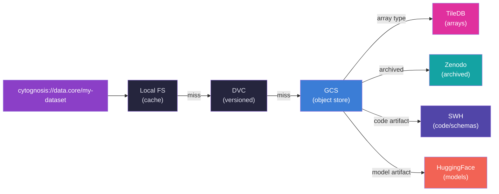

### Three-Axis Tagging System

Every registered asset receives classification along three orthogonal axes:

| Axis | Taxonomy | Coverage | Example Tags |
|------|----------|----------|-------------|
| **Axis A: Engineering** | SWEBOK 4.0 | Software engineering knowledge areas | `requirements`, `design`, `testing`, `configuration-management` |
| **Axis B: Organizational** | APQC PCF 8.0 | Business process classification | `6.0-manage-IT`, `8.0-manage-knowledge`, `5.0-manage-enterprise-services` |
| **Axis C: Scientific** | EDAM 1.25 | Bioinformatics operations, data, formats | `topic:3325` (Rare diseases), `operation:3661` (SNP annotation), `format:3016` (VCF) |

> [!TIP]
> **Cross-axis queries** enable powerful discovery: "Find all datasets (`Axis B: manage-knowledge`) that contain variant annotations (`Axis C: EDAM operation:3661`) and were produced by a validated pipeline (`Axis A: testing`)."

---

## 4. Four-Layer Provenance

> **Reference**: [ADR-002](file:///home/mohammadi/repos/cytognosis/org/plans/architecture-decisions.md#adr-002-four-layer-provenance-stack) · [experiment-orchestration-research.md](file:///home/mohammadi/repos/cytognosis/org/plans/research/experiment-orchestration-research.md)

Reproducibility is non-negotiable for grant-funded biomedical research. The four-layer provenance stack captures every stage of an experiment's lifecycle, from raw data versioning to FAIR publication.

### Layer Architecture

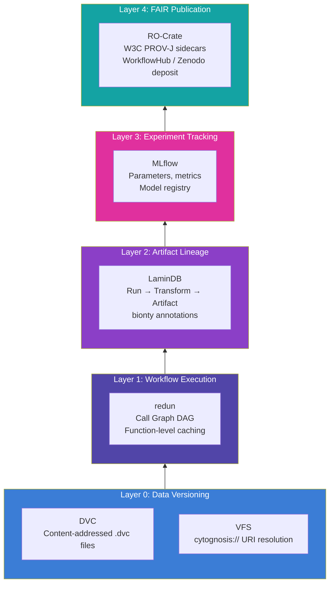

### Layer Responsibilities

| Layer | Tool | What It Captures | Persistence |
|:-----:|------|------------------|-------------|
| **0** | DVC + VFS | Data versions, content hashes, storage locations | Git-tracked `.dvc` files, `cytognosis://` URIs |
| **1** | redun | Workflow execution DAG, function call graph, automatic caching | PostgreSQL (redun schema), execution logs |
| **2** | LaminDB | Artifact lineage (`Run → Transform → Artifact`), biological metadata | PostgreSQL (lamindb schema), bionty annotations |
| **3** | MLflow | Experiment parameters, metrics, model versions, artifact links | PostgreSQL (mlflow schema), GCS artifact store |
| **4** | RO-Crate | FAIR publication package, W3C PROV-J provenance sidecars | `ro-crate-metadata.json`, DOI via Zenodo |

### Cross-System Identity Resolution

An identity mapping table links records across all four layers:

```
mlflow:run/abc123 ↔ lamindb:run/xyz789 ↔ redun:exec/def456 ↔ dvc:stage/ghi012
```

The mapping is populated automatically by `cytoskeleton run` and queried by the Experiment Management Interface (ADR-011).

### RO-Crate Profiles

Three WRROC (Workflow Run RO-Crate) profiles structure provenance packaging:

| Profile | Use Case | Key Elements |
|---------|----------|-------------|
| **Process Run Crate** | Single computational step | Input artifacts, output artifacts, software agent, timestamps |
| **Workflow Run Crate** | Multi-step pipeline | Ordered process runs, data flow between steps, environment snapshot |
| **Provenance Run Crate** | Full experiment campaign | Investigation context, funding attribution, compliance declarations |

### Provenance Emission Flow

```
cytoskeleton run --engine=redun my_experiment.py
    ├─ Layer 0: DVC tracks input/output data versions
    ├─ Layer 1: redun records Call Graph DAG with function hashes
    ├─ Layer 2: LaminDB registers artifacts with biological metadata
    └─ Layer 3: MLflow logs parameters, metrics, model artifacts

cytoskeleton publish --to zenodo my_experiment
    └─ Layer 4: Generates RO-Crate with references to L0-L3 identifiers
                Deposits to Zenodo, mints DOI
                Registers in FAIRDOM-SEEK catalog
```

---

## 5. LEGO Model Registry

> **Reference**: [ADR-010](file:///home/mohammadi/repos/cytognosis/org/plans/architecture-decisions.md#adr-010-composable-biological-model-registry) · [bio-model-zoos-research.md](file:///home/mohammadi/repos/cytognosis/org/plans/research/bio-model-zoos-research.md) · [biotools-schema-edam-research.md](file:///home/mohammadi/repos/cytognosis/org/plans/research/biotools-schema-edam-research.md)

The LEGO model registry implements the "LEGO biological model" concept: composable computational biology modules that snap together through typed interfaces. Each LEGO block performs a defined biological operation with EDAM-typed inputs and outputs.

### biotoolsSchema Function Model

Every LEGO block follows the biotoolsSchema function model, mapping biological operations to EDAM ontology terms:

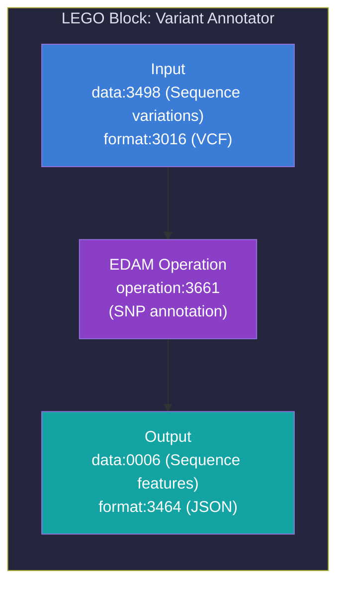

### Composability: EDAM Type Matching

Two LEGO blocks connect when the output EDAM types of block A match the input EDAM types of block B. The registry enforces type compatibility at pipeline construction time.

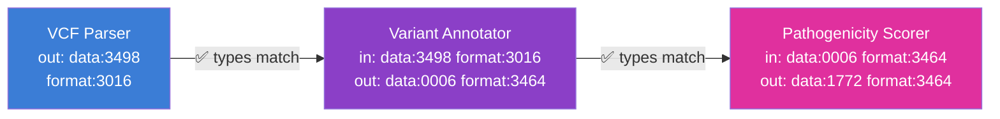

### Model Lifecycle

| State | Description | Requirements |
|-------|-------------|-------------|
| **Draft** | Work in progress, not discoverable | Valid `lego.yaml` manifest, passes schema validation |
| **Validated** | Tested, meets quality thresholds | Benchmark results on reference datasets, CAP conformance checks pass |
| **Published** | Production-ready, receives `biotoolsID` | Full EDAM annotation, RO-Crate provenance, registered in bio.tools |

### `lego.yaml` Manifest

Every LEGO block ships with a `lego.yaml` manifest specifying its interface, dependencies, and biological context:

```yaml
# lego.yaml — Variant Effect Predictor Block
name: variant-effect-predictor
version: 1.2.0
description: >
  Predicts functional effects of genomic variants on gene expression
  using a fine-tuned transformer model.

function:
  operations:
    - edam:operation_3661  # SNP annotation
    - edam:operation_3225  # Variant classification
  inputs:
    - name: variants
      data_type: edam:data_3498    # Sequence variations
      format: edam:format_3016     # VCF
      tensor_spec:
        dtype: string
        shape: [null]              # Variable-length variant list
      biological_entity: genomic_variant
    - name: reference_genome
      data_type: edam:data_2093    # Genome assembly
      format: edam:format_1929     # FASTA
      tensor_spec:
        dtype: uint8
        shape: [null]              # Chromosome length
      biological_entity: reference_sequence
  outputs:
    - name: effect_predictions
      data_type: edam:data_0006    # Sequence features
      format: edam:format_3464     # JSON
      tensor_spec:
        dtype: float32
        shape: [null, 5]           # [n_variants, 5 effect categories]
      biological_entity: functional_annotation

topics:
  - edam:topic_3325   # Rare diseases
  - edam:topic_3053   # Genetics
  - edam:topic_0199   # Genetic variation

modality: genotype
framework: pytorch
resolution: molecular

artifact:
  registry_id: cytognosis://models/variant-effect-predictor/1.2.0
  checkpoint_hash: sha256:a1b2c3d4...
  provenance_crate: cytognosis://experiments/vep-training-run-042

dependencies:
  - name: genome-tokenizer
    version: ">=2.0.0"
  - name: variant-normalizer
    version: ">=1.1.0"

benchmarks:
  - dataset: clinvar-2026q1
    metric: auroc
    value: 0.94
  - dataset: gnomad-rare-variants
    metric: precision_at_90recall
    value: 0.87
```

### EDAM Topic Coverage

| EDAM Topic | # Blocks (Target) | Example Blocks |
|------------|:------------------:|---------------|
| `topic:3053` Genetics | 8 | Variant annotator, PRS calculator, eQTL mapper |
| `topic:3308` Transcriptomics | 6 | Cell type classifier, differential expression, trajectory inference |
| `topic:0121` Proteomics | 4 | Protein function predictor, interaction scorer |
| `topic:3325` Rare diseases | 3 | Variant effect predictor, phenotype matcher |
| `topic:2229` Cell biology | 5 | Cell state embedding, pathway enrichment, gene regulatory network |
| `topic:3382` Imaging | 3 | Histology segmenter, spatial transcriptomics decoder |
| `topic:3474` Machine learning | 4 | Foundation model adapter, few-shot learner, ensemble scorer |

---

## 6. Multi-Resolution Alignment

Cytoverse operates across four biological resolutions. The critical challenge is aligning representations *across* resolutions so that molecular-level changes map to cellular behaviors, tissue phenotypes, and organismal outcomes.

### Four Resolutions

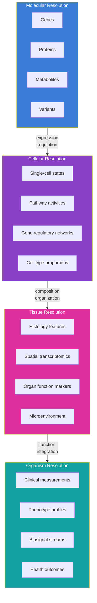

### Alignment Methods

Cross-resolution alignment requires mathematical techniques that compare representations of different dimensionality and semantics:

| Method | Full Name | Use Case | Complexity |
|--------|-----------|----------|:----------:|
| **CKA** | Centered Kernel Alignment | Compare learned representations across model layers or resolutions | O(n²) |
| **GW-OT** | Gromov-Wasserstein Optimal Transport | Align distributions across incomparable spaces (e.g., gene space ↔ cell space) | O(n³) |
| **Hilbert metric** | Projective Hilbert metric | Measure distances in positive cones (abundance data, expression profiles) | O(n) |
| **Procrustes** | Orthogonal Procrustes analysis | Align embedding spaces after independent training | O(n²d) |
| **SCOT** | Single Cell Optimal Transport | Align multi-modal single-cell data (ATAC + RNA) | O(n²) |

### Cross-Resolution Connectors

Each connector is itself a LEGO block (Section 5) that bridges two adjacent resolutions:

| Connector | Input Resolution | Output Resolution | Method |
|-----------|:----------------:|:-----------------:|--------|
| **Gene→Cell** | Molecular (expression vectors) | Cellular (cell state embeddings) | Autoencoder + GW-OT alignment |
| **Cell→Tissue** | Cellular (cell type proportions) | Tissue (spatial organization) | Deconvolution + spatial correlation |
| **Tissue→Organism** | Tissue (organ markers) | Organismal (clinical phenotype) | Multi-task regression + CKA validation |
| **Variant→Gene** | Molecular (variant effects) | Molecular (gene perturbation scores) | VEP + eQTL mapping |
| **Biosignal→Cell** | Organismal (PPG, EDA, HR) | Cellular (inferred cellular stress) | Temporal causal model + Hilbert metric |

### Alignment Validation

Each cross-resolution connector validates alignment quality through three metrics:

1. **Fidelity**: How well does the mapping preserve structure within each resolution? (CKA score > 0.7)
2. **Coverage**: What fraction of entities in the source resolution have valid mappings? (Target: > 80%)
3. **Biological plausibility**: Do mapped relationships agree with known biology? (Pathway enrichment p < 0.01)

---

## 7. Causal Modeling Architecture

> [!IMPORTANT]
> **Causal models are what differentiate Cytoverse from correlation-based approaches.** The health map is not just a data atlas. It embeds causal structure: knowing that variant X *causes* pathway disruption Y, which *causes* cellular phenotype Z, years before clinical symptoms emerge.

### Structural Causal Models (SCMs)

The causal backbone of Cytoverse is a hierarchy of structural causal models operating at each biological resolution:

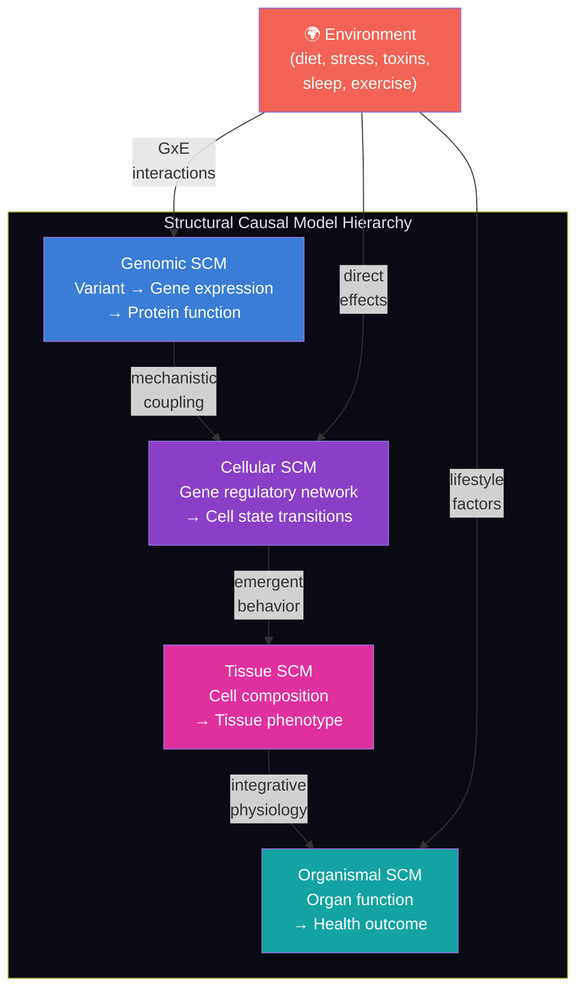

### Normalizing Flows and Conditional Flow Matching (CFM)

Normalizing flows model the continuous distribution of health states. Conditional Flow Matching (CFM) learns the *velocity field* that transports an individual's health state through time, conditioned on their molecular profile and environmental exposures.

| Component | Role | Implementation |
|-----------|------|----------------|
| **Base distribution** | Healthy reference population | Gaussian mixture model fit to healthy cohort embeddings |
| **Flow network** | Maps base distribution to observed health states | Neural ODE with continuous normalizing flows |
| **CFM objective** | Learns interpolation paths between health states | OT-CFM (optimal transport conditional flow matching) |
| **Conditioning variables** | Genotype, environment, time | Concatenated to flow input, modulating velocity field |

### GxE Interactions: Gene-Environment Causal DAGs

Gene-environment (GxE) interactions are first-class causal edges in the Cytoverse SCM:

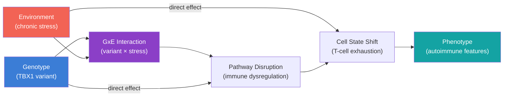

### Residual Spaces

Residual spaces capture what remains unexplained after accounting for known causal effects. These spaces are where novel disease mechanisms hide:

| Residual Space | Level | Definition | Biological Meaning |
|----------------|:-----:|------------|-------------------|
| **Delta pathway** | Cellular | Observed pathway activity − predicted pathway activity (from genomic SCM) | Novel regulatory mechanisms, epigenetic effects, post-translational modifications |
| **Delta phenotype** | Organismal | Observed clinical phenotype − predicted phenotype (from cellular SCM) | Unmeasured environmental factors, stochastic biological variation, missing genetic factors |

### Counterfactual Health Trajectories

The SCM hierarchy enables counterfactual reasoning: "What would this individual's health trajectory look like *if* a specific intervention were applied?"

```
Counterfactual query:
  Given:  Individual with TBX1 variant, current T-cell exhaustion state
  Do:     Intervene on chronic stress (reduce to baseline)
  Infer:  Predicted trajectory shift in immune function over 6 months

Implementation:
  1. Fix GxE node: set E = baseline stress level
  2. Propagate through SCM: recompute downstream causal effects
  3. Generate counterfactual trajectory via CFM velocity field
  4. Compare factual vs. counterfactual health coordinates
  5. Report: probability of immune recovery, expected timeline
```

---

## 8. TileDB Multi-Modal Storage

> **Reference**: [ADR-009](file:///home/mohammadi/repos/cytognosis/org/plans/architecture-decisions.md#adr-009-tiledb-based-multi-modal-storage) · [tiledb-cloud-analysis.md](file:///home/mohammadi/repos/cytognosis/org/plans/research/tiledb-cloud-analysis.md)

TileDB provides a unified array storage engine for all five Cytoverse data modalities, self-hosted on GCS to maintain cost control and data sovereignty.

### Modality-to-Array Mapping

| Modality | TileDB Component | Array Type | Dimensions | Typical Size |
|----------|-----------------|:----------:|------------|:------------:|
| **sc_omics** | TileDB-SOMA | Sparse | Cell × Gene × Layer | 10-100 GB |
| **Genotype** | TileDB-VCF | Sparse 3D | Contig × Position × Sample | 50-500 GB |
| **BioImaging** | TileDB-BioImaging | Dense (pyramidal) | X × Y × Resolution | 1-50 GB per slide |
| **Phenotype** | TileDB Embedded | Sparse | Subject × TimePoint × Phenotype | 1-10 GB |
| **Biosignal** | TileDB Embedded | Dense | Channel × TimePoint | 10-100 GB per subject |

### Storage Architecture

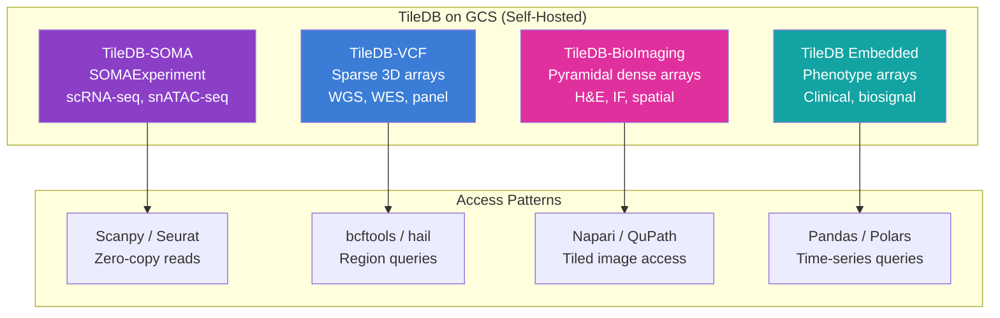

### Key Design Patterns

| Pattern | Description | Benefit |
|---------|-------------|---------|
| **Fragment-based versioning** | Each data ingestion creates an immutable fragment. No overwrites. | Time-travel queries, audit trail, complements DVC versioning |
| **Lazy DAG computation** | TileDB `Delayed` pattern composes array operations without materializing | Memory efficiency for larger-than-RAM datasets |
| **Background consolidation** | Periodic merge of small fragments into larger consolidated arrays | Read performance optimization without data loss |
| **Content-addressed fragments** | Each fragment receives a SHA-256 hash registered in LaminDB | Cross-references with asset registry (ADR-001) |

> [!WARNING]
> **Self-hosted, not TileDB Cloud.** TileDB Cloud starts at $50K/year. Cytoverse uses the open-source TileDB libraries with GCS as the storage backend. The `cytognosis://` URI scheme abstracts the storage location, allowing future migration to TileDB Cloud if cost-benefit analysis justifies it.

---

## 9. Experiment Orchestration

> **Reference**: [ADR-003](file:///home/mohammadi/repos/cytognosis/org/plans/architecture-decisions.md#adr-003-dual-engine-experiment-orchestration) · [experiment-orchestration-research.md](file:///home/mohammadi/repos/cytognosis/org/plans/research/experiment-orchestration-research.md) · [experiment-management-interface.md](file:///home/mohammadi/repos/cytognosis/org/plans/research/experiment-management-interface.md)

### Dual-Engine Strategy

Cytoverse runs two categories of computational experiments, each optimized for a different execution model:

| Engine | Domain | Key Capability | Use Cases |
|--------|--------|----------------|-----------|
| **redun** (primary) | Python-native ML/KG | Content-addressed caching, function-level provenance | ML training, KG builds, data curation, schema validation, model evaluation |
| **Nextflow** (secondary) | Bioinformatics | Container-native execution, nf-core ecosystem, HPC support | Variant calling (nf-core/sarek), RNA-seq (nf-core/rnaseq), scRNA-seq pipelines |

### `cytoskeleton` CLI Unification

The `cytoskeleton` CLI wraps both engines behind a unified interface:

```bash
# Python-native experiment (redun engine)
cytoskeleton run --engine=redun experiments/cell_type_classifier.py

# Bioinformatics pipeline (Nextflow engine)
cytoskeleton run --engine=nextflow nf-core/sarek --input samples.csv

# Publish experiment results as RO-Crate
cytoskeleton publish --to zenodo,seek experiments/cell_type_classifier

# List all experiments with FAIR readiness status
cytoskeleton experiments list --fair-status
```

### ISA Model for Experiment Organization

Experiments follow the ISA (Investigation-Study-Assay) model, extended with a campaign layer for longitudinal research programs:

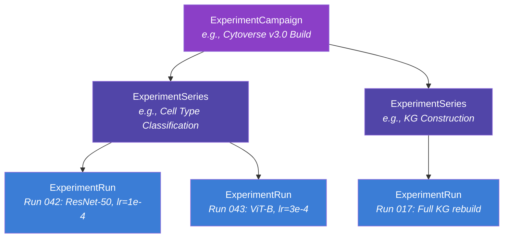

| ISA Layer | Cytoverse Mapping | Metadata |
|-----------|-------------------|----------|
| **Investigation** | `ExperimentCampaign` | Research question, funding source, team, timeline |
| **Study** | `ExperimentSeries` | Experimental design, hypothesis, control variables |
| **Assay** | `ExperimentRun` | Specific execution with parameters, metrics, artifacts |

### RO-Crate WRROC Profiles

| Profile | When Generated | Content |
|---------|---------------|---------|
| **Process Run Crate** | After each `ExperimentRun` | Single run provenance, input/output artifacts, environment |
| **Workflow Run Crate** | After each `ExperimentSeries` | Multi-run provenance, data flow, comparative metrics |
| **Provenance Run Crate** | After `cytoskeleton publish` | Full campaign provenance, ISA metadata, DOI, grant attribution |

### Cross-Engine Provenance Bridge

When a redun task calls a Nextflow sub-pipeline:

1. redun creates a `SubprocessTask` wrapping the Nextflow command
2. `cytoskeleton` bridge captures Nextflow execution trace (`-with-trace`)
3. On completion, bridge registers Nextflow outputs in LaminDB
4. Identity mapping records: `redun:task/abc → nextflow:process/xyz`
5. Experiment Management UI renders the combined lineage as a single DAG

---

## 10. CytoExplorer Interface

> **Reference**: [ADR-007](file:///home/mohammadi/repos/cytognosis/org/plans/architecture-decisions.md#adr-007-cytoexplorer-visualization-stack) · [cytoexplorer-interface-research.md](file:///home/mohammadi/repos/cytognosis/org/plans/research/cytoexplorer-interface-research.md)

CytoExplorer is the web interface for exploring the Cytoverse knowledge graph. It provides interactive graph visualization, hybrid search, and subgraph exploration for 10.7M nodes and 45M edges.

### Technology Stack

| Component | Technology | Rationale |
|-----------|------------|-----------|
| **Graph rendering** | Sigma.js v3 + Graphology | WebGL-native, handles 100K+ nodes without DOM overhead |
| **React integration** | `@react-sigma/core` | Clean React lifecycle management for graph state |
| **Search engine** | Meilisearch | Hybrid BM25 + vector search, sub-50ms queries, typo tolerance |
| **Frontend framework** | React + TypeScript | Type safety, component reusability, ecosystem maturity |
| **Iconography** | Phosphor Icons | Outlined, 2px stroke, consistent with Cytognosis design system |
| **Typography** | Inter | Clean, readable, optimized for data-dense interfaces |

### Three-Tier Rendering Strategy

| Tier | Node Count | Renderer | Layout | Interaction |
|------|:----------:|----------|--------|-------------|
| **Overview** | >10K | Sigma.js (WebGL) | Pre-computed ForceAtlas2 | Pan, zoom, hover tooltips |
| **Subgraph** | 100-10K | Sigma.js (WebGL) | Real-time ForceAtlas2 | Click to expand, drag nodes, filter edges |
| **Detail** | <100 | D3.js (SVG) | Hierarchical/radial | Full entity cards, relationship details, provenance links |

### Entity Color Palette

Derived from fluorescent dye wavelengths used in biological imaging:

| Entity Type | Color | Hex | Source Dye |
|-------------|-------|:---:|------------|
| Gene | Azure | `#3B7DD6` | Alexa Fluor |
| Protein | Violet | `#8B3FC7` | DAPI |
| Disease | Magenta | `#E0309E` | Rhodamine |
| Cell Type | Teal | `#14A3A3` | GFP |
| Pathway | Coral | `#F26355` | MitoTracker |
| Drug | Indigo | `#5145A8` | UV |

### Search Architecture


### Design System Integration

CytoExplorer follows the Cytognosis design system:

- **Dark theme**: Background `#0A0A14` to `#13131F`, cards `#25253D`, text `#E0E0ED` to `#F8F8FC`
- **Glassmorphism**: Elevated panels use `rgba(30,41,59,0.5)` + `backdrop-filter: blur(12px)`
- **Indigo-tinted neutrals**: All grays carry hue ~240, never cold gray
- **Touch targets**: Minimum 44px for accessibility
- **Contrast**: WCAG AAA (7:1 body text)

---

## 11. Cytos-Neuros Separation

> **Reference**: [ADR-005](file:///home/mohammadi/repos/cytognosis/org/plans/architecture-decisions.md#adr-005-cytos-neuros-separation) · [cytos-neuros-separation.md](file:///home/mohammadi/repos/cytognosis/org/plans/research/cytos-neuros-separation.md)

The cytos codebase evolved from neuroscience-specific work. Neuro-specific modules are embedded throughout the core package, preventing cytos from serving as a general-purpose cellular intelligence platform. The separation creates a clean boundary between the universal platform and domain-specific extensions.

### Module Distribution

| Category | Count | Destination | Examples |
|----------|:-----:|-------------|---------|
| **Core platform** | 98 | Stays in `cytos` | KG engine, VFS, ML framework, experiment orchestration, asset registry |
| **Neuro-specific** | 23 | Moves to `neuros` | NWB adapter, NBB ingester, brainSCOPE loader, PGC-GWAS, Allen Brain Atlas |
| **Shared utilities** | 19 | Stays in `cytos` | Logging, config, CLI tools |
| **Test infrastructure** | 14 | Split | Core tests stay, neuro tests move |

### Separation Architecture

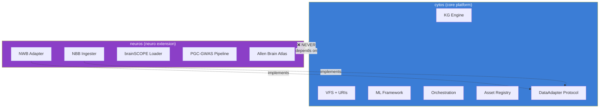

### DataAdapter Protocol

The clean interface between core and domain packages:

```python
# cytos/interfaces/data_adapter.py
class DataAdapter(Protocol):
    """Protocol for modality-specific data adapters."""
    def read(self, uri: str) -> Dataset: ...
    def write(self, dataset: Dataset, uri: str) -> str: ...
    def validate(self, dataset: Dataset) -> ValidationResult: ...
    def supported_formats(self) -> list[str]: ...
```

Domain packages register adapters via plugin entry points:

```toml
# neuros/pyproject.toml
[project.entry-points."cytognosis.adapters"]
nwb = "neuros.adapters.nwb_adapter:NWBAdapter"
brainscope = "neuros.adapters.brainscope_adapter:BrainSCOPEAdapter"
```

### CI Enforcement

A CI check in `cytos` ensures the one-way dependency is never violated:

```bash
# .github/workflows/dependency-check.yml
# Fail if any cytos source file imports from neuros
if grep -r "import neuros\|from neuros" src/cytos/; then
    echo "ERROR: cytos must not depend on neuros"
    exit 1
fi
```

### Future Domain Verticals

The same separation pattern scales to additional clinical domains:

| Package | Domain | Key Adapters | Timeline |
|---------|--------|-------------|:--------:|
| `neuros` | Neuroscience | NWB, brainSCOPE, Allen Brain Atlas | Q3 2026 |
| `cardios` | Cardiology | ECG formats, cardiac MRI, DICOM | Q2 2027 |
| `oncos` | Oncology | TCGA, cBioPortal, clinical trial data | Q3 2027 |
| `immunos` | Immunology | CyTOF, flow cytometry, immune profiling | Q4 2027 |

Each follows the identical pattern: one-way dependency on `cytos`, protocol-based interfaces, plugin entry point registration, and CI-enforced separation.

---

## 12. ARPA-H HSF Alignment

> [!IMPORTANT]
> **ARPA-H's Health Sensing Futures (HSF) program seeks continuous health monitoring infrastructure that intercepts disease before clinical presentation.** Cytoverse provides the computational substrate that makes continuous sensor data interpretable at the causal-biological level.

### Alignment Matrix

| HSF Requirement | Cytoverse Capability | Evidence |
|----------------|----------------------|---------|
| **Continuous health monitoring** | Real-time health coordinate tracking via Cytoscope→Cytoverse pipeline | Sensor schema (ADR-004), TileDB biosignal arrays (ADR-009) |
| **Pre-symptomatic detection** | Causal SCM hierarchy detects trajectory deviations before clinical thresholds | Section 7: counterfactual health trajectories |
| **Multi-modal integration** | 5-modality TileDB storage with cross-resolution alignment | Section 6 + Section 8 |
| **Population-scale** | TileDB-SOMA handles 100M+ cells, TileDB-VCF scales to millions of genomes | ADR-009, CZI Cell Census benchmark |
| **Equitable access** | Open-source platform, non-profit mission, health equity by design | 501(c)(3) structure, CC-BY licensing |
| **Actionable insights** | Counterfactual reasoning generates specific intervention recommendations | Section 7: counterfactual queries |
| **Reproducible science** | Four-layer provenance stack with FAIR publication | Section 4, RO-Crate WRROC profiles |

### Positioning Statement

Cytoverse positions as the missing infrastructure layer between raw health sensor data and clinical insight. Existing approaches suffer from three blind spots that Cytoverse addresses:

| Blind Spot | Current State | Cytoverse Solution |
|------------|---------------|-------------------|
| **Mechanistic** | Symptoms trigger diagnosis (reactive) | Causal SCMs trace from molecular perturbation to clinical outcome (proactive) |
| **Temporal** | Point-in-time snapshots miss trajectory information | Continuous health coordinates with CFM-based trajectory modeling |
| **Complexity** | Population averages ignore individual biology | Personalized SCMs conditioned on individual genotype and environment |

### Key Differentiators for ARPA-H

1. **Cellular intelligence, not just sensor analytics.** Cytoverse maps sensor signals to their cellular-mechanistic origins through the multi-resolution alignment framework, not just statistical anomaly detection.

2. **Causal, not correlational.** The SCM hierarchy enables counterfactual reasoning ("what if this intervention?") rather than pattern matching ("this looks abnormal"). This supports the HSF's goal of actionable interception.

3. **Open infrastructure, not a proprietary product.** As a 501(c)(3) nonprofit FRO, Cytoverse functions as shared public infrastructure. The entire stack is open-source, ensuring reproducibility and broad access.

4. **Founded by lived experience.** Shahin Mohammadi's 37-year diagnostic odyssey, resolved by self-directed genomic analysis identifying an ultra-rare TBX1 mutation, grounds the platform in the reality of diagnostic failure. Cytognosis exists so no one else waits decades for answers.

### Focus Areas

| Focus Area | Cytoverse Contribution | Target Population |
|------------|----------------------|-------------------|
| **Chronic disease interception** | Detect metabolic, cardiovascular, and autoimmune trajectory deviations 5-10 years before clinical presentation | 60% of US adults with at least one chronic condition |
| **Health equity** | Open-source platform + Solid Pod data sovereignty (ADR-008) ensure underserved communities benefit | Communities historically excluded from precision medicine |
| **Precision prevention** | Personalized risk trajectories replace population-average screening guidelines | Individuals with rare variant backgrounds (TBX1, BRCA, etc.) |

---

## 13. Implementation Timeline

### Phase Overview

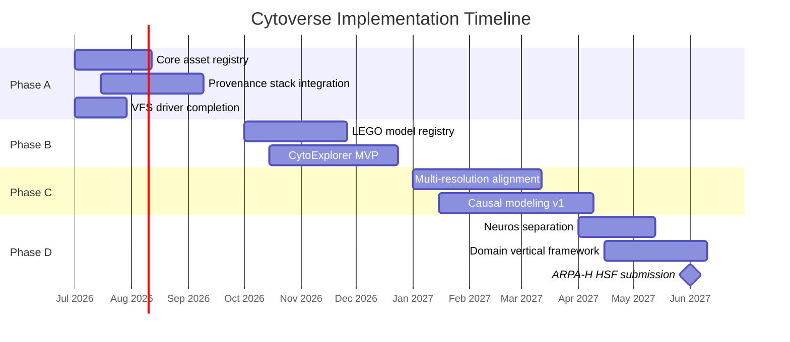

### Phase A: Core Infrastructure (Q3 2026)

| Deliverable | Duration | Dependencies | Success Criteria |
|-------------|:--------:|:------------:|-----------------|
| LaminDB deployment on Cloud SQL | 2 weeks | GCP infrastructure | `cytognosis://` URI resolution works end-to-end |
| bionty ontology integration | 1 week | LaminDB deployment | Organism, tissue, assay annotations on all registered artifacts |
| VFS driver chain completion | 4 weeks | URI scheme (done) | All 7 VFS backends (Local, DVC, GCS, TileDB, Zenodo, SWH, HF) operational |
| SHA-256 content-addressing | 1 week | LaminDB deployment | Every artifact receives content hash on registration |
| Provenance identity mapping | 2 weeks | LaminDB + MLflow + redun | Cross-system ID resolution table populated by `cytoskeleton run` |
| FAIRDOM-SEEK self-hosting | 2 weeks | GCP infrastructure | `hub.cytognosis.org` operational with Cytognosis branding |
| DVC → LaminDB bridge | 2 weeks | LaminDB deployment | DVC pipeline outputs auto-registered in LaminDB |

### Phase B: Discovery and Composition (Q4 2026)

| Deliverable | Duration | Dependencies | Success Criteria |
|-------------|:--------:|:------------:|-----------------|
| LEGO block schema (LinkML) | 2 weeks | EDAM integration | `lego.yaml` manifest validates against LinkML schema |
| EDAM type-matching engine | 3 weeks | LEGO schema | Block composition validated at pipeline construction time |
| Model lifecycle workflow | 2 weeks | LaminDB, MLflow | Draft → Validated → Published lifecycle operational |
| First 10 LEGO blocks | 4 weeks | All Phase B infra | 10 blocks covering variant annotation, cell typing, pathway enrichment |
| CytoExplorer frontend | 6 weeks | React, Sigma.js | Interactive graph exploration with dark theme and entity colors |
| Meilisearch indexing pipeline | 2 weeks | KG rebuild pipeline | Sub-50ms hybrid search across 10.7M nodes |
| ForceAtlas2 layout precomputation | 2 weeks | Sigma.js integration | Overview tier renders full KG without client-side layout computation |

### Phase C: Intelligence Layer (Q1 2027)

| Deliverable | Duration | Dependencies | Success Criteria |
|-------------|:--------:|:------------:|-----------------|
| Cross-resolution connectors | 6 weeks | LEGO registry | Gene→Cell, Cell→Tissue, Tissue→Organism connectors operational |
| CKA alignment validation | 2 weeks | Connectors | CKA scores > 0.7 on reference datasets |
| GW-OT transport maps | 4 weeks | Connectors | Molecular-to-cellular alignment converges on training data |
| Genomic SCM prototype | 6 weeks | GenomeKG | Variant→expression→pathway causal chain validated |
| CFM trajectory model | 6 weeks | SCM prototype | Health trajectory predictions on synthetic cohort data |
| Counterfactual engine | 4 weeks | SCM + CFM | Intervention queries produce biologically plausible trajectories |

### Phase D: Domain Graduation (Q2 2027)

| Deliverable | Duration | Dependencies | Success Criteria |
|-------------|:--------:|:------------:|-----------------|
| neuros package separation | 4 weeks | DataAdapter protocol | 23 modules relocated, CI enforcement passing |
| Plugin entry point system | 2 weeks | neuros separation | `cytognosis.adapters` entry points discovered at runtime |
| cardios scaffold | 2 weeks | Plugin system | ECG adapter, cardiac pathway annotations |
| Domain vertical documentation | 2 weeks | All separations | Contribution guide for new domain packages |
| ARPA-H HSF application draft | 4 weeks | All Phases A-C | Complete application with Cytoverse architecture as technical plan |

---

## 14. Risk Assessment

| # | Risk | Probability | Impact | Mitigation |
|:-:|------|:-----------:|:------:|------------|
| 1 | **LaminDB API instability** (pre-1.0, evolving) | Medium | High | Pin to specific version. Wrap all calls through `cytoskeleton.catalog` adapter layer. Maintain local fork if API breaks. |
| 2 | **redun maintenance risk** (small team, Insitro-maintained) | Medium | High | redun core is ~5K lines, forkable. Content-addressed caching concept is portable to Snakemake or custom engine. CWL export planned for external interop. |
| 3 | **TileDB fragment accumulation** | Medium | Medium | Automated consolidation job (weekly cron). Monitor fragment count per array. Alert threshold: >1000 unconsolidated fragments. |
| 4 | **Cross-resolution alignment quality** | High | High | Start with well-characterized reference datasets (e.g., PBMC 10x multiome). Validate against known biology before deploying on novel data. CKA/GW-OT methods have theoretical guarantees. |
| 5 | **EDAM annotation burden** | Medium | Medium | Build AI-assisted annotation tool using LLM + EDAM embeddings. Pre-populate common operations. Provide annotation templates for each LEGO block type. |
| 6 | **Causal model identifiability** | High | High | SCMs require assumptions about causal structure. Use observational + interventional data where available. Report confidence intervals on causal estimates. Validate with Mendelian randomization. |
| 7 | **DVC ownership change** (lakeFS acquisition) | Medium | Medium | VFS abstraction isolates cytos from DVC internals. DataLad is a tested swap-in alternative. Monitor lakeFS roadmap quarterly. |
| 8 | **Scope creep across domain verticals** | Medium | Medium | Strict one-way dependency enforcement via CI. Each vertical has its own release cycle. Core platform changes require cross-vertical compatibility review. |
| 9 | **ARPA-H HSF program timeline uncertainty** | Medium | High | Build Cytoverse architecture regardless of HSF outcome. Architecture serves internal research needs and other funding applications (NIH, NSF). |
| 10 | **Single-developer bottleneck** | High | Critical | Prioritize infrastructure that reduces bus factor: comprehensive documentation, CI/CD automation, LaminDB's built-in provenance reduces tribal knowledge. Recruit first engineering hire by Q4 2026. |

---

## Technology Stack Summary

| Layer | Component | Technology | Status |
|-------|-----------|------------|:------:|
| **Data** | Knowledge graph | Neo4j + SurrealDB | ✅ Deployed |
| **Data** | Array storage | TileDB (SOMA, VCF, BioImaging, Embedded) | 🔶 Partial |
| **Data** | Object storage | GCS | ✅ Deployed |
| **Data** | Search index | Meilisearch | 📋 Planned |
| **Registry** | Asset catalog | LaminDB + bionty | 📋 Planned |
| **Registry** | Model registry | LEGO blocks on LaminDB | 📋 Planned |
| **Registry** | FAIR catalog | FAIRDOM-SEEK | 📋 Planned |
| **Pipeline** | Python workflows | redun | 📋 Planned |
| **Pipeline** | Bioinformatics | Nextflow + nf-core | 📋 Planned |
| **Pipeline** | Data versioning | DVC | ✅ Deployed |
| **Pipeline** | Experiment tracking | MLflow | ✅ Deployed |
| **Provenance** | Packaging | RO-Crate (WRROC) | 🔶 Partial |
| **Provenance** | Publication | Zenodo + WorkflowHub | 📋 Planned |
| **Compute** | Schema | LinkML | ✅ Deployed |
| **Compute** | Validation | SHACL | ✅ Deployed |
| **Compute** | Causal modeling | SCM + CFM (PyTorch) | 📋 Planned |
| **Frontend** | Graph explorer | Sigma.js v3 + React | 📋 Planned |
| **Frontend** | Experiment UI | React + FastAPI | 📋 Planned |
| **Infra** | Database | PostgreSQL (Cloud SQL) | ✅ Deployed |
| **Infra** | Cache | Redis (Memorystore) | 📋 Planned |
| **Infra** | CLI | `cytoskeleton` | ✅ Deployed |

---

## ADR Cross-Reference Index

| ADR | Title | Sections Referenced |
|:---:|-------|:-------------------:|
| [ADR-001](file:///home/mohammadi/repos/cytognosis/org/plans/architecture-decisions.md#adr-001-central-asset-registry-on-lamindb) | Central Asset Registry on LaminDB | §3, §4, §5, §8 |
| [ADR-002](file:///home/mohammadi/repos/cytognosis/org/plans/architecture-decisions.md#adr-002-four-layer-provenance-stack) | Four-Layer Provenance Stack | §4, §9, §12 |
| [ADR-003](file:///home/mohammadi/repos/cytognosis/org/plans/architecture-decisions.md#adr-003-dual-engine-experiment-orchestration) | Dual-Engine Experiment Orchestration | §9, §13 |
| [ADR-004](file:///home/mohammadi/repos/cytognosis/org/plans/architecture-decisions.md#adr-004-linkml-universal-sensor-schema) | LinkML Universal Sensor Schema | §8, §12 |
| [ADR-005](file:///home/mohammadi/repos/cytognosis/org/plans/architecture-decisions.md#adr-005-cytos-neuros-separation) | Cytos-Neuros Separation | §11, §13 |
| [ADR-006](file:///home/mohammadi/repos/cytognosis/org/plans/architecture-decisions.md#adr-006-cap-protocol-integration-strategy) | CAP Protocol Integration Strategy | §4, §12 |
| [ADR-007](file:///home/mohammadi/repos/cytognosis/org/plans/architecture-decisions.md#adr-007-cytoexplorer-visualization-stack) | CytoExplorer Visualization Stack | §10 |
| [ADR-008](file:///home/mohammadi/repos/cytognosis/org/plans/architecture-decisions.md#adr-008-data-sovereignty-via-solid-pods) | Data Sovereignty via Solid Pods | §12 |
| [ADR-009](file:///home/mohammadi/repos/cytognosis/org/plans/architecture-decisions.md#adr-009-tiledb-based-multi-modal-storage) | TileDB-Based Multi-Modal Storage | §8, §12 |
| [ADR-010](file:///home/mohammadi/repos/cytognosis/org/plans/architecture-decisions.md#adr-010-composable-biological-model-registry) | Composable Biological Model Registry | §5, §6, §13 |
| [ADR-011](file:///home/mohammadi/repos/cytognosis/org/plans/architecture-decisions.md#adr-011-experiment-management-interface) | Experiment Management Interface | §4, §9 |
| [ADR-012](file:///home/mohammadi/repos/cytognosis/org/plans/architecture-decisions.md#adr-012-edam-ontology-for-tool-classification) | EDAM Ontology for Tool Classification | §3, §5 |

---

## Research Document Cross-Reference

| Document | Location | Sections Informing |
|----------|----------|--------------------|
| Central Asset Registry Research | [central-asset-registry-research.md](file:///home/mohammadi/repos/cytognosis/org/plans/research/central-asset-registry-research.md) | §3 |
| LaminDB Deep Analysis | [lamindb-deep-analysis.md](file:///home/mohammadi/repos/cytognosis/org/plans/research/lamindb-deep-analysis.md) | §3, §4 |
| Experiment Orchestration Research | [experiment-orchestration-research.md](file:///home/mohammadi/repos/cytognosis/org/plans/research/experiment-orchestration-research.md) | §4, §9 |
| Bio Model Zoos Research | [bio-model-zoos-research.md](file:///home/mohammadi/repos/cytognosis/org/plans/research/bio-model-zoos-research.md) | §5 |
| Biotools Schema EDAM Research | [biotools-schema-edam-research.md](file:///home/mohammadi/repos/cytognosis/org/plans/research/biotools-schema-edam-research.md) | §5, §3 |
| Cytos-Neuros Separation | [cytos-neuros-separation.md](file:///home/mohammadi/repos/cytognosis/org/plans/research/cytos-neuros-separation.md) | §11 |
| CytoExplorer Interface Research | [cytoexplorer-interface-research.md](file:///home/mohammadi/repos/cytognosis/org/plans/research/cytoexplorer-interface-research.md) | §10 |
| TileDB Cloud Analysis | [tiledb-cloud-analysis.md](file:///home/mohammadi/repos/cytognosis/org/plans/research/tiledb-cloud-analysis.md) | §8 |
| Experiment Management Interface | [experiment-management-interface.md](file:///home/mohammadi/repos/cytognosis/org/plans/research/experiment-management-interface.md) | §9 |
| Domain Vertical Naming | [domain-vertical-naming.md](file:///home/mohammadi/repos/cytognosis/org/plans/research/domain-vertical-naming.md) | §11 |
| Universal Sensor Schema | [universal-sensor-schema.md](file:///home/mohammadi/repos/cytognosis/org/plans/research/universal-sensor-schema.md) | §8, §12 |
| Data Infrastructure Research | [data-infrastructure-research.md](file:///home/mohammadi/repos/cytognosis/org/plans/data-infrastructure-research.md) | §3, §4, §8 |
| Solid Pods Comprehensive | [solid-pods-comprehensive.md](file:///home/mohammadi/repos/cytognosis/org/plans/research/solid-pods-comprehensive.md) | §12 |
| CAP Protocol Assessment | [cap-protocol-assessment.md](file:///home/mohammadi/repos/cytognosis/org/plans/research/cap-protocol-assessment.md) | §4, §12 |

---

## Revision History

| Date | Change | Author |
|------|--------|--------|
| 2026-05-25 | Initial creation, synthesized from 18 research documents and 12 ADRs | Shahin Mohammadi |

---

**Document Version**: 1.0
**Last Updated**: 2026-05-25
**Next Review**: After Phase A implementation begins (~August 2026)
**Owner**: Shahin Mohammadi, Cytognosis Foundation
