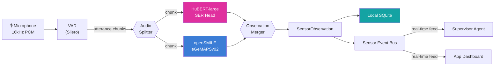

# Cytonome Universal Sensor Architecture

> **Status**: v0.1 (Design Specification)
> **Date**: 2026-05-17
> **Scope**: Defines the pluggable sensor framework for Cytonome, enabling modular, user-controlled data streams from heterogeneous input sources

---

## 1. Design Philosophy

Cytonome operates as a "GPS for Health," and like GPS, it requires sensors. The sensor architecture follows three principles:

1. **Sensor Independence**: Each sensor is a self-contained unit that produces structured observations. Sensors know nothing about each other.
2. **User Sovereignty**: Users connect and disconnect sensors at will. No sensor is mandatory. All data stays on-device unless explicitly exported.
3. **Universal Schema**: Every sensor, regardless of modality (voice, wearable, image, text), describes itself and its outputs using the same schema language. Any organization can implement a sensor plugin.

This mirrors how smartphone apps integrate peripherals: a heart rate monitor from Apple Watch, a glucose monitor from Dexcom, or a sleep tracker from OURA all speak through a common health data layer. Cytonome's sensor layer is that common layer for cognitive and emotional health.

---

## 2. Sensor Descriptor Schema

Every sensor registers itself with a `SensorDescriptor`. This is the universal language for sensor identity and capabilities.

```python
from __future__ import annotations

from datetime import datetime
from enum import StrEnum
from typing import Any

from pydantic import BaseModel, Field


class SensorModality(StrEnum):
    """Primary input modality of the sensor."""
    VOICE = "voice"           # Audio stream analysis
    TEXT = "text"             # Natural language analysis
    IMAGE = "image"           # Still image / photo analysis
    VIDEO = "video"           # Video stream analysis
    PHYSIOLOGICAL = "physio"  # Wearable / biometric data
    MULTIMODAL = "multimodal" # Fused from multiple modalities
    ENVIRONMENTAL = "env"     # Ambient context (light, noise, location)


class SensorCategory(StrEnum):
    """Functional category of what the sensor measures."""
    EMOTION = "emotion"
    COGNITION = "cognition"
    VITALS = "vitals"
    SLEEP = "sleep"
    ACTIVITY = "activity"
    SPEECH = "speech"
    SOCIAL = "social"
    ENVIRONMENT = "environment"


class SensorPrivacyLevel(StrEnum):
    """How sensitive the sensor's output data is."""
    BIOMETRIC = "biometric"    # Voice prints, facial features — never transmitted
    HEALTH = "health"          # Heart rate, HRV, SpO2 — on-device only
    BEHAVIORAL = "behavioral"  # Activity, sleep patterns — user-controlled export
    CONTEXTUAL = "contextual"  # Ambient noise level, time of day — lowest sensitivity


class ObservationField(BaseModel):
    """A single field in a sensor's output schema."""
    name: str
    dtype: str                     # "float", "int", "str", "list[float]", "enum"
    unit: str | None = None        # "Hz", "ms", "bpm", "0-1", "categorical"
    description: str
    clinical_relevance: str | None = None
    range_min: float | None = None
    range_max: float | None = None
    enum_values: list[str] | None = None


class SensorDescriptor(BaseModel):
    """Universal sensor registration. Every sensor plugin implements this."""

    # Identity
    sensor_id: str = Field(description="Unique identifier, e.g. 'cytonome.voice.emotion.hubert'")
    name: str = Field(description="Human-readable name, e.g. 'Voice Emotion Sensor'")
    version: str = Field(description="Semantic version, e.g. '0.1.0'")
    author: str = Field(description="Organization or individual")
    license: str = Field(description="SPDX license identifier")

    # Classification
    modality: SensorModality
    categories: list[SensorCategory]
    privacy_level: SensorPrivacyLevel

    # Capabilities
    realtime: bool = Field(description="Can produce observations in real-time (<100ms)")
    sample_rate_hz: float | None = Field(
        default=None,
        description="Expected input sample rate (e.g. 16000 for audio, 1.0 for per-second)"
    )
    observation_interval_ms: float | None = Field(
        default=None,
        description="How often the sensor produces an observation (e.g. 250ms for per-utterance)"
    )
    languages: list[str] = Field(
        default_factory=lambda: ["*"],
        description="ISO 639-1 codes supported, or ['*'] for language-independent"
    )

    # Output schema
    observation_fields: list[ObservationField]

    # Hardware requirements
    requires_microphone: bool = False
    requires_camera: bool = False
    requires_bluetooth: bool = False
    requires_internet: bool = False
    min_memory_mb: int = 0
    min_compute_flops: float = 0.0  # for model-based sensors

    # Dependencies
    model_ids: list[str] = Field(
        default_factory=list,
        description="Model identifiers this sensor depends on, e.g. 'hubert-large-ls960-ft'"
    )
    external_packages: list[str] = Field(
        default_factory=list,
        description="Required packages, e.g. ['opensmile>=2.5', 'transformers>=4.40']"
    )
```

---

## 3. Sensor Protocol (Interface)

Every sensor implements the `Sensor` protocol:

```python
from typing import AsyncIterator, Protocol

class SensorObservation(BaseModel):
    """A single observation from a sensor."""
    sensor_id: str
    timestamp: datetime
    session_id: str
    sequence_number: int
    fields: dict[str, Any]  # keys match ObservationField.name
    confidence: float = 1.0
    metadata: dict[str, Any] = Field(default_factory=dict)


class Sensor(Protocol):
    """Universal sensor interface. All sensors implement this."""

    @property
    def descriptor(self) -> SensorDescriptor: ...

    async def initialize(self) -> None:
        """Load models, connect to hardware, validate dependencies."""
        ...

    async def start(self, session_id: str) -> None:
        """Begin producing observations for a session."""
        ...

    async def stop(self) -> None:
        """Stop producing observations. Release resources."""
        ...

    async def observe(self, raw_input: bytes | None = None) -> SensorObservation:
        """Produce a single observation from the current input.

        For pull-based sensors (wearables), raw_input is None; the sensor
        polls its source. For push-based sensors (audio, video), raw_input
        contains the data chunk.
        """
        ...

    def stream(self, raw_input_stream: AsyncIterator[bytes]) -> AsyncIterator[SensorObservation]:
        """Produce a stream of observations from a stream of inputs.

        Default implementation calls observe() on each chunk.
        """
        ...

    async def teardown(self) -> None:
        """Clean up. Release models from memory."""
        ...
```

---

## 4. Sensor Registry and User Control

```python
class SensorRegistry:
    """Central registry for available and active sensors."""

    def list_available(self) -> list[SensorDescriptor]:
        """List all installed sensor plugins."""
        ...

    def list_active(self) -> list[SensorDescriptor]:
        """List sensors the user has enabled."""
        ...

    async def connect(self, sensor_id: str) -> None:
        """User enables a sensor. Initialize and validate."""
        ...

    async def disconnect(self, sensor_id: str) -> None:
        """User disables a sensor. Stop and teardown."""
        ...

    def get_sensor(self, sensor_id: str) -> Sensor:
        """Get an active sensor instance by ID."""
        ...
```

In the Cytonome app, this translates to a Settings → Sensors page where the user sees available sensors as cards, each with a toggle to connect/disconnect and a summary of what it measures.

---

## 5. Instance 0: Voice Emotion Sensor (HuBERT + openSMILE)

The first sensor in the Cytonome ecosystem. This is a **push-based** sensor that receives audio chunks from the microphone and produces per-utterance emotion + vocal biomarker observations.

### 5.1 Descriptor

```python
voice_emotion_descriptor = SensorDescriptor(
    sensor_id="cytonome.voice.emotion.v0",
    name="Voice Emotion Sensor",
    version="0.1.0",
    author="Cytognosis Foundation",
    license="Apache-2.0",
    modality=SensorModality.VOICE,
    categories=[SensorCategory.EMOTION, SensorCategory.COGNITION],
    privacy_level=SensorPrivacyLevel.BIOMETRIC,
    realtime=True,
    sample_rate_hz=16000.0,
    observation_interval_ms=250.0,
    languages=["*"],  # paralinguistic features are language-independent
    observation_fields=[
        ObservationField(name="emotion_categorical", dtype="enum", description="Detected emotion category", enum_values=["anger", "sadness", "fear", "joy", "neutral", "surprise", "disgust"]),
        ObservationField(name="emotion_confidence", dtype="float", unit="0-1", description="Confidence in categorical prediction", range_min=0.0, range_max=1.0),
        ObservationField(name="valence", dtype="float", unit="-1 to 1", description="Emotional valence (negative to positive)", range_min=-1.0, range_max=1.0),
        ObservationField(name="arousal", dtype="float", unit="0-1", description="Emotional arousal (calm to activated)", range_min=0.0, range_max=1.0),
        ObservationField(name="dominance", dtype="float", unit="0-1", description="Perceived dominance (submissive to dominant)", range_min=0.0, range_max=1.0),
        ObservationField(name="pitch_mean_hz", dtype="float", unit="Hz", description="Mean fundamental frequency"),
        ObservationField(name="pitch_std_hz", dtype="float", unit="Hz", description="F0 standard deviation"),
        ObservationField(name="speech_rate_syl_sec", dtype="float", unit="syl/sec", description="Syllables per second"),
        ObservationField(name="jitter_percent", dtype="float", unit="%", description="Cycle-to-cycle pitch variation"),
        ObservationField(name="shimmer_db", dtype="float", unit="dB", description="Amplitude variation"),
        ObservationField(name="hnr_db", dtype="float", unit="dB", description="Harmonic-to-noise ratio"),
        ObservationField(name="pause_count", dtype="int", description="Number of pauses in utterance"),
        ObservationField(name="pause_total_ms", dtype="float", unit="ms", description="Total pause duration"),
    ],
    requires_microphone=True,
    requires_internet=False,
    min_memory_mb=512,
    model_ids=["facebook/hubert-large-ls960-ft"],
    external_packages=["opensmile>=2.5", "transformers>=4.40", "torch>=2.2"],
)
```

### 5.2 Architecture



### 5.3 Why This Is Sensor 0

1. **Language-independent**: Paralinguistic features (pitch, jitter, shimmer, HNR) are universal. HuBERT's representations are trained on raw audio, not transcribed text. This sensor works for any language from day one.
2. **Privacy-first**: All processing is on-device. Raw audio is ephemeral (deleted after feature extraction). Only structured observations are stored.
3. **Clinically validated**: openSMILE's eGeMAPSv02 feature set is the standard in computational paralinguistics research (Interspeech, AVEC challenges).
4. **Separable from speech**: This sensor runs in parallel with the speech processing pipeline but produces independent observations. It can be connected or disconnected without affecting conversation flow.

---

## 6. Future Sensor Roadmap

| Priority | Sensor | Modality | Source | Notes |
|---|---|---|---|---|
| **v0.1** | Voice Emotion | Voice | HuBERT + openSMILE | First sensor, Gemma hackathon |
| **v0.2** | Text Emotion | Text | BERT-based sentiment | Analyze conversation transcripts |
| **v0.3** | Facial Emotion | Image/Video | DeiT / MobileFaceNet | Camera-based, opt-in only |
| **v0.4** | Multimodal Fusion | Multimodal | Intermediate fusion | MindMed-style transformer fusion |
| **v1.0** | Apple Watch Vitals | Physiological | HealthKit API | HRV, heart rate, SpO2 |
| **v1.1** | OURA Ring | Physiological | OURA API | Sleep, readiness, activity |
| **v1.2** | CGM | Physiological | Dexcom/Libre API | Glucose variability |
| **v2.0** | Environmental | Environmental | Device sensors | Ambient noise, light, location |

### 6.1 MindMed AI Reference Architecture

The [MindMed AI](https://www.researchsquare.com/article/rs-8613173/v1) paper (Malik et al., 2026) demonstrates a transformer-based multimodal framework for emotion recognition in mental health assessment:

| Modality | Model | Accuracy (Unimodal) |
|---|---|---|
| Voice (acoustic) | HuBERT + openSMILE | **91.22%** (highest unimodal) |
| Face (visual) | DeiT (Data-efficient Image Transformer) | ~85% |
| Text (linguistic) | BERT | ~87% |
| **Intermediate Fusion** | **Transformer cross-attention** | **91.89%** (best overall) |

Key findings for Cytonome:
- **Intermediate fusion** (cross-attention between modality embeddings) outperforms both unimodal and early fusion (concatenation)
- Voice is the strongest single modality for emotion detection
- The fusion layer does not need to be in any individual sensor; it belongs in the **Supervisor Agent** or **Guardian Agent** layer

This validates our architecture: individual sensors produce independent observations, and the fusion/interpretation happens at a higher level in the agent hierarchy.

---

## 7. Third-Party Sensor Plugin Example

Any organization can create a sensor plugin by implementing the `Sensor` protocol and providing a `SensorDescriptor`:

```python
# Example: hypothetical OURA Ring sensor plugin
class OuraRingSensor:
    """Cytonome sensor plugin for OURA Ring Gen 3+."""

    @property
    def descriptor(self) -> SensorDescriptor:
        return SensorDescriptor(
            sensor_id="oura.ring.vitals.v1",
            name="OURA Ring Vitals",
            version="1.0.0",
            author="OURA Health",
            license="MIT",
            modality=SensorModality.PHYSIOLOGICAL,
            categories=[SensorCategory.VITALS, SensorCategory.SLEEP, SensorCategory.ACTIVITY],
            privacy_level=SensorPrivacyLevel.HEALTH,
            realtime=False,  # polled every 5 minutes
            sample_rate_hz=0.003,  # ~every 5 min
            observation_interval_ms=300_000,
            languages=["*"],
            observation_fields=[
                ObservationField(name="heart_rate_bpm", dtype="float", unit="bpm", description="Heart rate"),
                ObservationField(name="hrv_ms", dtype="float", unit="ms", description="Heart rate variability (RMSSD)"),
                ObservationField(name="spo2_percent", dtype="float", unit="%", description="Blood oxygen saturation"),
                ObservationField(name="skin_temp_celsius", dtype="float", unit="°C", description="Skin temperature"),
                ObservationField(name="readiness_score", dtype="int", unit="0-100", description="OURA readiness score"),
            ],
            requires_bluetooth=True,
            requires_internet=False,
        )
```

---

## 8. Multi-Language Support

The sensor architecture is inherently multi-language because:

1. **Paralinguistic sensors** (voice emotion, vocal biomarkers) are language-independent. Pitch, jitter, shimmer, HNR, and speech rate are acoustic properties, not linguistic ones.
2. **Text-based sensors** will leverage multilingual models (mBERT, XLM-R) from the start.
3. **The sensor descriptor's `languages` field** declares supported languages, allowing the registry to filter sensors by user's language preference.
4. **The speech layer** (separate from emotion sensing) uses Gemma 4, which supports 35+ languages natively.

Multi-language is not a feature to add later; it is embedded in the architecture from day one.
