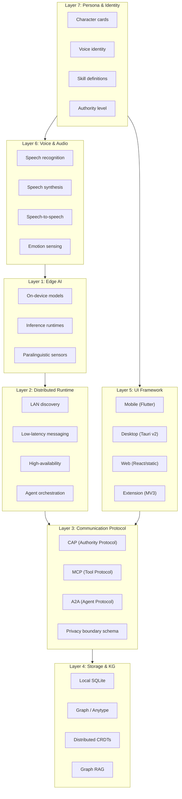

# Cytonome Platform — Unified Master Reference

> **Status**: Living document
> **Date**: 2026-05-17
> **Sources**: 4 research docs (old/), CAP v0.1 spec, Yar implementation, fresh research (May 2026)
> **Scope**: Everything evaluated, selected, or planned for the Cytonome ecosystem

---

## 1. What Cytonome Is

Cytonome is the **on-device, privacy-preserving cognitive-social operating system** of the Cytognosis platform. It is the Navigator: a companion agent on the user's phone that reduces the invisible tax of existing in systems not designed for how many brains actually work, supported by a supervisor agent on a nearby laptop or cloud that provides context, guidance, and continuity. **Yar** is the first product instance of Cytonome, built by neurodivergent minds as a cognitive companion for everyone: capturing thoughts before they vanish, translating communication across neurotypes, and tracking cognitive/emotional patterns longitudinally.

### 1.1 System Layers



---

## 2. Layer 1: Edge AI — Complete Assessment

### 2.1 Inference Runtimes

| Runtime | Platforms | Model Format | Key Strength | License | Yar Status |
|---|---|---|---|---|---|
| **LiteRT-LM** | Android, iOS | TFLite | Google flagship, Gemma optimized, PLE support | Apache 2.0 | ✅ Current pick |
| **Cactus** | iOS, Android, Flutter, RN, KMP | GGUF → `.cact` | Hybrid on-device/cloud routing, NPU accel, tool calling, RAG | MIT | ⚠️ **Evaluate** |
| **llama.cpp** | All | GGUF | 125K+ models, MIT, broadest ecosystem | MIT | Alternative |
| **MLX** | Apple Silicon only | MLX format | Best Apple perf (19-27% faster) | MIT | Apple-only alt |
| **ExecuTorch** | iOS, Android | .pte | Meta-backed, LoRA fine-tuning | BSD | RN-only path |
| **ONNX Runtime** | All | ONNX | Cross-vendor NPU support | MIT | Complementary |
| **Ollama** | Desktop/server | GGUF | "Docker for LLMs", auto-discovery | MIT | ✅ Supervisor |

> [!IMPORTANT]
> **Cactus is the most significant new option** since the original research. Its hybrid routing (on-device for simple/private tasks, cloud for complex ones) aligns with Yar's tiered architecture. Flutter SDK is production-ready. Evaluate against LiteRT-LM for the interviewer role in Phase 2.

### 2.2 Edge Models — Thinking & Reasoning

| Model | Params | Audio? | Edge RAM | License | Multilingual | Best Role |
|---|---|---|---|---|---|---|
| **Gemma 4 E2B** | ~2B eff | ✅ ASR+understanding | ~1.5 GB | Apache 2.0 | 35+ strong | Interviewer (current) |
| **Gemma 4 E4B** | ~4B eff | ✅ ASR+understanding | ~3 GB | Apache 2.0 | 35+ strong | Interviewer (upgrade) |
| **LFM2.5-1.2B** | 1.2B | ❌ Text | ~700 MB | LFM Open ($10M) | 8 langs | Smallest edge reasoning |
| **LFM2-8B-A1B** | 8.3B/1.5B active | ❌ Text | ~5 GB | LFM Open ($10M) | 8 langs | Edge supervisor MoE |
| **Qwen3 4B** | 4B | ❌ Text | ~3 GB | Apache 2.0 | 19+ | Alternative edge reasoning |
| **Gemma 4 26B-A4B** | 26B/4B active | ❌ Text | ~24 GB | Apache 2.0 | 35+ | **Supervisor (selected)** |
| **Gemma 4 31B** | 31B dense | ❌ Text | ~64 GB | Apache 2.0 | 35+ | Cloud supervisor |

### 2.3 Edge Models — Voice

| Model | Type | Params | Latency | Duplex | Edge RAM | License |
|---|---|---|---|---|---|---|
| **Whisper** | ASR only | 39M-1.5B | Fast | N/A | <1 GB | Apache 2.0 |
| **Parakeet TDT-0.6B** | ASR only | 600M | Very fast (high RTFx) | N/A | ~400 MB | Apache 2.0 |
| **Kokoro 82M** | TTS only | 82M | Fast | N/A | <100 MB | Apache 2.0 |
| **Fish Audio S2 Pro** | TTS only | 4B | ~100ms | N/A | ~3 GB | Research |
| **LFM2.5-Audio-1.5B** | **S2S** | 1.5B | <100ms | Streaming | ~1 GB | LFM Open |
| **Moshi 7B** | **S2S** | 7B | ~200ms | **Native full-duplex** | ~8 GB | CC-BY 4.0 |
| **Qwen3.5-Omni** | **S2S** | 30B/3B active | ~234ms | Streaming | ~15 GB (Q4) | Apache 2.0 |
| **GLM-4-Voice 9B** | **S2S** | 9B | Streaming | Full-duplex | ~8 GB (Q4) | Custom |

> [!TIP]
> **Parakeet TDT-0.6B** is a strong Whisper alternative: better speed, Apache 2.0, ONNX-optimized for edge. Evaluate for Yar's cascaded pipeline as a Whisper replacement. **NVIDIA Nemotron Speech** is also worth tracking for ultra-low-latency streaming ASR.

### 2.4 Emotion & Paralinguistic Sensing

| Component | Purpose | Tech |
|---|---|---|
| Speech emotion recognition | Detect emotion categories | HuBERT-large fine-tuned on IEMOCAP/RAVDESS |
| Acoustic features | Prosodic feature extraction | openSMILE eGeMAPSv02 (88 features/frame) |
| Voice quality biomarkers | Vocal stress | Jitter, shimmer, HNR |
| Hesitation detection | Uncertainty, processing load | VAD + pause-duration + filler detection |
| Continuous sentiment | Valence/arousal tracking | Dimensional model |

---

## 3. Layer 2: Distributed Runtime

### 3.1 Selected Stack

| Component | Pick | License | Why |
|---|---|---|---|
| Agent runtime | **Dapr Agents** | Apache 2.0 | Virtual actors, language-agnostic sidecar, durable workflows |
| Message bus | **NATS JetStream** | Apache 2.0 | Sub-ms LAN latency, single ~20MB binary |
| Real-time signal | **LiveKit Agents** | Apache 2.0 | WebRTC media + data channels |
| Orchestration | **Google ADK** | Apache 2.0 | Gemma-native function calling, multi-step planning |
| LAN discovery | **mDNS/DNS-SD** | RFC standard | `_cytonome-agent._tcp`, TXT records for role/model/tools |
| Distributed state | **Iroh Documents** | MIT | CRDTs, mobile-ready, QUIC transport, BLAKE3 |

### 3.2 HA Supervisor Pattern (3-tier)

1. **Tier 1**: Primary supervisor on laptop (Gemma 4 26B MoE)
2. **Tier 2**: Hot standby in cloud (replicated state via NATS)
3. **Tier 3**: Local degraded mode on phone (conservative script, safe close)

Takeover: heartbeat loss >2s → standby takes over. Both unreachable >5s → phone enters degraded mode.

### 3.3 Frameworks Evaluated & Dropped

| Framework | Why Dropped |
|---|---|
| MAF on Orleans | Requires MAUI; incompatible with Flutter |
| AgentScope 1.0 | Weak HA primitives |
| LangGraph | Single-process; no native distributed runtime |
| AutoGen/CrewAI/Letta/Swarm | Single-process orchestrators |
| Ray | Viable for cloud tier; overkill for LAN |

---

## 4. Layer 3: Communication & Coordination (CAP Scope)

**This is the layer CAP governs.** See [02_cap_comprehensive.md](file:///home/mohammadi/.gemini/antigravity/brain/3a11be50-0404-4087-86d2-471b9987ec43/artifacts/02_cap_comprehensive.md) for the dedicated deep-dive.

### 4.1 Protocols Inventory

| Protocol | Scope | Status | Relationship to CAP |
|---|---|---|---|
| **CAP** | Authority + safety boundary | v0.1 Production Candidate | **Central** |
| **MCP** | Agent ↔ tools | De facto standard | CAP wraps MCP calls |
| **A2A** | Agent ↔ agent | Emerging standard (150+ orgs) | CAP metadata in A2A messages |
| **OPA/Rego** | Policy evaluation | Mature | CAP Guard adapter |
| **OpenTelemetry** | Observability | Mature | `cap.*` semantic conventions |
| **W3C PROV-O** | Provenance | Standard | CAP maps roles → PROV agents |
| **DSSE/in-toto/SLSA** | Supply-chain attestation | Mature | Decision chain verification |
| **ACP** (IBM) | Governance | Early | Monitor |
| **ANP** (W3C DID) | Identity | Early | Monitor |
| **LMOS** | Multi-agent OS | Early | Monitor |

### 4.2 Privacy Boundary Schema (Must-Draft)

Everything above the boundary stays on-device. The schema defines exactly what crosses:

| Crosses to supervisor | Never crosses |
|---|---|
| `stress_signal(level, timestamp)` | Raw audio |
| `topic_shift(from, to, timestamp)` | Transcripts |
| `user_disengaged(timestamp, severity)` | Raw feature vectors |
| `session_phase`, `mood_arc` | Free-text from user |
| Structured guidance hints | Audio fragments |
| Supervisor interrupt signals | PHI identifiers |

### 4.3 Session Lifecycle (TCP-like)

1. **Discovery**: mDNS query for `role=supervisor`
2. **Handshake**: DH key exchange + signed session token
3. **Session armed**: Interview may begin
4. **Active session**: NATS pub/sub (<1ms), LiveKit data channels
5. **Resilience**: Buffer locally on drop, reconnect within 2min, replay

---

## 5. Layer 4: Storage & Knowledge Graph

### 5.1 Current (Yar)

| Component | Status |
|---|---|
| **SQLite** | ✅ Primary local store (objects, links, captures, voice turns, write plans) |
| **Graph Store** | ✅ Graph abstraction over SQLite link table |
| **Anytype MCP** | ✅ Optional external KG (read/search/guarded-write via MCP) |
| **Schema Registry** | ✅ LinkML-like YAML → normalized schema → JSON Schema validation |

### 5.2 Planned/Evaluated

| Component | Purpose | Status |
|---|---|---|
| **Iroh Documents** | Distributed CRDTs for session state sync | Evaluated, not integrated |
| **Neo4j** | Production graph DB for KG queries | Planned (cytoverse) |
| **Graph RAG** | Retrieval over knowledge graph | Needs design |
| **TileDB-VCF** | Genomics data (cytoverse) | Separate system |

---

## 6. Layer 5: UI Framework

### 6.1 Selected Stack

| Surface | Stack | Model | Status |
|---|---|---|---|
| **Mobile** | Flutter + Rive + LiteRT-LM | Gemma 4 E2B | ✅ Functional MVP |
| **Desktop + Web** | React + Vite + Tauri v2 | Gemma 4 26B MoE (sidecar) | Planned |
| **Web Shell** | Static HTML/CSS/JS | Backend API | ✅ Functional basic |
| **Extension** | MV3 Chrome/Firefox | Backend API | Planned |

### 6.2 Key Decision: Split vs. Unified

**Current posture**: Split (Flutter mobile, Tauri desktop/web). Revisit if brand parity becomes critical.

| Approach | Pro | Con |
|---|---|---|
| Split (Flutter + Tauri) | Best per-platform quality, strongest ecosystems | Two codebases, two design systems |
| Flutter everywhere | Single codebase, pixel-perfect | Larger desktop binary, weaker dashboard libs |
| Compose Multiplatform | Strong Kotlin ecosystem, growing fast | Less mature than Flutter, fewer animation libs |

### 6.3 Shared Coherence Mechanisms

- OpenAPI 3.1 spec as contract source of truth
- JSON design tokens (compiled to CSS vars + Dart theme)
- Versioned Rive persona assets
- Single identity provider (Keycloak/Auth0)
- Unified telemetry schema

---

## 7. Layer 6: Voice & Audio Architecture

### 7.1 Four Candidate Architectures (from research)

| Arch | Edge Model | Supervisor | Latency | Best For |
|---|---|---|---|---|
| **A: Gemma Cascaded** | Gemma 4 E4B + Kokoro TTS | Gemma 4 26B MoE | 500-700ms | Multilingual, Apache 2.0 |
| **B: Native S2S** | Moshi 7B | Qwen3.5-Omni | 200-300ms | Full-duplex naturalism |
| **C: Smallest Edge** | LFM2.5-Audio-1.5B | Gemma 4 26B MoE | 300-500ms | Budget phones |
| **D: Lowest Risk** | Whisper + Gemma 4 + Kokoro | Gemma 4 26B MoE | 600-800ms | **Phase 1 pilot** |

**Yar current**: Arch D variant (Gemma 4 E2B/E4B via LiteRT-LM + Ollama, no TTS yet).

### 7.2 Updated Assessment (May 2026)

| Update | Impact |
|---|---|
| **MoshiRAG** (April 2026) | Addresses Moshi's factuality weakness with async knowledge retrieval |
| **Qwen3.5-Omni** (March 2026) | 256K context, Hybrid-MoE, ARIA for smoother speech; still cloud-only for full model |
| **Parakeet TDT v3** | "Sweet spot" for offline voice dictation; ONNX-optimized on consumer hardware |
| **Nemotron Speech** | Ultra-low-latency streaming ASR; worth evaluating for agentic voice |
| **Cactus** hybrid routing | Could simplify Yar's tiered architecture by handling on-device/cloud routing natively |

---

## 8. Layer 7: Persona & Identity

### 8.1 What Exists

| Standard/Tool | Scope | Status |
|---|---|---|
| **Character Card V3 (CCv3)** | JSON persona definition (name, personality, dialogue examples, behavior rules, lorebook) | De facto community standard |
| **SillyTavern** | Frontend for character cards | Dominant hobbyist platform |
| **Rive** | Animated visual persona | ✅ Selected for Flutter mobile |
| **Fish Audio S2** | Voice cloning (48+ emotions) | Evaluate for persona voice |
| **Kokoro 82M** | High-quality TTS | ✅ Selected for cascaded pipeline |
| **NVIDIA PersonaPlex** (Jan 2026) | Full-duplex persona with emotional state | Monitor |

### 8.2 Persona Schema for Cytognosis (Proposed)

```yaml
persona:
  id: "yar-companion"
  name: "Yar"
  version: "1.0"

  # Core identity
  identity:
    role: "cognitive companion"  # "the one beside you"
    specialty: ["cognitive accessibility", "knowledge capture", "gentle planning", "communication translation"]
    non_diagnostic: true  # CAP-Lite enforced
    identity_safe: true   # never a masking engine

  # Voice characteristics
  voice:
    tts_model: "kokoro-82m"
    voice_id: "warm-neutral"
    speech_rate: 0.95  # slightly slower for accessibility
    emotion_range: ["warm", "encouraging", "calm", "curious"]
    avoid: ["clinical", "authoritative", "urgent", "performative"]

  # Behavioral parameters (ND-informed)
  behavior:
    authority_level: "companion"  # not therapist, not authority
    warmth: 0.85           # 0-1 scale
    directness: 0.60
    formality: 0.30
    humor: 0.40
    patience: 0.95         # very high — meets users where they are
    turn_taking: "gentle"  # long pauses OK, no rush
    interruption_style: "minimal"
    shame_avoidance: true  # never guilt, streaks, punishment framing
    emotional_aftercare: true   # post-conversation processing support
    communication_translation: true  # bidirectional ND↔NT bridging
    replay_loop_interruption: true   # helps break rumination cycles
    consistent_interface: true       # never rearranges, predictable patterns

  # Skill capabilities (CAP-enforced)
  skills:
    - knowledge_capture
    - gentle_planning
    - communication_translation
    - reflection_prompting
    # NOT: diagnosis, treatment, prescription, crisis_intervention

  # Safety constraints (CAP-Lite profile)
  constraints:
    non_diagnostic: true
    no_treatment_recommendations: true
    no_raw_data_sharing: true
    explicit_write_confirmation: true

  # Visual representation
  visual:
    type: "rive_animation"
    asset: "yar_companion_v1.riv"
    states: ["idle", "listening", "thinking", "speaking", "empathic"]
```

### 8.3 Persona Layers for Multi-Agent Systems

| Layer | What It Controls | Where Defined |
|---|---|---|
| **Character** | Name, backstory, personality traits, dialogue style | Persona schema (above) |
| **Voice** | TTS model, voice ID, speech rate, emotion palette | Voice config in persona |
| **Authority** | What the agent can/cannot do | **CAP profile** (CAP-Lite, CAP-Med) |
| **Skills** | Domain expertise the agent claims | **cyto-skills** registry |
| **Visual** | Avatar, animation states, reactions | Rive asset + state machine |
| **Memory** | What the agent remembers across sessions | Storage layer config |

---

## 9. Technology Readiness Matrix

| Component | Research | Prototype | MVP | Production | Notes |
|---|---|---|---|---|---|
| CAP v0.1 | ✅ | ✅ | ✅ | ⚠️ Needs external audit | 89/89 tests pass |
| Yar backend | ✅ | ✅ | ✅ | ❌ | Needs Phase 1-6 refactor |
| Flutter mobile | ✅ | ✅ | ✅ | ❌ | Hackathon MVP only |
| Gemma 4 E2B on-device | ✅ | ✅ | ⚠️ | ❌ | 30s audio clip limit |
| Anytype MCP adapter | ✅ | ✅ | ⚠️ | ❌ | 48KB monolith, needs refactor |
| Web shell | ✅ | ✅ | ⚠️ | ❌ | No framework, basic |
| Dapr + NATS runtime | ✅ | ❌ | ❌ | ❌ | Evaluated, not integrated |
| Tauri desktop | ✅ | ❌ | ❌ | ❌ | Evaluated, not started |
| Iroh CRDTs | ✅ | ❌ | ❌ | ❌ | Evaluated, not integrated |
| Paralinguistic sensor | ✅ | ❌ | ❌ | ❌ | Architecture designed |
| Crisis detection | ✅ | ❌ | ❌ | ❌ | Architecture designed |
| Persona system | ⚠️ | ❌ | ❌ | ❌ | Schema proposed above |
| Cactus integration | ⚠️ | ❌ | ❌ | ❌ | Research complete, evaluate |

---

## 10. What's Missing (Tracked Gaps)

| # | Gap | Severity | When |
|---|---|---|---|
| 1 | Privacy boundary schema (formal) | CRITICAL | Before distributed runtime |
| 2 | Crisis detection subsystem | CRITICAL | Before any therapy use |
| 3 | Paralinguistic sensor pipeline | HIGH | Phase 3+ |
| 4 | Persona system (schema + runtime) | MEDIUM | Phase 3+ |
| 5 | Cactus vs LiteRT-LM evaluation | MEDIUM | Phase 2 |
| 6 | Parakeet vs Whisper ASR evaluation | MEDIUM | Phase 2 |
| 7 | Desktop app (Tauri) | MEDIUM | Phase 4+ |
| 8 | **Browser extension (Cytomark)** | **HIGH** | **Phase 2-3** (may be primary interface) |
| 9 | Distributed runtime (Dapr+NATS) | MEDIUM | Future phase |
| 10 | Graph RAG | MEDIUM | Future phase |
| 11 | Full-duplex S2S (Moshi/LFM) | LOW | Phase 4+ (if research justifies) |
| 12 | mDNS peer discovery | LOW | Future phase |
| 13 | Multi-org CAP interop | LOW | CAP v2 |
| 14 | **Vocal biomarker storage** (VocalBiomarkerFrame) | **HIGH** | Phase 3+ |
| 15 | **Communication Translation** (bidirectional ND↔NT) | **HIGH** | Phase 2+ |
| 16 | Emotional aftercare module | MEDIUM | Phase 3+ |
| 17 | Persistent relational context (per-person models) | MEDIUM | Phase 4+ |
