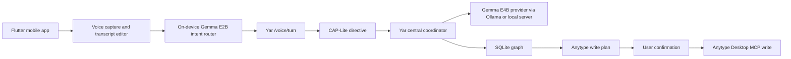
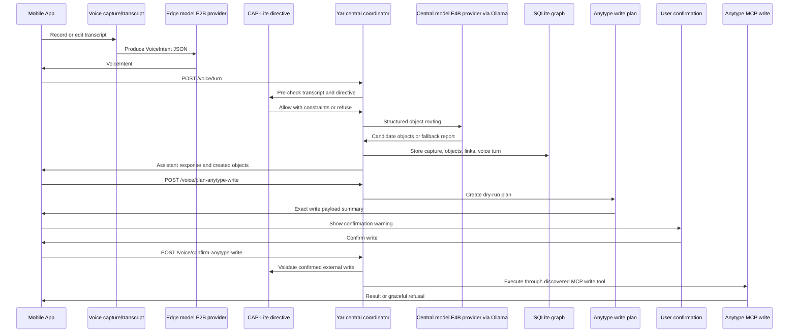

# Product Milestone 1: Mobile Voice Vertical Slice

## Architecture



The vertical slice keeps raw voice transcript handling local-first. External writes are split into plan and confirm steps, and every confirmed execution reuses the existing CAP-Lite guarded Anytype MCP path.

## Implemented Files

Backend:

- `src/yar/models/voice.py` defines `VoiceIntent`, `CAPMobileDirective`, request/response models, status models, and conversation history models.
- `src/yar/core/voice_service.py` orchestrates CAP pre-checks, edge intent resolution, central routing, local graph writes, suggested actions, and voice history.
- `src/yar/api/routes_voice.py` exposes `/product/status` and `/voice/*`.
- `src/yar/core/model_router.py` supports deterministic stub, HTTP JSON, and Ollama-compatible routing with strict JSON requests.
- `src/yar/storage/sqlite_store.py` stores voice conversations and voice turns.

Mobile:

- `mobile/lib/src/screens/app_shell.dart` provides Status, Voice, Objects, Plan, and Settings screens.
- `mobile/lib/src/services/gemma_edge_intent_service.dart` loads the active LiteRT Gemma model and asks it for strict `VoiceIntent` JSON.
- `mobile/lib/src/audio/voice_input_service.dart` wraps platform STT.
- `mobile/lib/src/api/yar_api_client.dart` calls `/product/status`, `/voice/turn`, object search/list, and Anytype plan/confirm endpoints.
- `mobile/test/yar_api_client_test.dart` verifies API parsing and explicit confirmation behavior.

Docs/tests:

- Backend voice tests live in `tests/test_voice_routes.py`.
- Environment examples are in `.env.example`.
- Mobile setup and runtime notes are in `README.md`.

## Sequence



## Setup

Backend:

```bash
cd /Users/ali/Documents/Yas
source venv/bin/activate
pip install -e ".[dev]"
python scripts/register_demo_schema.py
uvicorn yar.main:app --host 0.0.0.0 --port 8000 --reload
```

Find the desktop IP for mobile:

```bash
ipconfig getifaddr en0
```

Mobile:

```bash
cd /Users/ali/Documents/Yas/mobile
flutter pub get
flutter test
flutter run --release -d <your-device-id>
```

Use a physical iOS or Android device for LiteRT-LM model execution. Configure the backend URL in the Settings tab as `http://YOUR_LOCAL_IP:8000`.

Central model:

```bash
export YAR_CENTRAL_MODEL_PROVIDER=ollama
export YAR_CENTRAL_MODEL_ENDPOINT=http://127.0.0.1:11434
export YAR_CENTRAL_MODEL_NAME=gemma4:e4b
export YAR_CENTRAL_MODEL_FALLBACK_TO_STUB=true
```

The target model is Gemma E4B. On this desktop, Ollama exposes it as `gemma4:e4b`; use the exact installed Ollama name in `YAR_CENTRAL_MODEL_NAME`.

Edge model:

```bash
export YAR_EDGE_MODEL_PROVIDER=stub
```

For backend-managed near-device E2B runtime:

```bash
export YAR_EDGE_MODEL_PROVIDER=http_json
export YAR_EDGE_MODEL_ENDPOINT=http://127.0.0.1:9000/voice-intent
export YAR_EDGE_MODEL_NAME=gemma-4-E2B-it
```

Anytype:

```bash
export ANYTYPE_MCP_ENABLED=true
export ANYTYPE_MCP_COMMAND="your-anytype-mcp-command"
export ANYTYPE_API_KEY="your-local-secret"
export ANYTYPE_SPACE_ID="your-space-id"
```

## API Contract

`GET /product/status`

Returns backend status, router provider, edge model status, central model status, Anytype status, and CAP-Lite status. Secrets such as API keys and tokens are redacted.

`POST /voice/turn`

```json
{
  "conversation_id": null,
  "transcript": "Save this: this paper introduces a Gemma method for annotation of research datasets and the code is on GitHub.",
  "source": "mobile",
  "edge_model_provider": "mobile_local",
  "edge_intent": {
    "intent_type": "capture",
    "user_goal": "save research capture",
    "object_hints": [{"type": "Paper", "source_term": "paper"}],
    "search_query": null,
    "requested_external_write": true,
    "confidence": 0.8
  },
  "schema_id": null,
  "schema_name": null,
  "validation_mode": "permissive",
  "user_confirmed_external_write": false
}
```

Returns:

- `conversation_id`
- `assistant_message`
- `created_objects`
- `suggested_actions`
- `model_report.edge`
- `model_report.central`
- `validation_report`
- `cap_report`
- `mobile_directive`
- `anytype_plan`

`POST /voice/plan-anytype-write`

```json
{
  "conversation_id": "conversation-id",
  "local_object_ids": ["object-id"],
  "action": "create",
  "target_kind": "object"
}
```

Creates a dry-run `AnytypeWritePlan`. It does not execute any external write.

`POST /voice/confirm-anytype-write`

```json
{
  "conversation_id": "conversation-id",
  "plan_id": "plan-id",
  "user_confirmed_external_write": true
}
```

Executes only if the confirmation flag is true, CAP-Lite allows the plan, Anytype is configured, and a suitable MCP write tool is discovered.

`GET /voice/conversations/{conversation_id}`

Returns stored voice turns with transcript, assistant message, intent, object IDs, model report, CAP report, and timestamp.

## Data Model Details

`VoiceIntent`

- `intent_type`: `capture`, `search`, `annotate`, `plan_write`, `confirm_write`, `status`, or `unknown`.
- `user_goal`: short interpretation of the user goal.
- `object_hints`: lightweight hints such as `{"type": "Paper", "source_term": "paper"}`.
- `search_query`: query text for search turns.
- `requested_external_write`: true only when the user asks to save/sync/write externally.
- `confidence`: 0.0 to 1.0.

`CAPMobileDirective`

- Records the mobile source, conversation ID, intent, allowed actions, forbidden actions, confirmation requirement, and timestamp.
- It is a CAP-Lite directive, not the full CAP protocol.

`VoiceTurnResponse`

- Never performs an unconfirmed external write.
- Includes suggested actions when the user asks to save externally.
- Includes model reports so fallback and provider failures are visible to the mobile app.

## Runtime Behavior

Edge provider modes:

- `stub`: deterministic backend intent classifier for tests and demos.
- `mobile_local`: mobile app sends `edge_intent` produced by on-device Gemma E2B.
- `http_json`: backend calls a configured near-device/local edge endpoint.

Central provider modes:

- `stub`: deterministic object routing.
- `http_json`: backend posts capture payload and expects strict object JSON.
- `ollama`: backend calls `/api/chat` or `/api/generate`, requests `format=json`, and parses with `json_utils`.

Fallback behavior:

- If fallback is enabled, model failure uses deterministic stub and marks `used_fallback=true`.
- If fallback is disabled, the API returns a failed model report and stores no routed objects.
- The API does not silently pretend Gemma is running.

Safety behavior:

- Diagnosis, treatment, health-risk scoring, raw sharing without consent, and unconfirmed external writes are refused.
- Raw transcript content remains local-only.
- Anytype execution path always re-validates through CAP-Lite.

## Verified Results

Backend:

```text
84 passed
```

Mobile:

```text
flutter analyze: No issues found
flutter test: All tests passed
```

Runtime smoke:

- `uvicorn yar.main:app --host 0.0.0.0 --port 8000 --reload` started successfully.
- `/product/status` returned 200.
- Local Ollama listed `gemma4:e4b`.
- `/voice/turn` with `YAR_CENTRAL_MODEL_PROVIDER=ollama` and `YAR_CENTRAL_MODEL_NAME=gemma4:e4b` returned structured central routing with `used_fallback=false`.

Not verified in this environment:

- Physical-device on-device E2B inference.
- Real Anytype write against a disposable Anytype space.

## Demo Script

1. Start the backend on LAN.
2. Open the mobile app on a physical device.
3. Set the backend URL in Settings.
4. Open Status and verify backend, CAP-Lite, central model, edge model, and Anytype status.
5. Optional: install/load Gemma E2B on device.
6. Open Voice.
7. Record or type: `Save this: this paper introduces a Gemma method for annotation of research datasets and the code is on GitHub.`
8. Send the turn.
9. Verify assistant response and local objects.
10. Select one or more objects and create an Anytype write plan.
11. Review the exact payload summary.
12. Confirm only if Anytype MCP is configured and you want the external write.
13. If Anytype is unavailable, verify the result is a graceful refusal and the local object remains stored.
14. Try `Diagnose me from my captures.` and verify CAP-Lite refusal.

## Known Limitations

- Speech-to-text uses the platform speech engine. The transcript text box is the reliable fallback.
- On-device E2B requires the Flutter mobile app and a device capable of loading the `.litertlm` model.
- Backend edge `http_json` is an integration interface, not an embedded LiteRT runtime.
- Central E4B through Ollama depends on the configured model being installed locally.
- Anytype write execution depends on real MCP configuration and write-tool discovery.
- This slice does not implement browser extension import, Hypothesis/Memex workflows, personalization, health tracking, planning, or communication translation.

## Next Steps

- Add a richer retrieval endpoint for questions like “what did I capture about scvi-tools?”
- Add a stable local edge server option for E2B when on-device runtime is not available.
- Add deeper Anytype schema/type/property registration once write-tool semantics are known.
- Add mobile integration tests once a CI device strategy is available.
