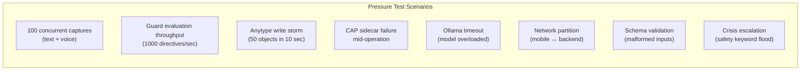

# Yar — Product Definition & Implementation Deep-Dive

> **Status**: Draft
> **Date**: 2026-05-17
> **Prerequisite**: Read [01_cytonome_master_reference.md](file:///home/mohammadi/.gemini/antigravity/brain/3a11be50-0404-4087-86d2-471b9987ec43/artifacts/01_cytonome_master_reference.md) and [02_cap_comprehensive.md](file:///home/mohammadi/.gemini/antigravity/brain/3a11be50-0404-4087-86d2-471b9987ec43/artifacts/02_cap_comprehensive.md)

---

## 1. Product Identity

### 1.1 What Yar Is

Yar is a **personalized cognitive substrate** built by neurodivergent minds, for everyone whose tools weren't designed for how their brain actually works. Not a note app. Not a productivity tool. Not an AI therapist. Yar is the companion that sits beside you and reduces the invisible tax of existing in systems that were not designed for your cognition.

It remembers what you forget. It translates what you mean into what they need to hear. It catches you when your brain is looping. It tracks how you're doing without making you feel broken for having bad weeks. It holds context about *you*, so you don't have to carry everything yourself.

Yar is built by neurodivergent minds, for everyone. It runs on your phone, your laptop, and your browser. Your data never leaves your devices.

**Yar is NOT**:
- ❌ A therapist or diagnostic tool (it is a companion, not a clinician)
- ❌ A productivity system (no streaks, no red overdue tasks, no optimization guilt)
- ❌ A masking engine (it never teaches you to hide who you are)
- ❌ A replacement for professional support (it builds bridges to support, not walls around it)
- ❌ A dependency machine (it teaches fishing, not just gives fish)

### 1.2 The Three Pillars

| Pillar | What It Does | How It Feels |
|---|---|---|
| **Layer 1: Friction Reduction** | Captures thoughts before they vanish. Routes brain dumps to typed objects. Quick voice capture. Browser-aware contextual capture. | Immediate relief. "Finally, something that keeps up with my brain." |
| **Layer 2: Cognitive & Emotional Skill Building** | Embeds CBT-adjacent principles naturally (like MIT's Guardians). Communication translation. Gentle reflection prompting. Pattern surfacing. | Invisible growth. "I didn't realize I was learning to do this differently." |
| **Layer 3: Relational Companionship** | Longitudinal understanding of your cognitive patterns, communication preferences per person, emotional aftercare after hard conversations, vocal biomarker tracking over time. | Trust. "It actually knows me." |

### 1.3 Target Audience

| Segment | What They're Drowning In | How Yar Helps |
|---|---|---|
| **ADHD adults** | Thought loss, executive dysfunction, shame spirals from failed systems | Voice capture before thoughts vanish; gentle planning without guilt; brain-dump-to-structure routing |
| **Autistic adults** | Communication mismatch, social interpretation load, sensory overwhelm | Bidirectional Communication Translator; social script interpretation; consistent, predictable interface |
| **2e (twice-exceptional)** | Brilliant but can't operationalize; deep knowledge with no organization | Schema-aware knowledge capture; auto-linking papers↔code↔people↔projects; semantic retrieval |
| **Late-diagnosed adults** | Decades of coping strategies that half-work; grief + relief + confusion | Emotional aftercare; reflection without judgment; longitudinal pattern visibility |
| **ND researchers & students** | Hyperfocus without capture; context-switching devastation; paper mountains | Browser extension captures context in-flow; Anytype KG; gentle task management |

### 1.4 Core Capabilities

#### Tier 1: Friction Reduction (immediate value)

1. **Brain dump capture**: "I just had this thought about..." → Voice/text → Yar routes to typed object (Note/Idea/Task/Paper) → stores locally → optionally writes to Anytype
2. **Browser-aware contextual capture**: Reading a paper/code/article → Extension captures context + highlights + your annotation → auto-links to related objects in your KG
3. **Gentle planning**: "What should I focus on today?" → Suggests based on recent captures, energy level, pending tasks → no guilt, no streaks, no punishment framing
4. **Quick lookup**: "What was that thing about..." → Semantic retrieval across all captures → surfaces connections you missed

#### Tier 2: Skill Building (invisible growth)

5. **Communication Translation** (bidirectional):
   - **ND → NT moderation**: "I need to say this to my boss..." → Translates emotional content into professional language while preserving intent
   - **NT → ND interpretation**: "My manager said 'we should discuss your priorities'..." → Surfaces possible subtext, implicit expectations, and emotional undertones that may not be obvious
6. **Emotional aftercare**: After a hard conversation → "That sounded intense. Want to process what happened?" → Reduces replay loops by structured reflection
7. **Pattern surfacing**: "You've been capturing a lot about sleep this week. Is that something you want to think about together?"
8. **Gentle cognitive scaffolding**: Embeds CBT-adjacent principles naturally into conversations, not as exercises or worksheets

#### Tier 3: Relational Depth (long-term trust)

9. **Persistent relational context**: Models communication preferences per person in your life (your boss prefers bullet points, your partner needs emotional acknowledgment first)
10. **Longitudinal vocal biomarker tracking**: How your voice changes over weeks. Energy levels. Stress patterns. Medication effects. For your eyes only.
11. **Reflection without judgment**: "What have I been thinking about this week?" → Not a performance review. A gentle mirror.

### 1.5 Product Ecosystem

| Product | What | Primary Interface | Status |
|---|---|---|---|
| **Yar** (companion backend) | Python backend with CAP, Anytype adapter, model routing, schema registry, voice pipeline | API + CLI | ✅ MVP |
| **Yar Mobile** | Flutter app: voice capture, gentle planning, persona animation | Phone (iOS/Android) | ✅ Hackathon MVP |
| **Yar Browser Extension** (Cytomark) | MV3 Chrome/Firefox extension: contextual capture, annotation, social interpretation layer | **Browser** (potentially the primary interface) | 🔜 Planned |
| **Yar Desktop** | Tauri v2 wrapper: system tray capture, supervisor dashboard, vocal biomarker viz | Laptop | 🔜 Planned |
| **Yar Web** | Static web shell: quick capture + search when at computer | Browser tab | ⚠️ Basic |

> [!IMPORTANT]
> **The browser extension may be the most important interface.** People spend enormous time in browsers (reading, researching, communicating). Contextual capture where cognition already happens is more valuable than requiring a separate app switch.

### 1.6 Design Principles (by ND, for ND)

| Principle | What It Means in Practice |
|---|---|
| **No shame, ever** | No streaks. No red overdue tasks. No "you missed 3 days." No productivity language. No gamification that punishes inconsistency. |
| **Identity-safe** | Never a masking engine. Communication translation preserves your intent and teaches the bridge, not the mask. |
| **Frictionless** | Support where cognition already happens (browser, voice). No context-switching tax. |
| **Trust-first** | Health tracking (vocal biomarkers, mood) is a natural extension AFTER relationship trust is built, not a day-1 surveillance feature. |
| **Teaching fishing** | Skill building embedded in companionship, not as separate "lessons" or "exercises." Growth happens naturally through use. |
| **Consistent, predictable** | Interface never rearranges. Interactions follow patterns. Surprising UI changes are hostile to many ND users. |
| **Private by architecture** | On-device AI. Local storage. Your data is yours. Not "we promise not to look" but "we literally can't." |

### 1.7 Reference Products & Inspiration

| Product | What Yar Takes From It | What Yar Does Differently |
|---|---|---|
| **Goblin Tools** | ND-specific task decomposition | Yar adds relational context + longitudinal tracking |
| **Finch** | Emotional companion, no shame | Yar adds knowledge capture + communication translation |
| **Tana** | Structured knowledge capture, supertags | Yar adds voice-first, ND-aware, on-device |
| **Hypothesis/Memex** | Browser annotation + highlights | Yar adds AI interpretation + auto-linking to personal KG |
| **MIT Guardians** | CBT principles embedded in gameplay | Yar embeds CBT in conversation, not gamification |
| **Tiimo/Leantime** | ND-aware task management | Yar is companion-first, not productivity-first |
| **Replika/Pi** | Relational AI companion | Yar adds structured capture + real cognitive utility |
| **Super Productivity** | ADHD-friendly task management | Yar avoids productivity framing entirely |

### 1.8 README Rewrite Strategy

**Current README**: 33 KB technical document (API routes, CAP internals, schema details). Reads like an engineering spec written by and for engineers.

**Target README**: 3-5 KB document that speaks to users first, developers second.

```markdown
# Yar — The One Beside You

Your brain works differently. Yar works with it, not against it.

Yar is a cognitive companion that captures your thoughts before they vanish,
translates what you mean into what they need to hear, and tracks how you're
doing without making you feel broken for having bad weeks.

Built by neurodivergent minds. Runs on your devices. Your data stays yours.

## What Yar Does

**Captures**: Voice or text, routed to the right place. Brain dumps welcome.
**Translates**: Helps bridge the gap between what you mean and what they hear.
**Remembers**: So you don't have to carry everything yourself.
**Reflects**: Surfaces patterns gently. No performance reviews.

## Privacy

Yar uses on-device AI. Your thoughts, your voice, your patterns stay on your
phone and laptop. Not "we promise not to look." We literally can't.

## Quickstart

pip install cytognosis-yar
yar serve

## Built With

FastAPI · Gemma 4 · SQLite · Flutter · CAP

## License

Apache 2.0 — Cytognosis Foundation
A 501(c)(3) nonprofit building open-source tools for precision health.
```

---

## 2. Implementation Phases (Detailed)

### Phase 1: CAP Integration (Week 1-2)

#### 2.1.1 Create `src/yar/cap/` subpackage

Move and consolidate:
- `cap_profile.py` → `src/yar/cap/profile.py`
- `core/cap_lite_guard.py` → `src/yar/cap/guard.py`
- `api/routes_cap.py` → stays (imports from new location)
- `CAP/policies/*.json` → `src/yar/cap/data/`

#### 2.1.2 Replace dict factories with Pydantic models

**Critical evaluation**: The current `cap_profile.py` returns raw dicts. This is the single highest-risk pattern in the codebase because:
1. No validation at construction time
2. Easy to produce malformed Directives
3. Impossible to statically verify correctness
4. JSON serialization is fragile

Replace with:

```python
class Directive(BaseModel):
    directive_id: str = Field(default_factory=lambda: f"yar-dir-{uuid4().hex[:12]}")
    directive_type: Literal["execute", "observe", "compensate", "wait"] = "execute"
    action: DirectiveAction
    constraints: ConstraintSet
    authority_chain: list[AuthorityChainStep]
    policy_refs: list[PolicyRef] = []
    expiry: datetime
    reversibility: Literal["reversible", "partial", "irreversible"]
    session_id: str | None = None  # v0.2 addition

    @field_validator("expiry")
    @classmethod
    def expiry_must_be_future(cls, v: datetime) -> datetime:
        if v <= datetime.now(UTC):
            raise ValueError("Directive expiry must be in the future")
        return v
```

#### 2.1.3 Implement sidecar with in-process fallback

```python
async def evaluate(directive: Directive, settings: YarSettings) -> GuardDecision:
    """Evaluate via sidecar if available, else use in-process guard."""
    if settings.cap_sidecar_enabled:
        try:
            async with httpx.AsyncClient(timeout=settings.cap_timeout_secs) as client:
                response = await client.post(
                    f"{settings.cap_http_url}/evaluate",
                    json=directive.model_dump(mode="json"),
                )
                return GuardDecision.model_validate(response.json())
        except (httpx.ConnectError, httpx.TimeoutException):
            if settings.cap_deny_on_sidecar_failure:
                return GuardDecision(outcome="deny", reason="sidecar_unreachable")
            # Fall through to in-process
    return _evaluate_local(directive)
```

**Critical evaluation of deny-on-failure**: The current plan says "deny-by-default on sidecar failure." This is correct for production safety, but **blocks all functionality during development when sidecar isn't running**. Solution: `cap_deny_on_sidecar_failure` config option, default `true` in production, `false` in dev.

#### 2.1.4 Test gate

- All 34 existing tests pass
- New unit tests for Pydantic models
- New integration test: sidecar up → evaluate → allow
- New integration test: sidecar down → deny (production mode)
- New integration test: sidecar down → fallback to local (dev mode)

---

### Phase 2: Anytype Submodule (Week 2-4)

#### 2.2.1 Create `src/yar/anytype/` (8 modules)

See [yar_revision_plan.md](file:///home/mohammadi/.gemini/antigravity/brain/3a11be50-0404-4087-86d2-471b9987ec43/artifacts/yar_revision_plan.md) Phase 1 for full module inventory.

**Critical evaluation**: The current 48KB monolithic adapter is the largest module in the codebase. It works, but:
- 1 file = 1 point of failure for all Anytype operations
- MCP subprocess spawning per-request is expensive
- No connection pooling or retry logic
- Schema bridge is hardcoded (not extensible)

#### 2.2.2 Connection lifecycle

```python
class AnytypeMCPClient:
    """Persistent MCP client with connection pooling."""

    async def connect(self) -> None:
        """Start MCP subprocess and discover tools. Reuse across requests."""

    async def disconnect(self) -> None:
        """Clean shutdown of MCP subprocess."""

    async def health(self) -> bool:
        """Check if MCP subprocess is alive and responsive."""

    @asynccontextmanager
    async def session(self) -> AsyncGenerator[AnytypeSession, None]:
        """Scoped session with automatic cleanup."""
```

#### 2.2.3 CAP guard at write boundary

Every write goes through: `push.write_object()` → `guard.check_write_permission(object)` → `client.call_tool("write")`. The guard checks:
1. Object type is in allowed list (CAP-Lite profile)
2. User has confirmed the write (two-step confirmation)
3. Object doesn't contain diagnostic language (keyword + metadata check)
4. Write plan matches the approved plan (plan-execute parity)

---

### Phase 3: Mobile Interface (Week 4-6)

#### 2.3.1 Evaluate Cactus vs LiteRT-LM

| Dimension | LiteRT-LM | Cactus |
|---|---|---|
| Gemma 4 support | ✅ Native, Google-optimized | ⚠️ Via GGUF conversion |
| Hybrid routing | ❌ (manual) | ✅ Built-in on-device/cloud routing |
| Flutter SDK | ⚠️ Via platform channels | ✅ Native Flutter binding |
| Tool calling | ❌ (manual) | ✅ Built-in |
| RAG | ❌ (manual) | ✅ Built-in |
| NPU acceleration | ✅ (AICore) | ✅ (ARM NPU) |
| Model ecosystem | Gemma-focused | 125K+ GGUF models |
| License | Apache 2.0 | MIT |
| Production maturity | Google-backed | YC-backed startup |
| Risk | Google dependency | Startup risk |

**Recommendation**: Evaluate Cactus in a 1-week spike. If Flutter SDK quality matches the docs, it could simplify Yar's model routing significantly (replace `model_router.py`'s manual provider switching with Cactus's hybrid routing). Keep LiteRT-LM as the Google-backed fallback.

#### 2.3.2 Mobile app improvements

- [ ] Refactor `lib/src/` to use the new `src/yar/anytype/` API
- [ ] Add offline queue with sync-on-reconnect
- [ ] Add persona animation (Rive integration)
- [ ] Add gentle planning UI
- [ ] Test on iPhone 14+ and Pixel 7+ minimum hardware

---

### Phase 4: Desktop & Web (Week 6-8)

#### 2.4.1 Web shell upgrade

The current web shell (`src/yar/web/static/`) is functional but basic. Two paths:

| Path | Effort | Result |
|---|---|---|
| **A: Enhanced static** | Low (1 week) | Better CSS, responsive, brand-aligned, still dependency-free |
| **B: Vite + React** | Medium (3 weeks) | Full dashboard with charts, graph viz, schema browser |

**Recommendation**: Path A for now. Yar's primary interface is mobile voice. The web shell is for quick capture and search when at a computer. A full React dashboard is premature until user research validates the need.

#### 2.4.2 Desktop scaffold (Tauri v2)

Create minimal Tauri wrapper:
- Wraps the web shell
- Runs Yar backend as a sidecar subprocess
- Runs Ollama as a second sidecar (if not already running)
- System tray icon for quick capture

---

### Phase 5: Voice Pipeline (Week 8-10)

#### 2.5.1 ASR evaluation

| Model | Speed | Accuracy | Edge Size | License | Multilingual |
|---|---|---|---|---|---|
| **Whisper (base/small)** | Good | Good | 74-244 MB | Apache 2.0 | ✅ 99 langs |
| **Parakeet TDT-0.6B** | **Best** | **Best** | ~400 MB | Apache 2.0 | ❌ English |
| **Gemma 4 E2B native audio** | Good | Good | ~1.5 GB | Apache 2.0 | ✅ 35+ langs |
| **Nemotron Speech** | Very fast | Very good | Cloud-size | Apache 2.0 | ⚠️ Limited |

**Recommendation**: For Yar v1, use **Gemma 4's native audio input** (already integrated via LiteRT-LM). It collapses ASR + understanding into one model call. Evaluate Parakeet as a dedicated ASR module for Phase 2 if latency becomes an issue.

#### 2.5.2 TTS evaluation (for voice response)

| Model | Quality | Speed | Size | Expressiveness | License |
|---|---|---|---|---|---|
| **Kokoro 82M** | High (#1 HF Arena) | Fast | ~82 MB | Moderate | Apache 2.0 |
| **Fish Audio S2 Pro** | **Excellent** | Fast | ~3 GB | 48+ emotions | Research |
| **Qwen3-TTS** | Very high | Good | Varies | Good | Apache 2.0 |
| Platform TTS | Variable | Instant | 0 MB | Limited | N/A |

**Recommendation**: Start with **platform TTS** (iOS/Android native) for Yar v1. Kokoro 82M is the first upgrade when voice quality matters.

#### 2.5.3 Speech-to-speech evaluation (future)

Only evaluate for Phase 4+ if user research shows full-duplex naturalism matters for Yar's use case (cognitive companion, not therapy).

| Model | Fit for Yar | Why/Why Not |
|---|---|---|
| **Moshi 7B + MoshiRAG** | Low priority | Full-duplex matters less for knowledge capture than therapy |
| **LFM2.5-Audio-1.5B** | Medium | Smallest S2S; good for future Yar-as-voice-journal |
| **Qwen3.5-Omni** | Low (cloud) | Too large for Yar's edge-first model |

---

### Phase 6: Persona System (Week 10-12)

#### 2.6.1 Implement persona schema

Use the schema proposed in [01_cytonome_master_reference.md](file:///home/mohammadi/.gemini/antigravity/brain/3a11be50-0404-4087-86d2-471b9987ec43/artifacts/01_cytonome_master_reference.md) §8.2.

Key implementation:
- YAML persona definition loaded at startup
- Persona parameters injected into prompt templates
- CAP-Lite constraints enforced based on persona's authority level
- Visual state machine drives Rive animation (idle → listening → thinking → speaking → empathic)

#### 2.6.2 Character Card V3 compatibility

Export Yar's persona as a CCv3-compatible JSON for interoperability with other agent systems:

```python
def to_character_card_v3(persona: YarPersona) -> dict:
    """Export persona as Character Card V3 JSON."""
    return {
        "spec": "chara_card_v3",
        "data": {
            "name": persona.identity.name,
            "personality": persona.identity.specialty,
            "system_prompt": _build_system_prompt(persona),
            "extensions": {
                "cap_profile": persona.constraints.cap_profile,
                "authority_level": persona.behavior.authority_level,
            }
        }
    }
```

---

## 3. Testing & Pressure Testing

### 3.1 Test Strategy

| Layer | Tool | Coverage Target |
|---|---|---|
| Unit tests | pytest | >80% on `src/yar/cap/`, `src/yar/anytype/` |
| Integration tests | pytest + httpx | All API routes with live backend |
| CAP conformance | CAP conformance runner | 120+ tests (v0.2) |
| CAP hardening | CAP hardening suite | 40+ adversarial tests |
| E2E (backend) | pytest + subprocess | Capture → route → store → retrieve |
| E2E (mobile) | Flutter integration tests | Voice → capture → display → write-plan |
| Pressure tests | locust / custom | Concurrent captures, guard throughput |

### 3.2 End-to-End Pressure Test Plan



#### Critical pressure tests

1. **CAP sidecar kill during active session**: Backend must deny all subsequent requests (production mode) or fall back gracefully (dev mode). No data corruption.

2. **Concurrent Anytype writes with CAP guard**: 50 write-plan-execute cycles simultaneously. Guard must serialize correctly; no write should bypass guard. No duplicate objects in Anytype.

3. **Voice capture pipeline saturation**: 10 concurrent voice turns. Each must be queued, processed, and stored without data loss. Model router must handle timeouts gracefully.

4. **Schema validation with adversarial input**: Submit objects with diagnostic language, PHI patterns, and injection attempts. CAP-Lite guard must refuse all of them.

5. **Clock skew test**: Set system clock 5 minutes ahead. Expired directives must be rejected. Evidence freshness checks must fail for stale evidence.

---

## 4. Evaluation Summary: What's Potentially Sub-Optimal

| Decision | Current Choice | Concern | When to Revisit |
|---|---|---|---|
| SQLite as only store | Simple, local-first | No full-text search, no vector store for RAG | When semantic retrieval needs upgrade |
| Ollama as model host | Easy setup, multi-model | No NPU acceleration on mobile | When Cactus evaluation completes |
| In-process CAP guard | Fast, no network hop | Can't prove transport independence | Phase 1 (sidecar implementation) |
| 48KB monolithic Anytype adapter | Works | Untestable, unmaintainable | Phase 2 (subpackage refactor) |
| Static web shell | Zero dependencies | Ugly, limited functionality | Phase 4 (evaluate enhanced static vs React) |
| No persona system | Not needed for hackathon | Users have no sense of Yar's character | Phase 6 |
| Platform TTS only | Zero effort | Robotic, not warm | When voice quality matters to users |
| No distributed runtime | Not needed for single-user | Blocks multi-device sync | Future phase (Dapr + NATS) |
| No graph RAG | Not needed for MVP | Limits retrieval quality | Future phase |
