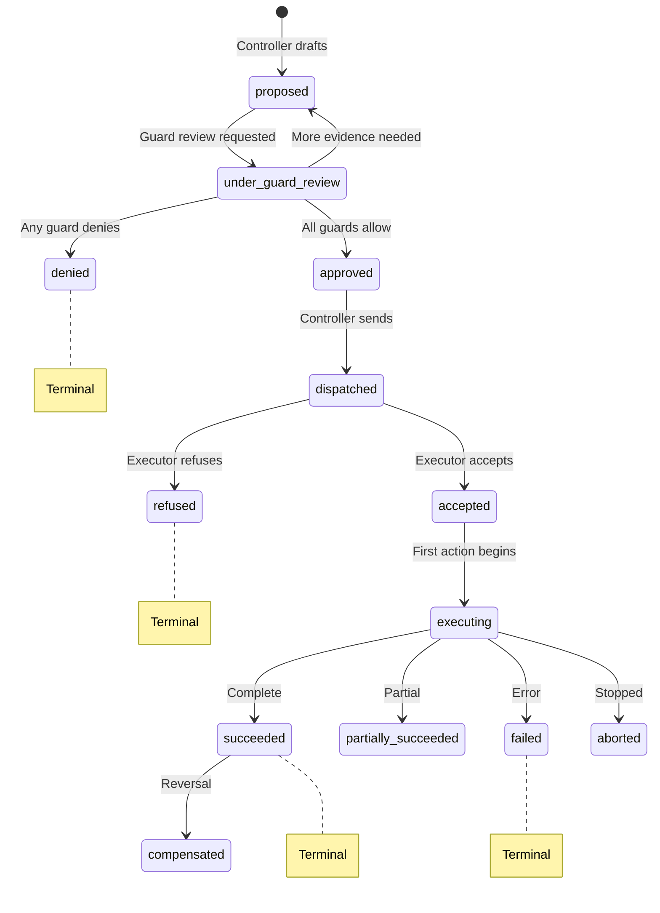
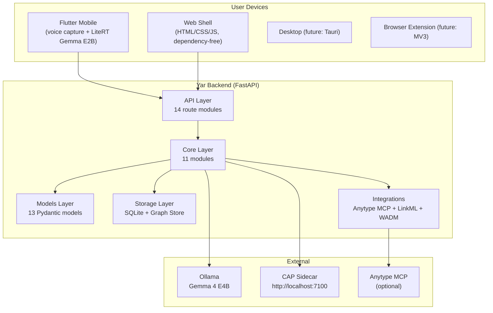
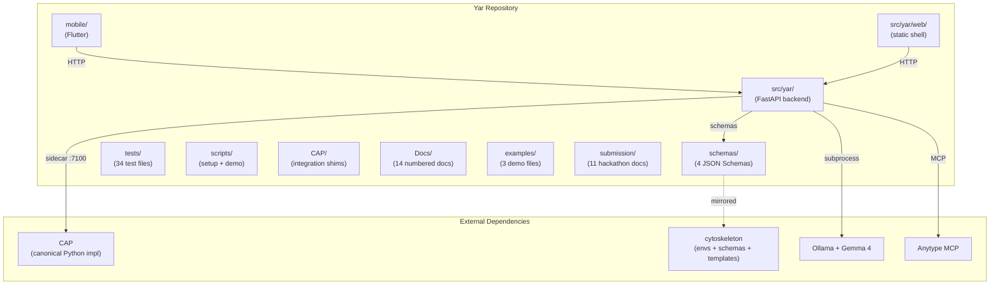

# CAP & Yar — Comprehensive Technical Reference

> **Status**: Active
> **Date**: 2026-05-17
> **Author**: @cytognosis-foundation
> **Audience**: engineers, reviewers, agents executing refactor
> **Tags**: `cap`, `yar`, `multi-agent`, `authority-protocol`, `knowledge-graph`, `refactor`

---

## Part I: CAP (Cytognosis Authority Protocol)

### 1. What CAP Is

CAP is a **transport-independent control layer for agentic systems**. It defines the authority contract between components that form intent (Controller) and components that act on the world (Executor), with Guard decisions, typed refusals, hash-chain audit, and standards-composition with adjacent protocols.

**CAP is NOT**: a transport, tool-calling protocol, policy engine, audit store, workflow runtime, identity system, or general-purpose agent framework. It composes with those.

### 2. Core Roles (4)

| Role | Responsibility | Cytognosis Mapping |
|---|---|---|
| **Controller** | Forms intent, issues bounded `Directive` objects | Center Supervisor agent |
| **Guard** | Evaluates policy/safety/privacy, emits `GuardDecision` | Policy evaluator; deny-wins semantics |
| **Executor** | Verifies authority, refuses or executes under constraints | Edge Interviewer agent |
| **Observer** | Emits telemetry/provenance from lifecycle events | Local audit log (each side) |

**Key properties**: Asymmetric authority (Controller proposes, Executor verifies and may refuse). Deny-wins (any Guard deny blocks the action). `allow_with_constraints` strictly narrows, never expands.

### 3. Core Primitives (7)

| # | Primitive | Purpose |
|---|---|---|
| 1 | **Directive** | Bounded authorization request: action, constraints, authority chain, policy refs, expiry, reversibility |
| 2 | **GuardDecision** | Policy decision: `allow`, `deny`, `allow_with_constraints`, `escalate`, `require_more_evidence`, `require_human_review`, `advisory_warning` |
| 3 | **RefusalMessage** | Typed, machine-actionable refusal with 16 reason codes (unauthorized, expired, missing_evidence, forbidden_tool, policy_denied, safety_denied, etc.) |
| 4 | **ExecutionReport** | Result with status (`succeeded`, `partially_succeeded`, `failed`, `aborted`, `compensated`), evidence produced, side effects |
| 5 | **DecisionRecord** | Audit-safe provenance artifact; NO chain-of-thought or raw evidence |
| 6 | **EvidenceRef** | Hash-bound, freshness-aware pointer to evidence (not the evidence itself) |
| 7 | **AuthorityChain** | Scoped capability claim binding Controller → Guard → Executor with temporal + attestation bounds |

### 4. Directive Lifecycle FSM



### 5. 11 Architectural Layers

| # | Layer | Purpose |
|---|---|---|
| 1 | Core primitives | 7 typed message schemas |
| 2 | Guard semantics | CAP-Lite, CAP-Med, custom profiles via policy-as-data JSON |
| 3 | Transport bindings | gRPC/protobuf reference + HTTP/JSON independent |
| 4 | Cryptographic verification | mTLS (Ed25519), detached JWS, DSSE, in-toto attestation |
| 5 | Audit & observability | Hash-chain append-only audit + OpenTelemetry |
| 6 | Policy integration | Policy-as-data JSON + optional OPA hook |
| 7 | Evidence linking | W3C PROV-O + SSSOM for domain mappings |
| 8 | Object graph integration | Anytype MCP, SQLite; CAP guards object creation |
| 9 | Domain-specific constraints | CAP-Med (clinical), CAP-Lite (general Yar) |
| 10 | Executor verification | Signature + decision + evidence + authority chain checks |
| 11 | Reporting | ExecutionReport (always emitted), optional supervisor review |

### 6. Transport Bindings (2, parity-verified)

- **gRPC/protobuf**: `reference_grpc/cap.proto`, bidirectional streaming, runtime mTLS Ed25519
- **HTTP/JSON**: `second_http/cap_types.py`, Python stdlib requests, independent (no codegen from gRPC)
- Both pass the same **28 conformance checks**
- Both prove CAP semantics are transport-agnostic

### 7. Cryptographic Stack

| Component | Purpose |
|---|---|
| **Ed25519 mTLS** | Runtime-generated certs per session; both sides authenticate |
| **Detached JWS** | Signs Directives/Reports without modifying body |
| **DSSE** | Tamper-evident envelope wrapping ExecutionReports |
| **in-toto** | Links Directive → GuardDecision → ExecutionReport as verifiable chain |

### 8. Conformance & Hardening

- **28 conformance checks** per binding (56 total): valid execution, temporal validity, authorization, evidence integrity, tool constraints, guard semantics, idempotency, reporting, integrations, privacy/safety
- **33 hardening checks**: crypto integrity, adversarial fixtures, redaction, idempotency under stress, policy enforcement
- All **PASS** (89/89 total)

### 9. Profiles

| Profile | Scope | What It Blocks |
|---|---|---|
| **CAP-Lite** (Yar default) | General users, cognitive companion | Diagnosis claims, treatment recs, mind-reading, raw data sharing without consent, external writes without confirmation |
| **CAP-Med** (clinical) | Center supervisor in clinical contexts | All CAP-Lite rules + medication, prescription language, non-diagnostic boundary on every question, raw transcript never reaches Center, audit log raw-free |

### 10. Standards Composition

CAP composes with (does NOT replace):

| Standard | CAP Relationship |
|---|---|
| MCP | CAP wraps MCP tool invocations; `Directive.action.target` = `mcp://server/tool` |
| A2A | CAP metadata embedded in A2A Task/Message/Part; AgentCard advertises CAP |
| OPA/Rego/Cedar | Guard adapter transforms Directive → OPA input → GuardDecision |
| OpenTelemetry | `cap.*` semantic conventions for spans; lifecycle events emitted |
| W3C PROV-O | Maps roles to PROV agents; Directives → Plans; reports → Entities |
| DSSE/in-toto/SLSA | Supply-chain attestation for decision chains |

### 11. Implementation Maturity

**Fully implemented**: All primitives + schemas, both transport bindings, crypto stack, hash-chain audit, CAP-Lite + CAP-Med, conformance + hardening suites, one-command runners + Colab notebooks.

**Stubs/limited**: Production KMS/HSM, live multi-org interop, latency benchmarks, profiles beyond Lite/Med.

**External gates**: Third-party security audit, org-specific policy authoring, clinical validity, voice pipeline, mobile runtime binding.

---

## Part II: Yar

### 1. What Yar Is

Yar is a **local-first cognitive companion for knowledge capture, built by neurodivergent minds**. It captures text, voice transcripts, webpages, and messages; routes through local Gemma via Ollama; structures them into typed graph objects; applies CAP-Lite guardrails; stores in local SQLite (with optional Anytype MCP write).

### 2. Architecture



### 3. Object Types

**Core MVP (10)**: `Note`, `Task`, `Idea`, `Project`, `Person`, `Paper`, `Webpage`, `Decision`, `Reflection`, `MessageDraft`

**Optional Research (8)**: `Author`, `Dataset`, `Code`, `Method`, `Model`, `Annotation`, `Collection`, `Concept`

### 4. Module Inventory

#### 4.1 API Routes (14 modules)

| Module | Routes | Purpose |
|---|---|---|
| `routes_health.py` | `GET /health` | Liveness check |
| `routes_capture.py` | `POST /capture` | Raw capture → Gemma routing → typed objects |
| `routes_annotations.py` | `POST /annotations/wadm`, `POST /annotations/capture` | WADM-compatible webpage annotations |
| `routes_objects.py` | `PATCH /objects/{id}`, `DELETE /objects/{id}`, etc. | CRUD for local objects + links |
| `routes_schemas.py` | `POST /schemas/register`, `POST /schemas/register-from-file` | LinkML-like schema registration |
| `routes_anytype.py` | `GET /anytype/status`, `POST /anytype/search`, write-plan/execute | Anytype MCP integration |
| `routes_cap.py` | `GET /cap/capabilities`, `GET /cap/rules`, `GET /cap/audit` | CAP metadata + audit endpoints |
| `routes_model.py` | `GET /model/status`, `POST /model/test` | Model router introspection |
| `routes_voice.py` | `POST /voice/turn`, voice conversation management | Mobile voice capture pipeline |
| `routes_planning.py` | `POST /plan/daily`, `GET /plan/daily` | Gentle daily planning (no shame/streaks) |
| `routes_communication.py` | `POST /communication/translate` | Communication Translator Lite |
| `routes_persona.py` | Persona endpoints | Persona/tone management |
| `routes_retrieval.py` | `POST /retrieve`, `GET /retrieve` | Semantic retrieval with Gemma reranking |
| `routes_export.py` | Export endpoints | JSON/Markdown export |

#### 4.2 Core Modules (11)

| Module | Size | Responsibility |
|---|---|---|
| `cap_lite_guard.py` | 21.6 KB | In-process CAP-Lite guard (keyword/metadata checks); Phase I plan: replace with httpx client to sidecar |
| `model_router.py` | 23.6 KB | Configurable model routing (ollama_cli, http_json, disabled) |
| `voice_service.py` | 19 KB | Voice conversation pipeline (edge intent → central routing → object creation) |
| `coordinator.py` | 9.6 KB | Core capture coordination pipeline |
| `proposal_validator.py` | 9.4 KB | Schema-aware object proposal validation |
| `gemma_router_stub.py` | 8.7 KB | Deterministic fallback router (tests only) |
| `anytype_write_planner.py` | 8 KB | Two-step write planning with CAP confirmation |
| `object_router.py` | 4.4 KB | Object routing abstraction |
| `json_utils.py` | 3 KB | JSON parsing/repair utilities |
| `annotation_service.py` | 2.1 KB | WADM annotation processing |
| `__init__.py` | 249 B | Core package init |

#### 4.3 Integration Modules (4)

| Module | Size | Responsibility |
|---|---|---|
| `anytype_mcp_adapter.py` | 48 KB | Full Anytype MCP adapter (read/search/write, tool discovery, dynamic tool selection) |
| `linkml_loader.py` | 11.5 KB | LinkML-like YAML schema loader + normalizer |
| `wadm_adapter.py` | 4.6 KB | W3C Web Annotation Data Model adapter |
| `__init__.py` | 172 B | Integration package init |

#### 4.4 Models (13 Pydantic models)

`__init__.py` (4.2 KB), `yar_object.py`, `capture.py`, `guard.py`, `link.py`, `model_router.py`, `planning.py`, `proposal_validation.py`, `schema_registry.py`, `voice.py`, `wadm.py`, `anytype.py`, `communication.py`

#### 4.5 Storage (3 modules)

| Module | Size | Responsibility |
|---|---|---|
| `sqlite_store.py` | 23.2 KB | Primary SQLite store for objects, links, captures, execution reports, schemas, write plans, voice turns |
| `graph_store.py` | 1.7 KB | Graph abstraction over SQLite links |
| `__init__.py` | 147 B | Storage package init |

#### 4.6 Supporting (top-level `src/yar/`)

| Module | Responsibility |
|---|---|
| `cap_profile.py` (12 KB) | Full CAP profile: directive/refusal/execution-report/decision-record factories, evidence refs, constraints, authority chains, capabilities matrix |
| `logging_config.py` (7 KB) | Structured logging (compact console + JSON file) |
| `main.py` (1.6 KB) | FastAPI app factory |
| `main_dependencies.py` (317 B) | Dependency injection setup |
| `__init__.py` (85 B) | Package init |

### 5. Interface Evaluation

#### 5.1 Flutter Mobile (`mobile/`)

- **Status**: Functional MVP for Gemma Hackathon
- **Capabilities**: Voice capture via microphone, editable transcript fallback, LiteRT Gemma E2B intent routing (on-device), object review, Anytype write planning, explicit write confirmation
- **Structure**: `lib/main.dart` + `lib/src/` with screens and services
- **Platforms**: iOS (physical device required for LiteRT), Android, macOS
- **Limitations**: No app-store packaging, no device-farm CI, simulator cannot run LiteRT-LM model

#### 5.2 Web Shell (`src/yar/web/static/`)

- **Status**: Functional dependency-free mobile-first HTML/CSS/JS
- **Capabilities**: Capture tab, search, Anytype status, write-plan actions, safety refusal demo, schema selector
- **Served by**: FastAPI static files mount at `/static/` + root route serves `index.html`
- **Limitations**: No framework, no build step, basic UI

#### 5.3 Desktop (not yet implemented)

- **Planned**: Tauri (Rust + web frontend)
- **From design docs**: `yar-desktop` cytocast profile, `app-desktop` cytoskeleton env, cargo workspace

#### 5.4 Browser Extension (not yet implemented)

- **Planned**: MV3 Chrome/Firefox extension
- **From design docs**: `yar-extension` cytocast profile, `app-extension` cytoskeleton env

### 6. Anytype Integration Analysis

#### 6.1 Current Implementation (`src/yar/integrations/anytype_mcp_adapter.py`)

The existing adapter is **48 KB** and comprehensive:
- Dynamic MCP tool discovery (search, read, write tool names)
- Read-only: status, tool listing, search, object read
- Guarded writes: two-step plan → confirm → execute
- CAP-Lite enforcement at every write boundary
- SQLite fallback when Anytype is unavailable

#### 6.2 Planned Anytype Submodule (`packages/yar-anytype/`)

The Phase I skeleton includes 4 modules:
- `client.py` — Connection wrapper (skeleton)
- `push.py` — Write objects/links/relations (skeleton)
- `pull.py` — Read/search from Anytype (skeleton)
- `schema_bridge.py` — LinkML ↔ Anytype type mapping (stub map + placeholders)

#### 6.3 Gap Analysis

| Feature | Current (`anytype_mcp_adapter.py`) | Planned (`yar-anytype`) | Gap |
|---|---|---|---|
| MCP client initialization | ✅ In-process subprocess | ❌ Skeleton | Full implementation needed |
| Tool discovery | ✅ Dynamic | ❌ Skeleton | Port discovery logic |
| Search | ✅ Via discovered tool | ❌ Skeleton | Port search logic |
| Read object | ✅ Via discovered tool | ❌ Skeleton | Port read logic |
| Write planning | ✅ Two-step with guard | ❌ Skeleton | Port planning logic |
| Write execution | ✅ Guarded confirmed | ❌ Skeleton | Port execution logic |
| Schema bridge | ✅ Deterministic mapping | ⚠️ Stub map only | Full LinkML → Anytype conversion |
| Error handling | ✅ Structured refusals | ❌ Skeleton | Port error patterns |
| Connection pooling | ❌ Per-request subprocess | ❌ Skeleton | New feature needed |
| Bulk operations | ❌ Not implemented | ❌ Skeleton | New feature needed |

### 7. CAP Integration Status (in Yar)

| Component | Status | Notes |
|---|---|---|
| `cap_profile.py` (12 KB) | ✅ Implemented | Full CAP primitives factory: directive, refusal, execution report, decision record, evidence refs, authority chains |
| `core/cap_lite_guard.py` (21.6 KB) | ✅ In-process guard | Keyword + metadata-based checks; Phase I plan: replace with httpx client to sidecar |
| `api/routes_cap.py` (2 KB) | ✅ Metadata endpoints | `/cap/capabilities`, `/cap/rules`, `/cap/audit` |
| `CAP/` directory at Yar root | ✅ Integration shims | Policies, schemas (cap-core, cap-med), docs, collab notebooks, verify scripts |
| External CAP sidecar | ❌ Not yet integrated | Phase I plan: add as submodule at `external/cap/`, run as sidecar on :7100 |

### 8. Test Coverage

**34 test files** covering:
- Health, capture flow, guard refusals, schema validation
- Anytype adapter (6 test files: gap regressions, mapping, read-only integration, write execution, write guard, write planning)
- CAP Lite guard (2 test files: guard checks, regressions)
- Model router, voice routes, communication
- Graph store, JSON utils, logging
- MVP end-to-end (no stub), planning MVP, proposal validator
- Schema file registration, schema registry
- Web shell, link routes, annotation capture flow, export/retrieval routes

### 9. Configuration

**`pyproject.toml`**: Python 3.12+, FastAPI, Pydantic, uvicorn, PyYAML. Dev: pytest, httpx. Build: setuptools. Layout: `src/`.

**Environment variables** (from `.env.example` + code):
- `YAR_ROUTER_PROVIDER`, `YAR_MODEL_NAME`, `YAR_MODEL_FALLBACK_TO_STUB`, `YAR_MODEL_TIMEOUT_SECONDS`
- `YAR_CENTRAL_MODEL_PROVIDER`, `YAR_CENTRAL_MODEL_NAME`, `YAR_CENTRAL_MODEL_ENDPOINT`
- `YAR_LOG_LEVEL`, `YAR_LOG_FILE`, `YAR_LOG_MAX_BYTES`, `YAR_LOG_BACKUP_COUNT`
- `ANYTYPE_MCP_ENABLED`, `ANYTYPE_MCP_COMMAND`, `ANYTYPE_API_KEY`, `ANYTYPE_SPACE_ID`, `ANYTYPE_VERSION`
- `CAP_HTTP_URL` (planned), `CAP_TIMEOUT_SECS` (planned)

### 10. Schema System

- **4 JSON Schemas** at `schemas/`:
  - `yar_object.schema.json` (779 B)
  - `capture.schema.json` (619 B)
  - `guard_decision.schema.json` (677 B)
  - `linkml_anytype_mapping.schema.json` (485 B)
- **LinkML-like loader** (`linkml_loader.py`): loads project-relative YAML; normalizes schema name, version, classes, slots, relationships
- **Demo schema** (`examples/demo_research_schema.yaml`): 6.2 KB research schema with Paper, Author, Dataset, etc.

---

## Part III: Cross-System Dependency Map



---

## Part IV: Key Architectural Decisions

| Decision | Rationale |
|---|---|
| CAP as separate product from cyto-skills | CAP is a protocol standard; cyto-skills is a skill runtime. Mixing conflates concerns. |
| CAP as HTTP sidecar (not in-process) | Proves transport independence; CAP can be ported to TS/Rust without changing Yar |
| SQLite as default storage | Local-first; no server setup; people shouldn't have to configure databases to think |
| Anytype as optional external write target | Users choose their own graph system; Yar works without it |
| Gemma on-device via LiteRT | Privacy (no cloud); users deserve local control of their own data |
| In-process CAP-Lite guard (current) | Fast path for hackathon; Phase I plan: replace with sidecar for correctness |
| Two-step Anytype writes | CAP-Lite requires explicit user confirmation before external mutations |
| Gentle planning language | No streaks, guilt, shame, or punishment framing; evidence-based for ADHD |

---

## Part V: File Tree Summary

```
Yar/
├── .env.example                    # Environment configuration template
├── .gitignore                      # Git ignore rules
├── README.md                       # 33 KB comprehensive README
├── pyproject.toml                  # Python project config (src layout)
├── CAP/                            # CAP integration shims
│   ├── policies/                   # cap_core_policy.json, cap_med_policy.json
│   ├── schemas/                    # cap-core/, cap-med/ JSON Schemas
│   ├── docs/                       # CAP documentation
│   └── ...                         # Verification scripts, colabs, hardening
├── Docs/                           # 14 numbered development docs (00-11 + milestones)
├── examples/                       # Demo data (captures.jsonl, schema YAML, expected objects)
├── mobile/                         # Flutter app
│   ├── lib/                        # Dart source (main.dart + src/)
│   ├── pubspec.yaml                # Dart dependencies
│   ├── android/                    # Android platform
│   ├── ios/                        # iOS platform
│   └── macos/                      # macOS platform
├── schemas/                        # 4 JSON Schemas
├── scripts/                        # 8 setup/demo scripts
├── src/yar/                        # Python backend
│   ├── api/                        # 14 FastAPI route modules
│   ├── core/                       # 11 core logic modules
│   ├── integrations/               # 4 integration modules (Anytype, LinkML, WADM)
│   ├── models/                     # 13 Pydantic model modules
│   ├── prompts/                    # 3 prompt templates (markdown)
│   ├── storage/                    # 3 storage modules (SQLite, Graph)
│   ├── web/                        # Static web shell (HTML/CSS/JS)
│   ├── cap_profile.py              # CAP primitives factory
│   ├── logging_config.py           # Structured logging
│   ├── main.py                     # FastAPI app factory
│   └── main_dependencies.py        # DI setup
├── submission/                     # 11 Gemma Hackathon submission docs
├── tests/                          # 34 test files
└── refactor/                       # Refactor planning docs (this work)
    ├── CAP/                        # CAP documentation (3 variants)
    ├── Yar/                        # Yar documentation (research + implementation)
    ├── design_docs/                # Master plan + per-system designs
    ├── phase1.md                   # Phase I master hand-off
    └── skills/                     # cytognosis-dev, cytognosis-doc
```
