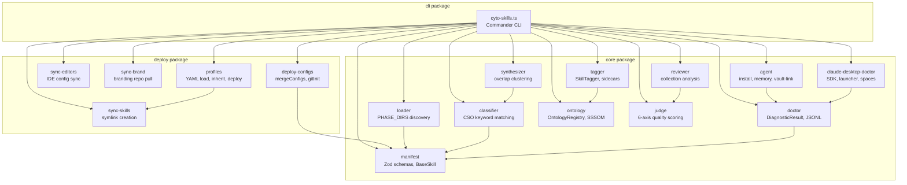
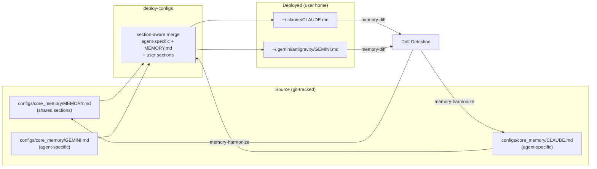
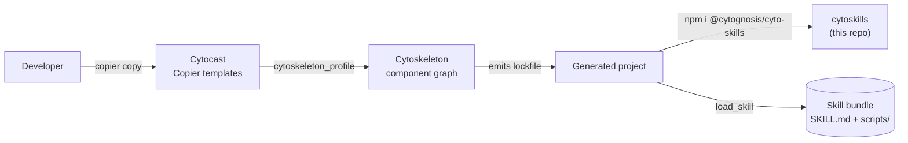

# cytoskills Architecture

**cytoskills** is a TypeScript monorepo that provides the runtime
skill catalog, profile-based deployment system, quality assurance
tooling, and memory management for the Cytognosis multi-agent
ecosystem. It replaces the earlier Python implementation.

## Package Structure

The monorepo contains three packages under `packages/`:

| Package | npm Name | Purpose |
|---------|----------|---------|
| `core` | `@cytognosis/cyto-skills` | Manifest parsing, classification, ontology, quality, agent memory |
| `deploy` | `@cytognosis/cyto-skills-deploy` | Config deployment, skill syncing, profile management, branding |
| `cli` | `@cytognosis/cyto-skills-cli` | `cyto-skills` command-line interface (all user-facing commands) |

## Core Package Modules

### manifest.ts

Defines the **Zod schemas** that validate SKILL.md frontmatter and the
`BaseSkill` class that wraps a parsed skill directory. Key schemas:

- `SkillFrontmatterSchema` — name, description, tags, triggers,
  inputs/outputs, EDAM metadata, agent compatibility
- `SkillIOSchema` — typed I/O slots with `namespace:Type` schema refs
- `CSOAxisTagSchema` / `StructuredTagsSchema` — CSO-aligned tag axes
- `EdamMetadataSchema` — EDAM topics, operations, tool type, maturity
- `AgentCompatSchema` — runtime compatibility (runtimes, MCP servers,
  min context window)

### loader.ts

Discovers skills across the **four-phase repository layout** using
`PHASE_DIRS` mapping. Searches multiple sibling repositories (branding,
cytoskeleton, cytoskills). Exports:

- `discoverSkill(name, searchRoots)` — find a single skill by name
- `iterSkills(searchRoots)` — discover and load all skills
- `PHASE_DIRS` — phase → relative path mapping (17 phases)

Supports nested namespaces (e.g., `community/author/skill-name/`)
and the `CYTO_SKILLS_ROOT` environment variable override.

### classifier.ts

Maps skills to **Cyto Skill Ontology (CSO)** CURIE terms using
keyword-based matching against a built-in taxonomy. The taxonomy
covers four axes:

| Axis | Coverage |
|------|----------|
| A — Software Engineering | Languages, frameworks, ML, data engineering |
| B — Scientific Domains | Bioinformatics, genomics, drug discovery |
| C — Organizational/Meta | Planning, troubleshooting, LLMs |
| D — Use-Case | Data science, research, project scaffolding |

Exports `classify()`, `classifyAll()`, `clusterByCso()`, `csoLabel()`.

### synthesizer.ts

Clusters skills by primary classifier tag and generates
**consolidation reports** for overlapping clusters (size >= 2).
Proposes merged skill names and unified trigger sets.

### doctor.ts

Provides the reusable `DiagnosticResult` pattern (error/warning/info
accumulation) and skill-level diagnostics. Also includes **JSONL
parsing and validation** utilities (from cowork-session-doctor).

- `diagnoseSkill(skillDir)` — checks SKILL.md, frontmatter, tags,
  triggers, IO schemas, body quality
- `diagnoseAll(searchRoots)` — runs diagnostics on all discoverable
  skills
- `parseJsonl()` / `validateJsonl()` — structural integrity checks
  for line-oriented JSON files

### ontology.ts

The `OntologyRegistry` class loads the bundled **CSO JSON-LD** and
**SSSOM TSV** files. Fully standalone with no network calls. Provides:

- CURIE expansion/contraction (12 prefix namespaces)
- Term validation and lookup
- Keyword → CSO term scoring (for auto-tagging)
- SSSOM cross-ontology mapping lookup
- Term search by label, alias, or CURIE

Data path resolution: explicit option → `CYTO_CSO_PATH` env →
bundled `dist/cso-data/` snapshot.

### tagger.ts

The `SkillTagger` class writes `.cyto-tags.yaml` sidecar files
alongside SKILL.md files. Tags are generated by scoring skill
content against CSO terms across three axes (A/B/C), with
confidence scores and SSSOM mapping references.

**Workflow**: `tag skill` → `.cyto-tags.yaml` → `tag promote` →
SKILL.md frontmatter.

### judge.ts

Multi-dimension quality scoring across **6 weighted axes**:

| Axis | Weight | What It Measures |
|------|--------|------------------|
| structure | 20% | Frontmatter fields, body length, H2 sections |
| trigger | 25% | Trigger language, quoted keywords, routing guidance |
| content | 25% | Decision tree, references, guardrails, code/tables |
| cso | 10% | CSO tags presence and CURIE format |
| naming | 10% | Kebab-case slug, length, name/slug match |
| freshness | 10% | Version, status, last_revised date |

**Verdicts**: PASS >= 70, WARN 50-69, FAIL < 50.

### reviewer.ts

Comparative analysis across a skill collection. Detects:

- **Naming issues** — duplicates, slug/name mismatches, long slugs
- **Overlap groups** — Jaccard similarity >= 0.35 on description vocab
- **Split candidates** — skills with > 20 trigger terms, > 300 lines,
  or > 1000-char descriptions

### agent.ts

Agent-specific skill and memory management for 5 supported agents:

| Agent | Skills Dir | Memory File |
|-------|-----------|-------------|
| `antigravity` | `~/.gemini/antigravity/skills/` | `GEMINI.md` |
| `claude` | `~/.claude/skills/` | `CLAUDE.md` |
| `agents` | `~/.agents/skills/` | `AGENTS.md` |
| `cursor` | `~/.cursor/skills/` | `CURSOR.md` |
| `kiro` | `~/.kiro/skills/` | `KIRO.md` |

**Operations**: install, uninstall, batch install, doctor (broken
symlinks), memory read/write/upsert, vault-link.

**Memory management** (diff/harmonize/revision): see
[Memory Architecture](#memory-architecture) below.

### claude-desktop-doctor.ts

Diagnoses and repairs Claude Desktop / Cowork installations. Covers
SDK binary resolution, launcher script management, spaces/sessions
validation, Electron cache purging. See
[module-spec-claude-desktop-doctor.md](module-spec-claude-desktop-doctor.md)
for full API documentation.

## Deploy Package Modules

### deploy-configs.ts

Deploys `CLAUDE.md` / `GEMINI.md` / `KIRO.md` to user directories.
Reads agent-specific config from `configs/core_memory/`, appends
shared `MEMORY.md`, and merges with existing target using
**section-aware merge** that preserves user-specific sections.

Optionally tracks changes via git (auto-init, snapshot before/after).

### profiles.ts

Loads and deploys **profile YAML files** that define bundles of
skills. Supports multi-level inheritance (`_base.yaml` → child
profiles). Profiles declare a `target` (agents, antigravity, claude,
cursor) and resolve to flat symlinks in the target directory.

### sync-skills.ts

Creates flat symlinks from each skill directory under `skills/` to
editor-specific directories (`~/.gemini/antigravity/skills/` and
`~/.agents/skills/`). Handles broken/stale symlink cleanup.

### sync-editors.ts

Copies IDE configuration files (`settings.json`, `keybindings.json`,
`launch.json`) from `configs/editors/{ide}/` to each IDE's user
config directory. Installs extensions listed in `extensions.json`.

Supported IDEs: VS Code, Antigravity, Cursor, Windsurf, Positron.

### sync-brand.ts

Pulls SKILL.tpl.md, guideline markdown files, and brand assets from
the `cytognosis/branding` repository into `skills/cytognosis/brand/`.
Wipes and recreates output directories for clean state on each sync.

## Memory Architecture

Memory management follows a **source → deploy → deployed** pipeline
with drift detection and reconciliation.

### Drift Detection (`memory-diff`)

Compares deployed memory files with source configs section-by-section.
Normalizes headings for comparison. Reports four states per section:

| State | Meaning |
|-------|---------|
| `identical` | Source and deployed content match |
| `modified` | Same heading, different body |
| `source-only` | Exists in source but not deployed |
| `deployed-only` | Exists in deployed but not source (drift) |

### Harmonization (`memory-harmonize`)

Analyzes deployed-only sections across all agents and proposes
backport actions:

- **In ALL agents** → `backport-shared` → write to `MEMORY.md`
- **In ONE agent** → `backport-agent` → write to agent's source file
- **In SOME agents** → `needs-review` → manual reconciliation

### Revision (`memory-revision`)

Updates a memory section in the source files. Determines whether the
section is shared (→ `MEMORY.md`) or agent-specific by checking all
source files. Creates new sections in `MEMORY.md` if not found
anywhere.

### Vault Link

Creates symlinks from ObsidianVault sections to repository `docs/`
folders, enabling the Dual-Track documentation architecture (Track A:
git specs, Track B: Obsidian-friendly).

## CLI Package

The `cyto-skills` binary exposes all functionality through a
Commander.js CLI organized into command groups:

| Group | Commands |
|-------|----------|
| Skill management | `list`, `inspect`, `classify`, `doctor`, `validate`, `synthesize`, `root` |
| Profiles | `profile list`, `profile show`, `profile deploy` |
| Deploy/sync | `deploy-configs`, `sync-skills`, `sync-editors`, `sync-brand`, `sync-all` |
| Ontology (CSO) | `ontology list`, `ontology search`, `ontology expand`, `ontology mappings`, `ontology validate` |
| Tagging | `tag skill`, `tag all`, `tag promote`, `tag show` |
| Quality | `judge skill`, `judge all`, `judge cytognosis` |
| Review | `review collection`, `review cytognosis` |
| Agent mgmt | `agent list`, `agent install`, `agent uninstall`, `agent batch`, `agent doctor`, `agent doctor-all`, `agent doctor-desktop`, `agent fix-launcher`, `agent fix-paths`, `agent purge-cache` |
| Memory | `agent memory`, `agent memory-update`, `agent memory-diff`, `agent memory-harmonize`, `agent memory-revision`, `agent vault-link` |
| Catalog | `catalog list`, `catalog fetch`, `catalog diff` |

See [cli-reference.md](cli-reference.md) for complete command
documentation.

## Cross-Repo Composition

## Org Tooling Standards

| Tool | Choice |
|------|--------|
| Language | TypeScript (ESM) |
| Build | tsc, tsup |
| Package manager | pnpm (workspace) |
| CLI framework | Commander.js |
| Validation | Zod |
| YAML | yaml (npm) |
| Linter | ESLint + Prettier |
| Testing | vitest |
| Env manager | uv (for Python scripts), pnpm (for TS) |

## What Lives Elsewhere

- **Project scaffolding** →
  [Cytocast](https://github.com/cytognosis/cytocast)
- **Component lock + ML-framework profiles** →
  [Cytoskeleton](https://github.com/cytognosis/cytoskeleton)
- **Brand guidelines source of truth** →
  [branding](https://github.com/cytognosis/branding)
